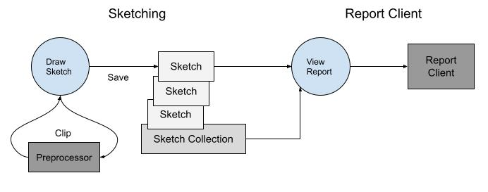
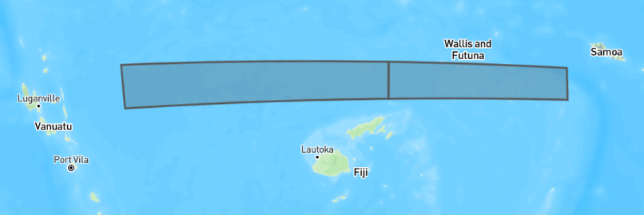
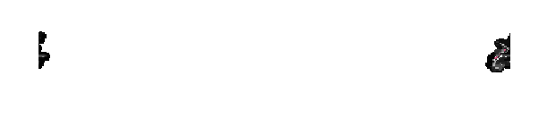

# Spatial Planning

A SeaSketch planning process typically does the following:



1. Captures user input in the form of spatial features (sketches) with attributes (e.g. allowed activities, notes, etc.).  Sketches are then organized into proposals (sketch collections).
2. Provides feedback (reports) on how well sketches and sketch collections meet measurable planning objectives and their targets (using geoprocessing functions).
3. Users then share and iterate on their designs until the group together can make proposals, narrow them down, and come to a decision.

The project goal is met if all measurable objectives are met and the proposal is legally viable.

The `core SeaSketch platform` is designed to accomplish #1 and #3.  The `geoprocessing framework` is primarily used to accomplish #2, as well as #1 (using preprocessing functions).  The two systems work together to provide an end-to-end spatial planning solution.

What's unique about the geoprocessing framework is it's flexibility.  It's not one-size-fits-all.  A developer can create custom reports through code starting with a template.

# Where to start

A geoprocessing project starts with a design phase, using a [planning tool design template](https://docs.google.com/document/d/1Qe7pZYmwg7ggRY9ocu3tpdTQkvuIHMr38wLxrjSitpU/edit?usp=sharing).

There are a number of terms and concepts to be familiar with:

* `MPA` - [marine protected area].  Protected areas of seas, oceans, estuaries. (https://en.wikipedia.org/wiki/Marine_protected_area)

* `Goal` - also known as vision or aim. These are general summaries of the desired future state of an area.

  * Example - Protect biological diversity, productivity, and ecological function across all habitat types

* [`Objective`](https://seasketch.github.io/geoprocessing/api/modules/geoprocessing.html#Objective) - aka purpose.  These are specific statements that describe how the goal will be reached and are typically measurable or quantifiable in some way.

  * Example - Designate a minimum of 20% of the EEZ as fully protected no-take Marine Protected Areas.

* `Target` - The measurement to reach to say that an objective has been met.

  * Example - 20% of the EEZ

One or more [Geographies](#geographies) are then defined that define the planning boundaries for the project.  This can be one large overarching boundary for the project, and/or multiple smaller planning boundaries.

[Datasources](#datasources) are then created/gathered to defined the extent of each Geography, and to provide data that measures progress towards an objective.  For example:

* A polygon boundary of a countries Exclusive Economic Zone is used to measure what % of the EEZ a proposed area covers.
* A coral reef dataset can be used to measure whether a proposed area covers at least 50% of each coral type.
* A geomorphology dataset can be used to measure whether a proposed area covers at least 20% of each seabottom type.

Planning processes may leverage a `classification system` for defining what levels of protection can be assigned to proposed areas. They then decide what protection levels are required at minimum to count towards meeting a planning objective.  Marine Protected Areas or MPA's for example have multiple [classification schemes](https://docs.google.com/document/d/1i0baxgK8JEUjtU8mnzFiG5VB_gO8lmxCrAtJ5rltk30/edit?usp=sharing) to choose from.

# Sketching

The core SeaSketch platform allows users to create and collaborate on the design of areas or features.  They are the main input to a geoprocessing project for processing and display of reports.

## Sketch

A [Sketch](https://seasketch.github.io/geoprocessing/api/interfaces/geoprocessing.Sketch.html)  is a user-drawn feature, typically a Polygon, that can be shared, further altered or put into a Sketch Collection.  A Sketch is an extension of a GeoJSON [Feature](https://www.rfc-editor.org/rfc/rfc7946#section-3.2).

[Sketch Properties](https://seasketch.github.io/geoprocessing/api/interfaces/geoprocessing.SketchProperties.html) are defined for both Sketches and SketchCollections and include key properties allowing sketches to be created and organized within a planning tool.

* `id` - the unique UUID of this sketch.
* `name` - the user-provided name
* `sketchClassId` - defines what type of sketch it is depending on the [classification system](https://docs.google.com/document/d/1i0baxgK8JEUjtU8mnzFiG5VB_gO8lmxCrAtJ5rltk30/edit?usp=sharing) used (e.g. Marine Reserve, Marine Sanctuary, High Protection MPA, Full Protection MPA).
* `userAttributes` - one or more attributes that the user can define on creation, for example a list of allowed activities in this area.
* `createdAt` - timestamp of original creation
* `updatedAt` - timestamp of last edit
* `isCollection` - whether or not the object is a sketch or a collection

An example of a Sketch is as follows:

```json
{
  "type": "Feature",
  "properties": {
    "name": "fsm-east-west",
    "updatedAt": "2022-11-17T10:02:53.645Z",
    "sketchClassId": "123abc",
    "id": "abc123"
  },
  "geometry": {
    "type": "Polygon",
    "coordinates": [
      [
        [
          149.3793667126688,
          7.033915089905491
        ],
        [
          167.1102326219892,
          7.196404501212555
        ],
        [
          167.0449537138265,
          7.671995147373664
        ],
        [
          149.3384476090506,
          7.40755063883897
        ],
        [
          149.3793667126688,
          7.033915089905491
        ]
      ]
    ]
  }
}
```

This is a sketch with unique ID `abc123` called `fsm-east-west` because it is a long thin polygon that stretches across the entire EEZ from east to west.  You can paste this sketch snippet into [geojson.io](https://geojson.io) and view it.

## Sketch Collection

A [Sketch Collection](https://seasketch.github.io/geoprocessing/api/interfaces/geoprocessing.SketchCollection.html) is a collection of user-drawn Sketches.  It can be used to represent a proposed group of areas.  It is an extension of a GeoJSON [FeatureCollection](https://www.rfc-editor.org/rfc/rfc7946#section-3.3).

```json
{
    "id": 10924,
    "type": "FeatureCollection",
    "features": [
        {
            "id": 10923,
            "bbox": [
                137.42888,
                8.6295395,
                138.27959,
                9.424693
            ],
            "type": "Feature",
            "geometry": {
                "type": "Polygon",
                "coordinates": [
                    [
                        [
                            137.428882987,
                            8.929802778
                        ],
                        [
                            137.778280122,
                            8.959815644
                        ],
                        [
                            138.127677257,
                            8.629539565
                        ],
                        [
                            138.279589055,
                            8.77970155
                        ],
                        [
                            137.89980956,
                            9.229818944
                        ],
                        [
                            137.550412426,
                            9.424693174
                        ],
                        [
                            137.428882987,
                            8.929802778
                        ]
                    ]
                ]
            },
            "properties": {
                "id": "10923",
                "name": "small-west",
                "createdAt": "2023-01-10T17:20:17.178528+00:00",
                "updatedAt": "2023-01-10T17:20:36.678816+00:00",
                "isCollection": false,
                "sketchClassId": "104",
                "userAttributes": [
                    {
                        "label": "Author(s)",
                        "value": "Tim Welch",
                        "exportId": "authors",
                        "fieldType": "TextArea"
                    },
                    {
                        "label": "Description",
                        "value": "Test sketch",
                        "exportId": "descriptionconsider_adding_a_ra",
                        "fieldType": "TextArea"
                    }
                ]
            }
        }
    ],
    "properties": {
        "id": "10924",
        "name": "yes-contig-ssn",
        "createdAt": "2023-01-10T17:20:33.668529+00:00",
        "updatedAt": "2023-01-10T17:21:07.432889+00:00",
        "description": null,
        "isCollection": true,
        "sketchClassId": "119",
        "userAttributes": [
            {
                "label": "Description",
                "value": "Test collection",
                "exportId": "description",
                "fieldType": "TextArea"
            },
            {
                "label": "Author(s)",
                "value": "Tim Welch",
                "exportId": "authors",
                "fieldType": "TextArea"
            }
        ]
    }
}
```

# Geographies

A `Geography` represents one or more geographic boundaries for the project, and is primarily used to define project planning boundaries.  Geographies are contained in `project/geographies.json`.

By default, a report will only display results for one geography at a time if the geoprocessing functions are designed to only process one geography at a time.  A `GeographySwitcher` is typically used to provide the ability to switch geographies, which will run the geoprocessing functions with a different geography input.

You could write a geoprocessing function that processes all geographies in one run, you just have to take into consideration the processing time required to complete it.

The default Geography for a new blank project is the entire world.  The default Geography for a new Ocean EEZ project is the EEZ boundary you chose at creation time.

World geography:
```json
{
  "geographyId": "world",
  "datasourceId": "world",
  "display": "World",
  "groups": ["default-boundary"],
  "precalc": true
}
```

EEZ geography:
```json
{
    "geographyId": "world",
    "datasourceId": "world",
    "display": "World",
    "groups": [],
    "precalc": false
  },
  {
    "geographyId": "eez",
    "datasourceId": "global-eez-mr-v12",
    "display": "Samoan EEZ",
    "propertyFilter": {
      "property": "GEONAME",
      "values": [
        "Samoan Exclusive Economic Zone"
      ]
    },
    "bboxFilter": [
      -174.51139447157757,
      -15.878383591829206,
      -170.54265693017294,
      -10.960825304544073
    ],
    "groups": [
      "default-boundary"
    ],
    "precalc": true
  }
```

Each `Geography` points to a [datasource](#datasources), which provides the polygon or multipolygon boundary for that Geography.

The way that Geographies are used in reporting is that sketches and datasources are clipped to these geographies, in order to produce metrics that are representative of that geographic boundary.  Project code is geography-aware at multiple points including:

- preprocessing functions - when sketches should be clipped to a geography beforehand.
- geoprocessing functions  - when sketches should be clipped to a geography at runtime (common in multi-geography use case)
- precalc - to calculate overall metrics (total area, count, sum of value) within each geography for each datasource.  These precalc metrics are used in the denominator when calculating a sketches % overlap with a given datasource within a given geography.
- report clients - to retrieve precalculated metrics, allow the user to potentially switch between geographies, and to pass the current user-selected geography to the geoprocessing functions.

## Geography Properties

* `geographyId` (string) - unique ID of the geography
* `datasourceId` (string) - unique ID of the datasource containing Geography bondary
* `display` (string) - display name for the Geography.  Can be used with GeographySwitcher to allow user to select a Geography.
* `layerId` (string, optional) - unique ID of external layer for visualizing the Geography.  Can be used with LayerSwitcher to send layer toggle event via iFrame.
* `groups` (string[], optional) - allows geography to identify as a member of one or more ad-hoc groups.  A default geography which identifies the planning boundary must be assigned to the `default-boundary` group.
* `precalc` (boolean) - whether or not datasources should be precalculated against this geography.
* `propertyFilter` (object[], optional) - for vector datasources only, defines filter to constrain geography features, matches feature property having one or more specific values.
  * `property` (string) - name of vector feature property to use in filter
  * `values` (string | number[]) - one or more values to match on to include features.  For example you could match on one or more EEZ names, or one or more smaller planning boundaries.

* `bboxFilter` ([number, number, number, number]) - constrain geography to only features within a bounding box

# Datasources

A datasource represents a spatial dataset, including what type it is, how to acces it, and optionally some key statistics for the whole dataset (count, sum, area).  Datasources are a combination of `vector` or `raster` and `internal` or `external`.

## Datasource Properties

Base:

* `datasourceId` - unique string identifier for datasource.
* `geo_type` - vector | raster
* [formats](https://github.com/seasketch/geoprocessing/blob/d633b20/packages/geoprocessing/src/types/datasource.ts#L11)
  * [fgb](https://flatgeobuf.org/) - Flatgeobuf. Efficient file and network transfer size.
  * [json](https://geojson.org/) - GeoJSON. Easy to use and human readable.
  * [subdivided](https://github.com/seasketch/union-subdivided-polygons) - Subdivided polygons that can be unioned back together. Efficient file and network transfer size
  * [tif](https://www.cogeo.org/) - Cloud-optimized GeoTiff. Efficient network transfer size.

Vector:

* `layerName` - name of layer within datasource to import, if format support multiple layers.  Otherwise layername should match the `src` dataset name, minus the extension (e.g. eez.shp has layerName of eez)
* `classKeys`: names of properties that data classes will be created for (e.g. "reef_type" property with name of reef type feature represents.)

Raster:

* `measurementType` - quantitative | categorical
* `band` - band number to import from source dataset
* `noDataValue` - value that if assigned to a raster cell, should not be counted as data.

External:

* `url` - url to access the datasource at

Internal:

* `src` - local file path to access the datasource at

## External Datasources

External [vector](https://seasketch.github.io/geoprocessing/api/modules/geoprocessing.html#ExternalVectorDatasource) and [raster](https://seasketch.github.io/geoprocessing/api/modules/geoprocessing.html#ExternalRasterDatasource) datasources are published on the Internet, external to the geoprocessing project and its stack.  This is commonly used for what are called `global` datasets that any geoprocessing project can use.

Global datasets are published independently and available for use in each project.  They include:

* `eez_union_land` (version 3, based on EEZ version 11).  This is the union of world country boundaries and Exclusive Economic Zones (EEZs) which are 200 nautical miles .  This allows a polygon be clipped to the outer EEZ boundary without using the Marine Regions interpretation of the shoreline which can be very coarse - https://marineregions.org/downloads.php

* `osm_land` (latest snapshot at time of download).  Derived from OpenStreetMap ways tagged with natural=coastline.  Uses the OSMCoastline program to assembline a single contigous polygon dataset.

## Internal Vector Datasource

Internal [vector](https://seasketch.github.io/geoprocessing/api/modules/geoprocessing.html#InternalVectorDatasource) datasource have a `src` path as well as optional `layerName` and `classKeys` properties.

This example is for an `eez` boundary datasets, that is imported from the `current-vector` geopackage with layerName `eez_mr_osm`.

```json
{
    "datasourceId": "eez",
    "geo_type": "vector",
    "formats": [
      "fgb"
    ],
    "layerName": "eez_mr_osm",
    "classKeys": [],
    "created": "2022-11-16T23:04:19.554Z",
    "lastUpdated": "2023-01-19T03:00:30.544Z",
    "src": "data/src/Analytics/current-vector.gpkg",
    "propertiesToKeep": []
  }
```

## Internal Raster Datasource

An [internal raster datasource]()

```json
{
    "datasourceId": "depth_zone_photic",
    "geo_type": "raster",
    "formats": [
        "tif"
    ],
    "measurementType": "quantitative",
    "band": 1,
    "noDataValue": -3.3999999521443642e+38,
    "created": "2022-11-21T21:44:08.941Z",
    "lastUpdated": "2023-01-19T03:00:39.518Z",
    "src": " data/src/Data_Received/EmLab/offshore/inputs/features/photic_zone.tif"
}
```

# Metrics

## Metric Types

There are 6 [types](https://github.com/seasketch/geoprocessing/blob/d633b202a855689655032bdb290e036f2733b33d/packages/geoprocessing/src/types/metricGroup.ts#L6) of metrics provided out-of-the-box and they all came out of the need to measure the overlap between a feature (usually a sketch) and another set of features (represented by a class of data, whether vector or raster).  Defining metric types allows the framework to look at a metric measurement and know how to work with and display it in reports.

* `areaOverlap` - the area of overlap between features and a sketch.
  * Example - a sketch overlaps with 100,000 square meters of a countries EEZ boundary.  The areaOverlap is `100000`.
* `areaOverlapPerc` - the percent of the total area of all features that a sketch overlaps with.
  * Example - assume there are 100 features totaling 1000 square meters and a sketch overlaps with 250 square meters of those meters, then the % overlap value is `25%`.
* `countOverlap` - count of features that a sketch overlaps with.
  * Example - a sketch overlaps with 5 known dive areas.  The `countOverlap` is `5`.
* `countOverlapPerc` - percentage of count of all features that a sketch overlaps with.
  * Example - a sketch overlaps with 5 of 25 known dive areas.  The `countOverlapPerc` is `20%`.
  * Example - you have a raster for presence/absence of coral reef and there are 100 total raster cells that have coral reef.  Your sketch overlaps with 20 of them.  The count % overlap is 20%.
* `valueOverlap` - sum of value of features that a sketch overlaps with.
  * Example - vector features representing ocean use areas, each with a property representing the number of people that use that area.  The `valueOverlap` if a sketch overlaps with 5 areas, with number of people that use each varying from 500-1500 might sum to `5000`.
  * Example - raster representing commercial tuna fishing value.  The `valueOverlap` if a sketch overlap with 5 cells yielding a total value of `5`.
* `valueOverlapPerc` - percentage of sum value of all features that a sketch overlaps with.
  * Example - raster representing commercial tuna fishing value.  The sum of all raster cells is the total value of the commercial tuna fishery is `500`, and each raster cell represent a portion of the value of the fishery. The `valueOverlapPerc` if a sketch overlaps with 5 cells yielding a total value of `5` is 5/500 or `1%`.

## Metric Group

A [MetricGroup](https://github.com/seasketch/geoprocessing/blob/dev/packages/geoprocessing/src/types/metricGroup.ts#L11) represents a specific metric for your project, with a base metric type, and one or more data classes.  Think of it as a unifying object, that pulls everything together.

* [DataClass](https://github.com/seasketch/geoprocessing/blob/dev/packages/geoprocessing/src/types/dataclass.ts#L8) - represents a single class of data.  It ties it to an underlying datasource, and holds attributes used for displaying the class in user interfaces.

The following is an example of a MetricGroup:

```json
{
    "metricId": "boundaryAreaOverlap",
    "type": "areaOverlap",
    "classes": [
        {
            "classId": "eez",
            "display": "EEZ",
            "datasourceId": "eez",
            "objectiveId": "eez",
            "layerId": "607b3caa11ccf2303daf87c5"
        },
        {
            "classId": "offshore",
            "display": "Offshore",
            "datasourceId": "offshore",
            "objectiveId": "offshore",
            "layerId": "607b3caa11ccf2303daf87c7"
        },
        {
            "classId": "contiguous",
            "display": "Contiguous",
            "datasourceId": "12_24_nm_boundary",
            "objectiveId": "12_24_zone",
            "layerId": "607b3caa11ccf2303daf87c9"
        }
    ]
}
```

This defines a `boundaryAreaOverlap` metric of type `areaOverlap`, which we define to represent the area of overlap between a sketch and a given boundary polygon or multipolygon.  In this case 3 different boundaries are configured as data classes:

* eez - 0-200 nautical miles
* offshore - typically 12-200 nautical miles
* nearshore - typically 0-12 nautical miles, aka territorial sea boundary.

In thise case, each data class has their own datasource, each of which contains a polygon boundary.  A single top-level datasource could also be used, with classes defined using an attribute, if the data happened to be structured that way.  Each data class is tied to its own planning objective, and its own layer published on the map as a visual representation of its spatial extent.

## Metric Value

A metric value is a quantifiable measure of something, a single measurement.  In this framework, the value is just called a [Metric](https://seasketch.github.io/geoprocessing/api/interfaces/geoprocessing.Metric.html)for short.  It has the following base properties:

* `metricId` - the unique id of the metric
* `value` - the numeric value of the measurement.
* `extra` - additional properties that can be added as needed.

A Metric can also use one or more standard [dimensions](https://github.com/seasketch/geoprocessing/blob/d633b20/packages/geoprocessing/src/types/metrics.ts#L5) for [stratifying](https://en.wikipedia.org/wiki/Stratified_sampling) data:

* `sketchId` - optional id of sketch this measurement is for.
* `classId` - optional id of data class that this metric is for.
  * Example - boundary overlap metrics may be categorized by boundary type (e.g. eez, offshore, nearshore).
* `groupId` - optional id of group that this metric is for.  Groups are typically not defined by the datasource, but by the planning process.
  * Example - protections levels, where all of the sketches in a collection may be grouped by the protection level they achieve (low, high, full) and their metrics combined into an aggregate value for each level.
* `geographyId` - optional id of a geographic unit that this metric is for.  A classId can and is usually used for geographic boundaries also, so this is typically reserved for a situation where you want to stratify by two different sets of geographic boundaries.
  * Example - you want to stratify by multiple jurisdictional boundaries (eez, nearshore, offshore) and you also want to stratify by multiple distinct environmental regions defined by natural clusterings of depth, species, seabottom, etc. (region 1, region 2, region 3).  This allows you to answer for example how much does a sketch overlap with areas that are nearshore and environmental region 1?  You can use classId for the jurisdictional boundaries and `groupId` for the environmental regions.

The following is an example of a single Metric object.

```json
{
    "metricId": "boundaryAreaOverlap",
    "sketchId": "abc123",
    "classId": "eez",
    "groupId": null,
    "geographyId": null,
    "value": 75066893245.88089,
    "extra": {
        "sketchName": "fsm-east-west"
    }
}
```

It's a `boundaryAreaOverlap` metric for sketch `abc123`, measuring an overlap of `75066893245.88089 square meters` with the `eez` boundary.  There is no associated group or geography.  The name of the sketch is additionally included for human readability.

# Objectives

Each planning [objective](https://github.com/seasketch/geoprocessing/blob/d633b202a855689655032bdb290e036f2733b33d/packages/geoprocessing/src/types/objective.ts) defines a target and 1 or more protection levels that count towards that target. The default protection level is `Fully Protected Area` which means no activities are allowed.  You can learn more about MPA [classification schemes](https://docs.google.com/document/d/1i0baxgK8JEUjtU8mnzFiG5VB_gO8lmxCrAtJ5rltk30/edit?usp=sharing)

In the geoprocessing framework, objectives are structured as follows:

```json
{
  "objectiveId": "eez",
  "shortDesc": "EEZ Objective",
  "target": 0.2,
  "countsToward": {
      "Fully Protected Area": "yes"
  }
}
```

This is an objective to target protection of at least `20%` of the `eez` boundary, which is defined as the shoreline out to 200 nautical miles.  A proposed area must be classified as a `Fully Protected Area` to count towards this objective.

# Antimeridian Crossing

When a Sketch polygon or multipolygon has coordinates that are on both sides of the 180 degree antimeridian, for example 179 degrees longitude would be on the left side, 181 degrees on the right side, then it is said to `cross` the antimeridian.  When this happens, the sketch needs to be split.

References
- [https://macwright.com/2016/09/26/the-180th-meridian](https://macwright.com/2016/09/26/the-180th-meridian)

Example of Polygon crossing over the "right" edge of the world at 180 degree longitude.
```json
{
  "type": "Polygon",
  "coordinates": [
    [
      [
        170.387412007,
        -14.240489787
      ],
      [
        186.381385397,
        -14.390078131
      ],
      [
        186.44313819,
        -15.493856974
      ],
      [
        170.480041196,
        -15.761471484
      ],
      [
        170.387412007,
        -14.240489787
      ]
    ]
  ]
}
```

Example of Polygon crossing over the "left" edge of the world at -180 degrees longitude

```json
{
  "type": "Polygon",
  "coordinates": [
    [
      [175, -16],
      [-178, -16],
      [-178, -15],
      [175, -15],
      [175, -16],
    ],
  ],
}
```

## Splitting Sketches

Most GIS libraries don't handle properly Polygons crossing this line.  For projects that allows users to draw Sketches across the antimeridian, if you want to analyze that Sketch in geoprocessing functions, the best solution is to `split` these Polygons into two pieces, one piece on the right side of the line, one piece on the left side of the line.

In SeaSketch, the split Polygon will look like this with a line through the middle at -180 or 180 degrees:


And in GIS software like QGIS, the same split Polygon will look as follows, each half on different sides of the world.

This is because the portion of the sketch that is "outside", in other words less than 180 degrees, or more than 180 degrees, gets shifted to be within -180 to 180 as part of the splitting process.

SeaSketch doesn't do this split, because it's confusing to the user to see a line split through their Sketch.  Geoprocessing functions are left to do this split using the `splitSketchAntimeridian()` function, which is already included when you use the `create:function` command.

## Splitting Datasources

Just like Sketches, `vector` datasources that you import and use in preprocessing geoprocessing functions also need to be split.  Many global datasources such as OSM land, Marine Regions EEZ, etc. already are split.  Other vector datasources are not pre-split and the `import` CLI command will automatically do this split using the ogr2ogr `wrapdateline` option.

`Raster` datasources do not need to be split.  They are expected to be within -180 to 180 degrees.  This means that data does not go off the `left` side of the world into less than -180 territory.  And data does not go off the `right` side of the world into greater than 180 territory.  So if you have a raster that covers the entire country of Fiji, you will end up with raster cells on both sides of the world, with no data in between.  Thankfully, the `geoblaze` raster analysis library is smart enough to not fetch all the empty data in between when you are analyzing a Sketch that is split onto both sides of the world.

