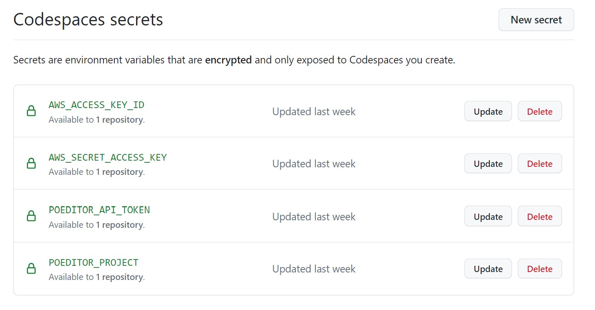
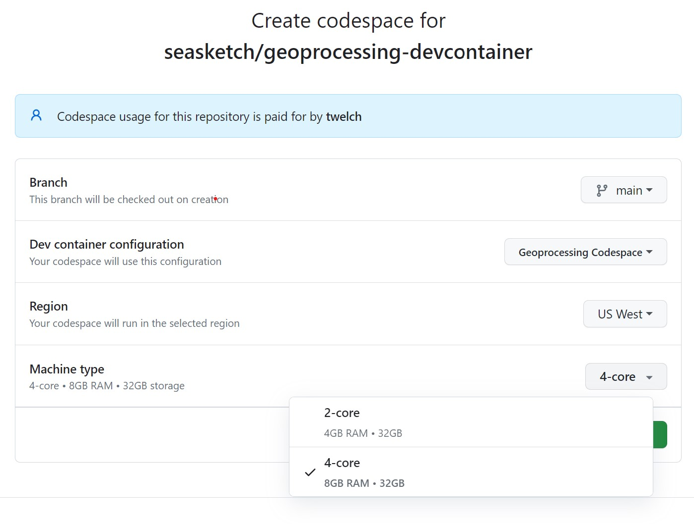
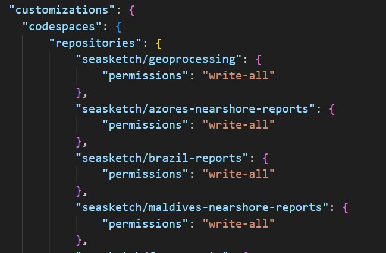
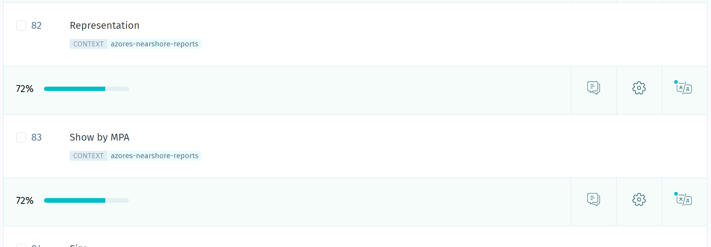
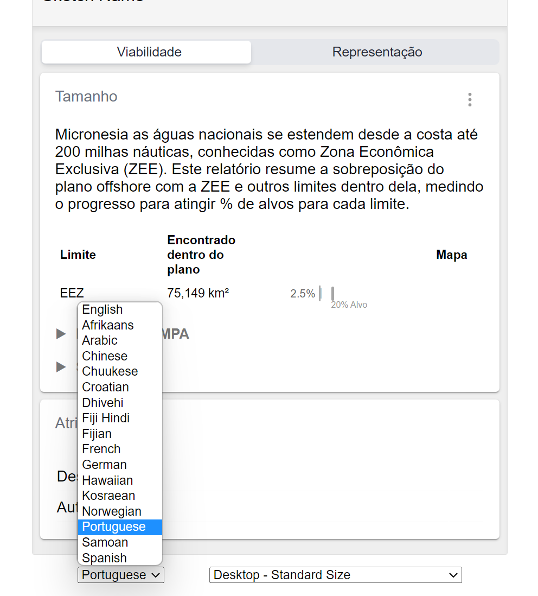

These tutorials will teach you the fundamentals of creating and deploying a seasketch `geoprocessing` project. They expect you have a basic working knowledge of your computer, command line interfaces, and web application development.  There is also a limit to what the framework can do out of the box and at some point you will likely need to extend it to create custom reports.  What follows is a short list of resources to help you:

* [Git and Github](https://www.youtube.com/watch?v=RGOj5yH7evk)
* [Node JS](https://www.freecodecamp.org/news/what-is-node-js/) development
* [VSCode](https://www.youtube.com/watch?v=WPqXP_kLzpo) integrated development environment (IDE)
* [Code debugging](https://www.freecodecamp.org/news/what-is-debugging-how-to-debug-code/)
* [Bash](https://www.freecodecamp.org/news/linux-command-line-bash-tutorial/) command line
* [React](https://www.freecodecamp.org/learn/front-end-development-libraries/#react) user interface development
* [Typescript](https://www.freecodecamp.org/news/programming-in-typescript/) code development
* [QGIS](https://www.qgis.org/en/site/) and [tutorials](https://www.qgistutorials.com/en/)
* [GDAL](https://gdal.org/index.html) and [tutorials](https://gdal.org/tutorials/index.html)

# Tutorial List

Get started:
* [Initial system setup](#initial-system-setup)
* [Setup an existing geoprocessing project](#setup-an-exising-geoprocessing-project)
* [Create a new geoprocessing project](#create-a-new-geoprocessing-project)

See sidebar for additional tutorials

# Assumptions

Unless otherwise instructed:

* You are working within VSCode, with your top-level directory open as the project workspace
* All commands are entered within a VSCode terminal, usually with the top-level project directory as the current working directory

# Initial System Setup

This tutorial gets your system ready to [create a new geoprocessing project](#create-a-new-geoprocessing-project) or [setup an existing project](#setup-an-exising-geoprocessing-project).

Examples of existing projects for reference and inspiration.  Note, some may use older versions of the geoprocessing library and may look a little different.

* [FSM Reports](https://github.com/seasketch/fsm-reports)
* [Samoa Reports](https://github.com/seasketch/samoa-reports)
* [Maldives Nearshore Reports](https://github.com/seasketch/maldives-nearshore-reports)
* [Azores Nearshore Reports](https://github.com/seasketch/azores-nearshore-reports)

You will need a computer running at least:

* Windows 11
* MacOS 11.6.8 Big Sur
* Linux: untested but recent versions of Linux such as Ubuntu, Debian, or Fedora should be possible that are capable of running VSCode and Docker Desktop.

Web browser:

* Chrome is the most common but Firefox, Safari, Edge can also work.  Their developer tools will all be a little different.

## Install Options

You have 3 options for how to develop geoprocessing projects

1. Github Codespace
    * Github provides a server running Ubuntu Linux, pre-configured to develop your geoprocessing project.  Your local VSCode editor connects to it.
    * Best for: beginners trying things out
    * Pros
      * Easiest to get started.  The codespace is managed by Github and connection to VSCode running locally is seamless.
    * Cons
      * Because the docker environment is completely in "the cloud", there are different limitations for bringing datasets into your environment.  Syncing with network drives like Box and Google Drive is not yet solved but may be possible.  Best-suited for projects utilizing external datasources, or reasonably sized files that can be kept directly in the repository.
2. Local Docker environment
    * Docker provides a sandboxed Ubuntu Linux environment on your local computer, setup specifically for geoprocessing projects.
    * Best for: intermediate to power users doing development every day
    * Pros
      * Provides a fully configured environment, with installation of many of the third-party dependencies already take care of.
      * Docker workspace is isolated from your host operating system.  You can remove or recreate these environment as needed.
      * You can work completely offline once you are setup.
    * Cons
      * You will need to get comfortable with Docker Desktop software.
      * Docker is slower than running directly on your system (maybe 30%)
      * Syncing data from network drives like Box into the Docker container is more challenging.
3. MacOS Bare Metal / Windows WSL
    * All geoprocessing dependencies are installed and maintained directly by you on your local computer operating system.  For MacOS this means no virtualization is done.  For Windows, this means running Ubuntu via WSL2 aka the Windows Subsystem for Linux.
    * Best for - power user.
    * Pros - fastest speeds because you are running without virtualization (aka bare metal)
    * Cons - prone to instability and issues due to progression of dependency versions or operating system changes. Difficult to test and ensure stable support for all operating systems and processors (amd64, arm64).

Choose an option and follow the instructions below to get started.  You can try out different options over time.

## If Install Option #1 - Github Codespace

* Install [VS Code](https://code.visualstudio.com)
* Setup or log in to your [Github account](https://github.com/)

If you are a developer on the SeaSketch team:

* You will work directly with this [devcontainer repository](`https://github.com/seasketch/geoprocessing-devcontainer`).  Skip to the next section.

If you are a developer independent of seasketch:

* You will need to create your own devcontainer repository in your own Github user account, or your own organization.
* Go to this [devcontainer repository](https://github.com/seasketch/geoprocessing-devcontainer-tpl).
* Click the green `Use this template` button and `Create a new repository`.


* You can call this repository `geoprocessing-devcontainer`.  And if you create it under a Github organization, then everyone in the organization will be able to utilize it.

Now you're ready to setup codespaces for this devcontainer:

* Configure Github secrets for all environment variables your codespace will need for accessing POEditor and Amazon Web Services.
  * Go to your [Github codespace settings](https://github.com/settings/codespaces)
  * Define each of the following Codespaces secrets found in the screenshot.
  * your POEditor API token you can find here - https://poeditor.com/account/api.  If you don't have one, then follow the instructions to [create your own](#setup-poeditor-as-an-independent-developer)
  * You can leave your AWS credentials blank until you set them up in a later tutorial when you want to deploy your project.



* Browse to `https://github.com/seasketch/geoprocessing-devcontainer`
* Click the green `Code` button, then the `Codespaces` tab, then `New with options...`


* Accept all defaults, except choose a Machine type of `4-core` which provides the minimum 8GB of ram needed.  This codespace can be run for 30 hours per month for free, and will cost $0.36 per hour after that.  See [Github codespace pricing](https://docs.github.com/en/billing/managing-billing-for-github-codespaces/about-billing-for-github-codespaces) for more information.



* It will automatically attempt to open your local VSCode editor and connect it to the codespace.  You will be prompted to allow this to happen.

## If Install Option #2 - Local Docker Environment

* Install [Docker Desktop](https://www.docker.com/products/docker-desktop/) for either Apple chip or Intel chip as appropriate to your system and make sure it's running.
  * If you don't know which you have, click the apple icon in the top left and select `About This Mac` and look for `Processor`
* Install [VS Code](https://code.visualstudio.com) and open it
* Clone the geoprocessing devcontainer repository to your system

```bash
git clone https://github.com/seasketch/geoprocessing-devcontainer
```

* Open the geoprocessing-devcontainer folder in VSCode
  * `File` -> `Open Folder` -> geoprocessing-devcontainer folder

* If you are prompted to install suggested extensions, then do so, otherwise go to the Extension panel and install the following:
  * Remote Development
  * Dev Containers
  * Docker
  * Remote Explorer
* Once you have DevContainer support, you should be prompted to ”Reopen folder to develop in a container”.  <b>*Do not do this yet.*</b>
* Under the `.devcontainer/local-dev` folder, make a copy of the `.env.template` file and rename it to `.env`.
  * Fill in your POEditor API token for you account, which you can find here - https://poeditor.com/account/api.  If you don't have one, then follow the instructions to [create your own](#setup-poeditor-as-an-independent-developer).
* If you have a data folder to mount into the docker container from your host operating system, edit the `.devcontainer/local-dev/docker-compose.yml` file and uncomment the volume below this comment
  * `# Bound host volume for Box data folder`
  * The volume is preset to bind to your Box Sync folder in you home directory but you can change it to any path in your operating system where your data resides for all your projects.
* To start the devcontainer at any time
  * `Cmd-Shift-P` to open command palette
  * type “Reopen in container” and select the Dev Container command to do so.
  * VSCode will reload, pull the latest `geoprocessing-workspace` docker image, run it, and start a remote code experience inside the container.  
* Once container starts
  * It will automatically clone the geoprocessing repository into your environment under `/workspaces/geoprocessing`, and then run `npm install` to install all dependencies.  Wait for this process to finish which can take up to 3-4 minutes the first time.
  * `Ctrl-J` will open a terminal inside the container.
  * Navigate to geoprocessing and verify tests run successfully.
    * `cd /workspaces/geoprocessing`
    * `npm run test`

If success, then you're now ready to create a new geoprocessing project in your devcontainer environment.

* To stop devcontainer at any time
  * `Cmd-Shift-P` to open command palette and type `“DevContainers: Rebuild and Reopen locally”` to find command and hit Enter.
  * Choose `Local Workspace`
  * Your devcontainer will now bootstrap, downloading the geoprocessing docker image and installing everything.
* Notice the bottom left blue icon in your vscode window.  It may say `Opening remote connection` and eventually will say `Dev Container: Geoprocessing`.  This is telling you that this VSCode window is running in a devcontainer environment.
* To exit your devcontainer:
  * Click the blue icon in the bottom left, and click `Reopen locally`.  This will bring VSCode back out of the devcontainer session.
* To delete a devcontainer:
  * This is often the easiest way to "start over" with your devcontainer.
  * First, make sure you've pushed all of your code work to Github.
  * Make sure you stop your active VSCODE devcontainer session.
  * Open the Remote Explorer panel in the left sidebar.
  * You can right-click and delete any existing devcontainers and volumes to start over.
  * You can also see and delete them from the Docker Desktop app, but it might not be obvious which containers and volumes are which.  The VSCode Remote Explorer window gives you that context.


* To upgrade your devcontainer:
  * The devcontainer settings in this repository may change/improve over time.  You can always pull the latest changes for your `geoprocessing-devcontainer` repository, and then `Cmd-Shift-P` to open command palette and type `“DevContainers: Rebuild and Reopen locally”`.
* To upgrade the `geoprocessing-workspace` Docker image
  * This devcontainer builds on the `geoprocessing-workspace` Docker image published at [Docker Hub](https://hub.docker.com/r/seasketch/geoprocessing-workspace/tags).  It will always install the latest version of this image when you setup your devcontainer for the first time.
  * It is up to you to upgrade it after the initial installation.  The most likely situation is:
    * You see some changes in the [Changelog](https://github.com/seasketch/docker-gp-workspace/blob/main/Changelog.md) that you want to utilize.
    * You are upgrading the `geoprocessing` library for your project to a newer version and it requires additional software that isn't in your current devcontainer.  This situation should be flagged in the geoprocessing [changelog](https://github.com/seasketch/geoprocessing/blob/dev/CHANGELOG.md).
  * In both cases you should be able to simply update your docker image to the latest.  The easiest way to do this is to:
    * Push all of your unsaved work in your devcontainer to Github.  This is in case the Docker `named volume` where your code lives (which is separate from the devcontainer) is somehow lost.  There are also ways to make a backup of a named volume and recover it if needed but that is an advanced exercise not discussed at this time.
    * Stop your devcontainer session
    * Go to the `Images` menu in Docker Desktop, finding your `seasketch/geoprocessing-workspace`.
    * If it shows as "IN USE" then switch to the `Containers` menu and stop all containers using `seasketch/geoprocessing-workspace`.
    * Now switch back to `Images` and pull a new version of the `seasketch/geoprocessing-image` by hovering your cursor over the image, clicking the 3-dot menu on the right side and the clicking `Pull`.   This will pull the newest version of this image.
    * Once complete, you should be able to restart your devcontainer and it will be running the latest `geoprocessing-workspace`.

## Option #3 - MacOS Bare Metal / Windows WSL

### MacOS

* Install [Docker Desktop](https://www.docker.com/products/docker-desktop/)
  * For MacOS, choose either Apple chip or Intel chip as appropriate to your system and make sure it's running.  If you don't know which you have, click the apple icon in the top left and select `About This Mac` and look for `Processor`.
* Install [Node JS](https://nodejs.org/en/download/) >= v16.0.0
  * [nvm](https://github.com/nvm-sh/nvm) is great for this, then `nvm install v16`.  May ask you to first install XCode developer tools as well which is available through the App Store or follow the instructions provided when you try to install nvm.
  * Then open your Terminal app of choice and run `node -v` to check your node version
* Install [VS Code](https://code.visualstudio.com)
  * Install recommended [extensions](https://code.visualstudio.com/docs/editor/extension-marketplace) when prompted.  If not prompted, go to the `Extensions` panel on the left side and install the extensions named in [this file](https://github.com/seasketch/geoprocessing/blob/dev/packages/geoprocessing/templates/project/.vscode/extensions.json)

* Install [NPM](https://www.npmjs.com/) package manager >= v8.5.0 after installing node.  The version that comes with node may not be recent enough.
  * `npm --version` to check
  * `npm install -g latest`

* Install [Java runtime](https://www.java.com/en/download/) for MacOS (required by AWS CDK library)

* Create a free Github account if you don't have one already
  * Set your git username

### Windows

For Windows, you won't actually be running bare metal.  your `geoprocessing` project and the underlying code run in a Docker container running Ubuntu Linux.  This is done using the Windows Subsystem for Linux (WSL2) so performance is actually quite good.  Docker Desktop and VSCode both know how to work seamlessly with WSL2.  Some of the building blocks you will install in Windows (Git, AWSCLI) and link them into the Ubuntu Docker container.  The rest will be installed directly in the Ubuntu Docker container.

In Windows:

* Install [WSL2 with Ubuntu distribution](https://learn.microsoft.com/en-us/windows/wsl/install)
* Install [Docker Desktop with WSL2 support](https://docs.docker.com/desktop/windows/wsl/) and make sure Docker is running
* Open start menu -> `Ubuntu on Windows`
  * This will start a bash shell in your Ubuntu Linux home directory

In Ubuntu:

* Install [Java runtime](https://stackoverflow.com/questions/63866813/what-is-the-proper-way-of-using-jdk-on-wsl2-on-windows-10) in Ubuntu (required by AWS CDK library)
* Install [Git in Ubuntu and Windows](https://learn.microsoft.com/en-us/windows/wsl/tutorials/wsl-git)
* Install [VS Code](https://learn.microsoft.com/en-us/windows/wsl/tutorials/wsl-vscode) in Windows and setup with WSL2.
  * Install recommended [extensions](https://code.visualstudio.com/docs/editor/extension-marketplace) when prompted.  If not prompted, go to the `Extensions` panel on the left side and install the extensions named in [this file](https://github.com/seasketch/geoprocessing/blob/dev/packages/geoprocessing/templates/project/.vscode/extensions.json)
* Install [Node JS](https://nodejs.org/en/download/) >= v16.0.0 in Ubuntu
  * [nvm](https://github.com/nvm-sh/nvm) is great for this, then `nvm install v16`.
  * Then open your Terminal app of choice and run `node -v` to check version
* Install [NPM](https://www.npmjs.com/) package manager >= v8.5.0 after installing node.  The version that comes with node may not be recent enough.
  * `npm --version` to check
  * `npm install -g latest`

## Final Steps

Whichever option you chose, if you haven't already, establish the [username](https://docs.github.com/en/get-started/getting-started-with-git/setting-your-username-in-git?platform=mac) and email address git should associate with your commits.

You can set these per repository, or set them globall on your system for all repositories and override them as needed.  Here's the commands to set globally for your environment.

```bash
git config --global user.name "Your Name"
git config --global user.email "yourusername@yourprovider.com"
```

Now verify it was set:

```bash
# If you set global - all repos
cat ~/.gitconfig

# If you set local - current repo
cat .git/config
```

At this point your system is ready for you to `create a new project`, or `setup an existing project`

# Setup an exising geoprocessing project

This use case is where a geoprocessing project already exists, but it was developed on a different computer.

First, clone your existing geoprocessing project to your work environment, whether this is in your codespace, local docker devcontainer, Windows WSL, or bare metal on your operating system.

## Link your source data

1. figure out [which option](#link-project-data) was used to bring data into your geoprocessing project, and follow the steps to set it up.

* Option 1, you're good to go, the data should already be in `data/src` and src paths in `project/datasources.json` should have relative paths pointing into it.
* Option 2, Look at `project/datasources.json` for the existing datasource paths and if your data file paths and operating system match you may be good to go.  Try re-importing your data as below, and if it fails consider migrating to Option 1 or 3.
* Option 3, if you're running a devcontainer you'll need to have made your data available in workspace by mounting it from the host operating system via docker-compose.yml (see installation tutorial) or have somehow synced or downloaded it directly to your container.  Either way, you then just need to symlink the `data/src` directory in your project to your data.  Make sure you point it to the right level of your data folder.  Check the src paths in `project/datasources.json`.  If for example the source paths start with `data/src/Data_Received/...` and your data directory is at `/Users/alex/Library/CloudStorage/Box-Box/ProjectX/Data_Received`, you want to create your symlink as such

```bash
ln -s /Users/alex/Library/CloudStorage/Box-Box/ProjectX data/src
```

Assuming `data/src` is now populated, you need to ensure everything is in order.

2.Reimport your data

This will re-import, transform, and export your data to `data/dist`, which is probably currently empty.

```bash
npm run reimport:data
```

Say yes to reimporting all datasources, and no to publishing them (we'll get to that).

If you see error, look at what they say.  If they say datasources are not being found at their path, then something is wrong with your drive sync (files might be missing), or with your symlink if you used option 3.

If all is well, you should see no error, and `data/dist` should be populated with files. In the Version Control panel your datasources.json file will have changes, including some updated timestamps.

But what if git changes show a lot of red and green?

* You should look closer at what's happening.  If parts of the smoke test output (examples directory JSON files) are being re-ordered, that may just be because Javascript is being a little bit different in how it generates JSON files from another computer that previously ran the tests.
* If you are seeing changes to your precalc values in precalc.json, then your datasources may be different from the last person that ran it.  You will want to make sure you aren't using an outdated older version.  If you are using an updated more recent version, then convince yourself the changes are what you expect, for example total area increases or decreases.

What if you just can't your data synced properly, and you just need to move forward?

* If the project was deployed to AWS, then there will be a copy of the published data in the `datasets` bucket in AWS S3.
* To copy this data from AWS back to your `data/dist` directory use the following, assuming your git repo is named `fsm-reports-test`
  * `aws s3 sync s3://gp-fsm-reports-test-datasets data/dist`

# Create a New Geoprocessing Project

Assuming [initial system setup](#initial-system-setup) is complete.

This tutorial now walks through generating a new geoprocessing project codebase and committing it to Github.

## Create Github Repository

First, we'll establish a remote place to store your code.

* [Create a new Github repository](https://github.com/new) called `fsm-reports-test` (you can pick your own name but the tutorial will assume this name). When creating, do not initialize this repository with any files like a README.
* In your VSCode terminal, make sure you are in your projects top-level directory.  A shorthand way to do this is `cd ~/src/fsm-reports-test`.

### If running codespace (Install Option 1)

When developing within a codespace, you need to give it permission to read and write files from other repositories.  You should have VSCode open and connected to your devcontainer codespace, with no outstanding uncommitted work.  Then do the following:

* In VSCode, edit the .devcontainer/devcontainer.json and add your new geoprocessing project repository `[your_organization_or_username]/fsm-report-test` to the list.  You will do this for each geoprocessing project you create and maintain in this devcontainer, which can be many.
* Commit and push these changes.



At this point, you need to close your VSCode codespace session and `delete` your existing codespace.  Wait at least one minute for the codespace to be fully delete.  Then recreate a new codespace and it will allow you to enable the new write permissions to your geoprocessing project repository.  It's unfortunate that you need to delete your codespace and recreate it for you to be prompted to enable these permissions, hopefully it will be made simpler in the future.  You can read more [here](https://docs.github.com/en/codespaces/managing-your-codespaces/managing-repository-access-for-your-codespaces#authorizing-requested-permissions)

## Final Steps

Now enter the following commands to establish your project as a git repository, connect it to your Github repository you created as a remote called "origin", and finally push your code up to origin.

```bash
git init
git add .
git commit -m "first commit"
git branch -M main
git remote add origin https://github.com/PUT_YOUR_GITHUB_ORG_OR_USERNAME_HERE/fsm-reports-test.git
git push -u origin main
```

It may ask you if it can use the Github extension to sign you in using Github.  It will open a browser tab and communicate with the Github website.  If you are already logged in there, then it should be done quickly, otherwise it may have you log-in to Github.

You should eventually see your code commit proceed in the VSCode terminal.  You can then browse to your Github repository and see that your first commit is present at https://github.com/[YOUR_GITHUB_ORG_OR_USERNAME]/foo-reports

After this point, you can continue using git commands right in the terminal to stage code changes and commit them, or you can use VSCode's [built-in git support](https://code.visualstudio.com/docs/sourcecontrol/overview).

## If running devcontainer or codespace (Install Option 1 and 2)

* Ensure your VSCode workspace is connected to your devcontainer
* You can now create as many geoprocessing projects as you want under `/workspaces` and they will persist as long as the associated docker volume is maintained.  Each project you create should be backed by a Github repository which you should regularly commit your code to in order to ensure it's not lost.

To get started:

* Open a terminal with Ctrl-J if not already open
* `cd /workspaces`

## If Running Bare Metal (Install Option 3)

Windows:

* Open start menu -> `Ubuntu on Windows`
  * This will start a bash shell in your Ubuntu Linux home directory
* Create a directory to put your source code
  * `mkdir -d src`
* Start VSCode in the Ubuntu terminal
  * `code .`
  * This will install a vscode-server package that bridges your Windows and Ubuntu Linux environments so that VSCode will run in Windows and connect with your source code living in your Ubuntu Linux project directory.
* Open a terminal in VSCode with `Ctrl-J` in Windows or by clicking Terminal -> New Terminal.
  * The current directory of the terminal should be your project folder.

MacOS:

* Open Finder -> Applications -> VSCode
* Open a terminal in VSCode with `Command-J` or by clicking Terminal -> New Terminal
* Create a directory to put your source code and change to that directory
  * `mkdir -d src && cd src`

## Final Steps (All Install Options)

Now we'll create a new project using `geoprocessing init`.

```sh
npx @seasketch/geoprocessing init
```

This command uses `npx`, which comes with `npm` and allows you to execute commands in a package.  In this case it will fetch the `geoprocessing` library from the `npm` repository and run the `geoprocessing init` command to create a new project.

`init` will download the framework, and then collect project metadata from you by asking questions.

## Project metadata

As an example, assume you are developing reports for the country of `The Federated States of Micronesia`.

```text
? Choose a name for your project fsm-report-test
? Please provide a short description of this project Test drive
```

Now paste the URL of the github repository you created in the first step

```text
? Source code repository location https://github.com/[YOUR_USERNAME_OR_ORG]/fsm-reports-test
```

You will then be asked for the name and email that establishes you as the author of this project.  It will default to your git settings.  Change it as you see fit for establishing you as the author of the project.

```text
? Your name Alex
? Your email alex@gmail.com
```

Now provide your organization name associated with authoring this project

```text
? Organization name (optional)
```

Choose a software license.  [SeaSketch](https://github.com/seasketch/next/blob/master/LICENSE) and [Geoprocessing](https://github.com/seasketch/geoprocessing/blob/dev/LICENSE) both use BSD-3 (the default choice).  If you are not a member of SeaSketch you are not required to choose this.  In fact, you can choose `UNLICENSED` meaning proprietary or "All rights reserved" by you, the creator of the work.

```text
? What software license would you like to use? BSD-3-Clause
```

Choose an AWS region you would like to deploy the project. The most common is to choose `us-west-1` or `us-east-1`, the US coast closest to the project location.  In some circumstances it can make sense to choose locations in Europe, Asia, Australia, etc. that are even closer but in practice this usually doesn't make a significant difference.

```text
? What AWS region would you like to deploy functions in?
```

Now enter the type of planning area for your project.  Choose Exclusive Economic Zone which is the area from the coastline to 200 nautical miles that a country has jurisdiction over.

```text
? What type of planning area does your project have? Exclusive Economic Zone (EEZ)
```

Since you selected EEZ, it will now ask what countries EEZ to use.  Choose Micronesia

```text
? What countries EEZ is this for? Micronesia.
```

If you answered `Other` to type of planning area it will now ask you for the name of this planning area.

```text
?  Is there a more common name for this planning area to use in reports than Micronesia? (Use arrow keys)
❯ Yes
  No
```

Answer `No`.  If you answered yes it would ask you:

```text
What is the common name for this planning area?
```

Finally, you will be asked to choose a starter template.  Choose `template-ocean-eez`. It will come with some features out of the box that are designed for EEZ planning.  `template-blank-project` is a barebones template and let's you start almost from scratch.

```text
? What starter-template would you like to install?
  template-blank-project - blank starter project
❯ template-ocean-eez - template for ocean EEZ planning project
```

After pressing Enter, your project will finish being created and installing all dependencies in `~/src/fsm-reports`.

## Blank starter project

Note, if you had selected `Blank starter project` as your template, it would then ask you for the bounding box extent of your projects planning area, in latitude and longitude.

```text
? What is the projects minimum longitude (left) in degrees (-180.0 to 180.0)?
? What is the projects minimum latitude (bottom) in degrees (-180.0 to 180.0)?
? What is the projects maximum longitude (right) in degrees (-180.0 to 180.0)?
? What is the projects maximum latitude (top) in degrees (-180.0 to 180.0)?
```

The answers to these questions default to the extent of the entire world, which is a reasonable place to start.  This can be changed at a later time.

# Open in VSCode Workspace and Explore Structure

Next, to take full advantage of VSCode you will need to open your new project and establish it as a workspace.

## If Running Devcontainer or Codespace (Install Option 1 and 2)

Once you have more than one folder under `/workspaces` backed by a git repository, VSCode will be default to a `multi-root` workspace.

For the best experience, you will want open a single workspace in your VSCode for a single folder in your devcontainer.

`File` -> `Open folder` -> /workspaces/fsm-report-test

VSCode should now reopen the under this new workspace, using the existing devcontainer, and you're ready to go.

## If Running Bare Metal (Install Option 3)

Type `Command-O` on MacOS or `Ctrl-O` on Windows or just click `File`->`Open` and select your project under `[your_username]/src/fsm-reports-test`

VSCode will re-open and you should see all your project files in the left hand file navigator.

* Type `Command-J` (MacOS) or `Ctrl-J` (Windows) to reopen your terminal.  Make this a habit to have open.

## Project Structure

Next, take some time to learn more about the structure of your new project, and look through the various files.  You can revisit this section as you get deeper into things.

### Configuration Files and Scripts

There are a variety of project configuration files.  Many have been pre-populated usings your answers to the initial questions.  You can hand edit most of these files later to change them, with some noted exceptions.

* `package.json` - Javascript [package](https://docs.npmjs.com/cli/v9/configuring-npm/package-json) configuration that defines things like the project name, author, and third-party dependencies.  The [npm](https://docs.npmjs.com/cli/v6/commands) command is typically used to add, upgrade, or remove dependencies using `npm install`, otherwise it can be hand-edited.
* `geoprocessing.json` - file used to register assets to be bundled for deployment.  If they aren't registered here, then they won't be included in the bundle.
* `tsconfig.json` - contains configuration for the [Typescript](https://www.typescriptlang.org/docs/handbook/tsconfig-json.html) compiler
* `project/` - contains project configuration files.  
  * `basic.json` - contains basic project configuration.
    * `planningAreaType`: `eez` or `other`
    * bbox - the bounding box of the project as [bottom, top, left, right].  This generally represents the area that users will draw shapes.  It can be used as a boundary for clipping, to generate examples sketches, and as a window for fetching from global datasources.
    * `planningAreaId` - the unique identifier of the planning region used by the boundary dataset.  If your planningAreaType is `eez` and you want to change it, you'll find the full list [in github](#https://raw.githubusercontent.com/seasketch/geoprocessing/dev/packages/geoprocessing/scripts/global/datasources/eez_land_union_v3.json), just look at the UNION property for the id to use
    * `planningAreaName` - the name of the planning region (e.g. Micronesia)
    * `externalLinks` - central store of links that you want to populate in your reports.
  * `geographies.json` - contains one or more planning geographies for your project.  If you chose to start with a blank project template, you will have a default geography of the entire world.  If you chose to start with the Ocean EEZ template, you will have a default geography that is the EEZ you chose at creation time.  Geographies must be manually added/edited in this file.  You will then want to re-run `precalc` and `test` to process the changes and make sure they are working as expected. Learn more about [geographies](./Concepts.md#geographies)
  * `datasources.json` - contains an array of one or more registered datasources, which can be global (url) or local (file path), with a format of vector or raster or subdivided.  Global datasources can be manually added/edited in this file, but local datasources should use the [import](#import-datasource) process.  After import, datasources can be manually added/edited in this file.  You will then want to run `reimport:data`, `precalc:data`, `precalc:clean`, and `test` to process the changes and make sure they are working as expected. Learn more about [datasources](./Concepts.md#datasources)
  * `metrics.json` - contains an array of one or more metric groups.  Each group defines a metric to calculate, with one or more data classes, derived from one or more datasources, measuring progress towards a planning objective.  An initial boundaryAreaOverlap metric group is included in the file by default that uses the global eez datasource.  Learn more about [metrics](./Concepts.md#metrics)
  * `objectives.json` - contains an array of one or more objectives for your planning process.  A default objective is included for protection of `20%` of the EEZ.  Objectives must be manually added/edited in this file.  Learn more about [objectives](./Concepts.md#objectives)
  * `precalc.json` - contains precalculated metrics for combinations of geographies and datasources. Specifically it calculates for example the total area/count/sum of the portion of a datasources features that overlap with each geography.  This file should not be manually edited.  If you have custome metrics/precalculations to do, then use a separate file.  Learn more about the [precalc](#precalc-data) command.

The object structure in many of the JSON files, particularly the `project` folder, follow strict naming and structure (schema) that must be maintained or you will get validation errors when running commands.  Adding additional undocumented properties may be possible, but is not tested.  The schemas are defined here:

* [Basic](https://github.com/seasketch/geoprocessing/blob/dev/packages/geoprocessing/src/types/projectBasic.ts)
* [Geographies](https://github.com/seasketch/geoprocessing/blob/dev/packages/geoprocessing/src/types/geography.ts)
* [Datasources](https://github.com/seasketch/geoprocessing/blob/dev/packages/geoprocessing/src/types/datasource.ts)
* [MetricGroup](https://github.com/seasketch/geoprocessing/blob/dev/packages/geoprocessing/src/types/metricGroup.ts)
  * [DataClass](https://github.com/seasketch/geoprocessing/blob/dev/packages/geoprocessing/src/types/dataclass.ts)
* [Objective](https://github.com/seasketch/geoprocessing/blob/dev/packages/geoprocessing/src/types/objective.ts)
* [Precalc Metrics](https://github.com/seasketch/geoprocessing/blob/dev/packages/geoprocessing/src/types/metrics.ts)

### Project Assets

* `src/` - contains all source code
  * `clients/` - report clients are React UI components that can be registered with SeaSketch and when given a sketch URL as input, are able to run the appropriate geoprocessing functions and display a complete report.  This can include multiple report pages with tabbed navigation.
  * `components/` - components are the UI building blocks of report clients.  They are small and often reusable UI elements.  They can be top-level ReportPage components, ResultCard components within a page that invoke geoprocessing functions and display the results, or much lower level components like custom Table or Chart components.  You choose how to build them up into sweet report goodness.
  * `functions/` - contains preprocessor and geoprocessor functions that take input (typicall sketch features) and return output (typically metrics).  They get bundled into AWS Lambda functions and run on-demand.
  * `i18n/` - contains building blocks for localization aka language translation in reports.
    * `scripts/` - contains scripts for working with translations
    * `lang/` - contains english terms auto-extracted from this projects report clients and their translations in one or more languages.
    * `baseLang/` - contains english terms and their translations for all UI components and report client templates available through the geoprocessing library.  Used to seed the `lang` folder and as a fallback.
    * `config.json` - configuration for integration with POEditor localization service.
    * `extraTerms.json` - contains extra translations. Some are auto-generated from configuration on project init, and you can add more such as plural form of terms.
    * `i18nAsync.ts` - creates an i18next instance that lazy loads language translations on demand.
    * `i18nSync.ts` - creates an i18nnext instance that synchronously imports all language translations ahead of time.  This is not quite functional, more for research.
    * `supported.ts` - defines all of the supported languages.

A [ProjectClient](https://seasketch.github.io/geoprocessing/api/classes/geoprocessing.ProjectClientBase.html) class is available in `project/projectClients.ts` that is used in project code for quick access to all project configuration including methods that ease working with them. This is the bridge that connects configuration with code and is the backbone of every geoprocessing function and report client.

### Other Files

* `node_modules` - contains all of the npm installed third-party code dependencies defined in package.json
* `README.md` - default readme file that becomes the published front page of your repo on github.com.  Edit this with information to help your users understand your project.  It could include information or sources on metric calculations and more.
* `package-lock.json` - contains [cached metadata](https://docs.npmjs.com/cli/v9/configuring-npm/package-lock-json) on the 3rd party modules you have installed.  Updates to this file are made automatically and you should commit the changes to your repository at the same time as changes to your package.json.
* `.nvmrc` - a lesser used config file that works with nvm to define the node version to use for this project.  If you use nvm to manage your node version as suggested then you can run `nvm use` in your project and it will install and switch to this version of node.

To learn more, check out the [Architecture](/Architecture.md) page

# Generate Examples

In order to create and test out the functions and report clients installed with `template-ocean-eez`, we need sample data that is relevant to our planning area.  Scripts are available that make this easy.

`genRandomSketch` - generates a random Sketch polygon within the extent of your planning area, which are most commonly used as input to geoprocessing functions.  Run it without any arguments to generate a single Sketch polygon in the `examples/sketches` directory of your project.  Run it with an argument of `10` and it will generate a SketchCollection with 10 random Sketch polygons.

```bash
npx ts-node scripts/genRandomSketch.ts
npx ts-node scripts/genRandomSketch.ts 10
```

`genRandomFeature` - generates random Feature Polygons within the extent of your planning area, which are most commonly used as input to preprocessing functions. Run it without any arguments to generate a single Sketch polygon in the `examples/features` directory of your project.

```bash
npx ts-node scripts/genRandomFeature.ts
```

## Differences

Look closely at the difference between the example features and the example sketches and sketch collections. Sketch and sketch collections are just GeoJSON Feature and FeatureCollection's with some extra attributes.  That said, sketches and sketch collections are technically not compliant with the GeoJSON spec but they are often passable as such in most tools.

## Create Custom Sketches

In addition to these scripts, you can create features and sketches using your GIS tool of choice, or draw your own polygons using [geojson.io](https://geojson.io)

# Precalc Data

Once you have geographies and datasources configured, you can precalculate metrics for them.

```bash
npm run precalc:data
```

Precalc will start a web server on localhost port 8001 that serves up data from `data/dist` access by this command.

You need to have at least one geography in geographies.json and one datasource in datasources.json with the `precalc` property set to true.  The command will measure (total area, feature count, value sum) the portion of a datasources features that fall within the geography (intersection).

These overall metric values are used almost exclusively for calculating % sketch overlap, they provide the denominator value.  For example, if you have a geography representing the EEZ of a country, and you have a sketch polygon, and you have a datasource representing presence of seagrass.  And you want to know the percentage of seagrass that is within the sketch, relative to how much seagrass is in the whole EEZ boundary.

`seagrass sketch % = seagrass area within sketch / seagrass area within EEZ`

We can and often need to precalculate that denominator for all possible geographies.  That is what the `precalc:data` command does, it precalculates a set of metrics for all datasources against all geographies, where the `precalc` property is set to true in both the datasource and the geography.

Precalc metrics are then imported into a report client, and combined with the sketch overlap metrics returned from the geoprocessing function, to produce a percentage.

Tips for precalculation:
* You have to re-run `precalc:data` every time you change a geography or datasource.
* Set `precalc:false` for datasources that are not currently used, or are only used to define a geography (not displayed in reports).  This is why the datasource for the default geography for a project is always set by default to `precalc: false`.
* If you are using one of the [global-datasources](https://github.com/seasketch/global-datasources) in your project, and you want to use it in reporting % sketch overlap, so you've set `precalc:true`, strongly consider defining a `bboxFilter`.  This will ensure that precalc doesn't have to fetch the entire datasource when precalculating a metric, which can be over 1 Gigabyte in size.  Also consider setting a `propertyFilter` to narrow down to just the features you need.  This filter is applied on the client-side so it won't reduce the number of features you are sending over the wire.

## Precalc Data Cleanup

If you remove a geography/datasource, then in order to remove their precalculated metrics from `precalc.json`, you will need to run the cleanup command.

```bash
npm run precalc:data:cleanup
```

# Test your project

Now that you have sample sketches and features, you can run the test suite.

```bash
npm run test
```

This will start a web server on port 8080 that serves up the `data/dist` folder.  Smoke tests will run geoprocessing functions against all of the sketches and features in the `examples` folder.  `projectClient.getDatasourceUrl` will automatically read data from localhost:8080 instead of the production S3 bucket url using functions like `fgbFetchAll()`, `geoblaze.parse()`.

## Smoke Tests

Smoke tests, in the context of a geoprocessing project, verify that your preprocessing and geoprocessing function are working, and produce an output, for a given input. It doesn't ensure that the output is correct, just that something is produced. The input in this case is a suite of features and sketches that you manage.

Preprocessing function smoke tests (in this case `src/functions/clipToOceanEezSmoke.test.ts`) will run against every feature in `examples/features` and output the results to `examples/output`.

All geoprocessing function smoke tests (in this case `src/functions/boundaryAreaOverlapSmoke.test.ts`) will run against every feature in `examples/sketches` and output the results to `examples/output`.

Smoke tests are your chance to convince yourself that functions are outputting the right results.  This output is committed to the code repository as a source of truth, and if the results change in the future (due to a code change or an input data change or a dependency upgrade) then you will be able to clearly see the difference and convince yourself again that they are correct.  All changes to smoke test output are for a reason and should not be skipped over.

### Default geography

When smoke tests run, they should run for the default geography, without needing to be told so, but you can still override it.  That's why this is the standard boilerplate for a geoprocessing function.

```typescript
  export async function boundaryAreaOverlap(
  sketch: Sketch<Polygon> | SketchCollection<Polygon>,
  extraParams: DefaultExtraParams = {}
): Promise<ReportResult> {
  const geographyId = getFirstFromParam("geographyIds", extraParams);
  const curGeography = project.getGeographyById(geographyId, {
    fallbackGroup: "default-boundary",
  });
```

If you call boundaryAreaOverlap with only a sketch as input (no extraParams), then `getFirstFromParam()` will return `undefined`, so
`project.getGeographyById` will receive `undefined` and fallback to the geography assigned to the `default-boundary` group, which every project should have at least one, or throw an error.

If you want to run smoke tests against a different geography, just to see what it produces, then you will have to do it explicitly:

```typescript
const metrics = await boundaryAreaOverlap(sketch, {geographyIds: ['my-other-geography']})
```

if you use a `GeographySwitcher` UI component in your story, then it will allow you to switch geographies, but the story will still only receive the metrics for the smoke test you ran, which may only have been run for the default geography.  In this situation, the report will load the precalc metrics for the geography you've chosen in the denominator for percentages, but the numerator metrics will always be for the default geography, or whatever geography you passed to your smoke test.

### Storybook

You can view the results of your smoke tests using Storybook.  It's already configured to load all of the smoke test output for each story.


## Unit Tests

Units tests go further than smoke tests, and verify that output or behavior is correct for a given input.

You should have unit tests at least for utility or helper methods that you write of any complexity, whether for geoprocessing functions (backend) or report clients (frontend).

* [Example](https://github.com/seasketch/geoprocessing/blob/dev/packages/geoprocessing/src/helpers/groupBy.test.ts)

You can also write unit tests for your UI components using [testing-library](https://testing-library.com/docs/react-testing-library/intro/).

* [Example](https://github.com/seasketch/geoprocessing/blob/dev/packages/geoprocessing/src/components/SketchAttributesCard.test.tsx)

# First Project Build

A `build` of your application packages it for deployment so you don't have to build it until you are ready.  Specifically it:

* Checks all the Typescript code to make sure it's valid and types are used properly.
* Transpiles all Typescript to Javascript
* Bundles UI report clients into the `.build-web` directory
* Bundles geoprocessing and preprocessing functions into the `.build` directory.

To build your application run the following:

```bash
npm run build
```

## Debugging build failure

If the build step fails, you will need to look at the error message and figure out what you need to do.  Did it fail in building the functions or the clients?  99% of the time you should be able to catch these errors sooner.  If VSCode finds invalid Typescript code, it will warn you with files marked in `red` in the Explorer panel or with red markes and squiggle text in any of the files.

If you're still not sure try some of the following:

* Run your smoke tests, see if they pass
* When was the last time your build did succeed?  You can be sure the error is caused by a change you made since then either in your project code, by upgrading your geoprocessing library version and not migratin fully, or by changing something on your system.
* You can stash your current changes or commit them to a branch so they are not lost.  Then sequentially check out previous commits of the code until you find one that builds properly.  Now you know that the next commit cause the build error.

# Link Project Data

Sample project data for Micronesia is available for [download](https://github.com/seasketch/geoprocessing/files/10560856/FSM_MSP_Data_Example_v1.zip) along with a QGIS project file for data viewing in desktop GIS.

In order to `import` and `publish` local project data to the cloud, it will need to be accessible on your local computer. There are multiple ways to do this, choose the appropriate one for you.

## Option 1. Keep your data where it is

Nothing to do, you will keep your data where it is on your local computer, and provide a direct path to this location on import.

Pros:

* Simple.  Can start with this and progress to more elaborate strategies
* Keeps your data separate from your code
* Can import data from different parts of your filesystem

Cons:

* Can make it hard to collaborate with others because they'll have to match your file structure, which may not be possible for some reason.

## Option 2. Keep your data in your project repository

Copy your datasources directly into the `fsm-reports-test/data/src` directory.

Pros:

* Data and relative import paths are consistent between collaborators
* Data can be kept under version control along with your code.  Just check out and it's ready to go.

Cons:

* You have an additional copy of your data to maintain.  You may not have a way to tell if your data is out of data or not from the source of truth.
* The github repository can get big fast if you have or produce large datasets.
* If your data should not be shared publicly, then the code repo will need to be kept private, which works against the idea of transparent and open science.
* If any file is larger than 100MB it will require use of [Git LFS](https://docs.github.com/en/repositories/working-with-files/managing-large-files/about-large-files-on-github)
  * Maximum of 5gb file size

MacOS this could be as easy as:

```bash
cp -r /my/project/data data/src
```

Windows, you can copy files from your Windows C drive into Ubuntu Linux using the following:

```bash
cp -r /mnt/c/my_project_data data/src
```

Change the `.gitignore` file to allow you to commit your data/src and data/dist directory to Git.  Remove the following lines:

```bash
data/src/**
data/dist/**
```

It's up to you to not make sensitive data public.  By choosing this option, you are possibly committing to it always being private and under managed access control.

## Option 3. Link Data

A symbolic link, is a file that points to another directory on your system.  What you can do is create a symbolic link at `data/src` that points to the top-level directory where you data is maintained elsewhere on your system.

Pros:

* Keeps your data separate from your code but accessed in a consistent way through the `data/src` path.
* Works with cloud-based drive share products like Box and Google Drive which can be your centralized source of truth.

Cons:

* Symbolic links can be a little harder to understand and manage, but are well documented.
* People managing the source of truth that is linked to may update or remove the data, or change the file structure and not tell you.  Running `reimport` scripts will fail and `datasources.json` paths will need to be updated to the correct place.

Steps:

* First, if you use a Cloud Drive product to share and sync data files, make sure your data is synced and you know the path to access it.  See [access Cloud Drive folder](Tipsandtricks#access-cloud-drive-folder)
* Assuming you are using MacOS and your username is `alex`, your path would be `/Users/alex/Library/CloudStorage/Box-Box`

To create the symbolic link, open a terminal and make sure you are in the top-level directory of your geoprocessing project:

```bash
ln -s /Users/alex/Library/CloudStorage/Box-Box data/src
```

Confirm that the symbolic link is in place, points back to your data, and you can see your data files

```bash
ls -al data
ls -al data/src
```

If you put your link in the wrong folder or pointed it to the wrong place, you can always just `rm data/src` to remove it, then start over.  It will only remove the symbolic link and not the data it points to.

## In Summary

None of these options solve the need for collaborators to manage data carefully, to communicate changes, and to ensure that updates are carried all the way through the data pipeline in a coordinated fashion.  The data won't keep itself in sync.

For all of these options, you can tell if your data is out of sync:

* `data/src` is out of date if the `Date modified` timestamp for a file is older than the timestamp for the same file wherever you source and copy your data from.
* `data/dist` is out of date with `data/src` if the `Date modified` timestampe for a file is older than the timestamp for the same file in `data/src`.

# Import datasource

The framework supports import of both vector and raster datasources and this tutorial assumes you have datasets that you want to import, accessible in the `data/src` directory, because you have [linked your project data](#link-project-data).

## Import vector datasource

Vector datasets can be any format supported by [GDAL](https://gdal.org/drivers/vector/index.html) "out of the box".  Common formats include:

* GeoJSON
* GeoPackage
* Shapefile
* File Geodatabase

Importing a vector dataset into your project will:

* Reproject the dataset to the WGS84 spherical coordinate system, aka EPSG:4326.
* Transform the dataset into one or more formats including the [flatgeobuf](https://flatgeobuf.org/) cloud-optimized format and GeoJSON
* Strip out any unnecessary feature properties (to reduce file size)
* Optionally, expand multi-part geometries into single part
* Calculates overall statistics including total area, and area by group property
* Output the result to the `data/dist` directory, ready for testing
* Add datasource to `project/datasource.json`
* Optionally, publish the datasource.

Start the import process and it will ask you a series of questions, press Enter after each one, and look to see if a default answer is provided that is sufficient:

```bash
npm run import:data
? Type of data? Vector
```

Assuming you are using the [FSM example data](#link-project-data) package and it is accessible via the `data/src` directory (using [data link option 2 or 3](#link-project-data)).  Let's import the `eez` boundary from the vector geopackage.

```bash
? Enter path to src file (with filename) data/src/current-vector.gpkg
```

Choose a datasource name that is different than any other datasourceId in `projects/datasources.json`.  The command won't let you press enter if it's a duplicate.

```bash
? Choose unique datasource name (use letters,numbers, -, _ to ensure will work) eez
```

A layer name must be specified if the datasource can store multiple layers.  If your dataset can only store one datasource such as a shapefile or a GeoJSON file, then the layer name should just be the name of the file (minus the extension).  You can use the QGIS project file in the example data to view the available layers in the geopackage.

```bash
? Enter layer name, defaults to filename (eez_mr_osm)
```

If your dataset contains one or more properties that classify the vector features into one or more categories, and you want to report on those categories in your reports, then you can enter those properties now as a comma-separated list.  For example a coral reef dataset containing a `type` propertie that identifies the type of coral present in each polygon. In the case of our EEZ dataset, there are no properties like this so this question is left blank.

```bash
? Enter feature property names that you want to group metrics by (
separated by a comma e.g. prop1,prop2,prop3)
```

By default, all extraneous properties will be removed from your vector dataset on import in order to make it as small as possible.  Any additional properties that you want to keep in should be specified in this next question.  If there are none, just leave it blank.

```bash
? Enter additional feature property names to keep in final datasource (separated by a comma e.g. prop1,prop2,prop3). All others will be filtered out
```

Typically you only need to published Flatgeobuf data, which is cloud-optimized so that geoprocessing functions can fetch features for just the window of data they need (such as the bounding box of a sketch).  But GeoJSON is also available if you want to be able to import data directly in your geoprocessing function typescript files, or inspect the data using a human readable format.  Just scroll with the arrow keys and press the spacebar for each format you want to publish. Flatgeobuf is selected by default and geojson is not so just press enter if you are happy with the default.

```bash
? What formats would you like to publish?  Suggested formats 
already selected (Press <space> to select, <a> to toggle all, <i> 
to invert selection)
❯◉ fgb - FlatGeobuf
 ◯ json - GeoJSON
```

You can import and then publish your data to AWS all in one step, but typically I default to `No` here so that I can ensure it's imported properly and precalculation runs properly.  If you answer yes, you must have already done your first deploy of the project, or else the `datasets` bucket won't exist.  You will also need to have your `awscli` setup properly IAM user account credentials.

```bash
? Do you want to publish the datasource to S3 cloud storage? (Use 
arrow keys)
  Yes 
❯ No
```

At this point the import will proceed and various log output will be generated.  Once complete you will find:

* The output file `data/dist/eez.fgb` and possibly `eez.json` if you chose to generate it.
* An updated `project/datasources.json` file with a new entry at the bottom with a datasourceId of `eez`

If the import fails, try again double checking everything.  It is most likely one of the following:

* You aren't running Docker Desktop (required for running GDAL commands)
* You provided a source file path that doesn't point to a valid dataset
* You aren't using a file format supported by GDAL
* The layer name or property names you entered are invalid

## Import raster datasource

Raster datasets can be any format supported by [GDAL](https://gdal.org/drivers/raster/index.html) "out of the box".  Common formats include:

* GeoTIFF

Importing a raster dataset into your project will:

* Reproject the data to the WGS84 spherical coordinate system, aka EPSG:4326.
* Extract a single band of data
* Transform the raster into a [cloud-optimized GeoTIFF](https://www.cogeo.org/)
* Calculates overall statistics including total count and if categorical raster, a count per category
* Output the result to the `data/dist` directory, ready for testing
* Add datasource to `project/datasource.json`
* Optionally, publish the datasource.

Start the import process and it will ask you a series of questions, press Enter after each one, and look to see if a default answer is provided that is sufficient:

```bash
npm run import:data
? Type of data? Raster
```

Assuming you are using the [FSM example data](#link-project-data) package and it is accessible via the `data/src` directory (using [data link option 2 or 3](#link-project-data)).  Let's import the `yesson_octocorals` raster which is a `binary` raster containing cells with value 1 where octocorals are predicted to be present, and value 0 otherwise.

```bash
? Enter path to src file (with filename) data/src/current-raster/offshore/inputs/features/yesson_octocorals.tif
```

Choose a datasource name that is different than any other datasourceId in `projects/datasources.json`.  The command won't let you press enter if it's a duplicate.

```bash
? Choose unique datasource name (use letters, numbers, -, _ to ensure will work) octocorals
```

If the raster has more than one band of data, choose the band you want to extract.  Defaults to band 1, which is what you want if there is only one band anyway.

```bash
? Enter band number to import, defaults to 1
```

Choose what the raster data represents
`Quantitative` - measures one thing.  This could be a binary 0 or 1 value thatidentifies the presence or absence of something, or a value that varies over the geographic surface such as temperature.
`Categorical` - measures presence/absence of multiple groups.  The value of each cell in the band is a numeric group identifier, and thus each cell can represent one and only one group at a time.

```bash
❯ Quantitative - values represent amounts, measurement of single thing
  Categorical - values represent groups
```

Choose a data format to publish.  The one and only raster data format supported is a cloud-optimized GeoTIFF so press Enter and accept the default value here.

```bash
? What formats would you like publish?  Suggested formats already selected
❯◉ tif - Cloud Optimized GeoTiff
```

Raster formats often support a `nodata` value, which is a value that if assigned to a cell, should not be counted as data.  In the case of the octocorals raster, the nodata value is a very very small negative number.  The `+38' portion of this number is a shorthand way of saying add 38 zeros to the end.  In the future this value can be automatically read and used, but for now You can find this value by checking the layer properties in QGIS and copying it over verbatim.

```bash
? Enter nodata value for raster or leave blank -3.3999999521443642e+38
```

You can import and then publish your data to AWS all in one step, but typically I default to `No` here so that I can ensure it's imported properly and precalculation runs properly.  If you answer yes, you must have already done your first deploy of the project, or else the `datasets` bucket won't exist.  You will also need to have your `awscli` setup properly IAM user account credentials.

```bash
? Do you want to publish the datasource to S3 cloud storage? (Use 
arrow keys)
  Yes 
❯ No
```

At this point the import will proceed and various log output will be generated.

Do not be concerned about an error that an ".ovr" file could not be found. This is expected.  Once complete you will find:

* The output file `data/dist/octocorals.tif`
* An updated `project/datasources.json` file with a new entry at the bottom with a datasourceId of `octocorals`.

If the import fails, try again double checking everything.  It is most likely one of the following:

* You aren't running Docker Desktop (required for running GDAL commands)
* You provided a source file path that doesn't point to a valid dataset
* You aren't using a file format supported by GDAL

# Setup Language Translation

The geoprocessign framework implements the [GIP-1](./gip/GIP-1-i18n.md) proposal for language translation, and uses POEditor as its third-party service, allowing translators to more easily provide translations.

This is more formally known as `internationalization` or `i18n` for short which is a reference to the word internationalization being the letter `i` followed by 18 letters, then the letter `n`.

You do not need to complete this step unless you want to support language translation.

POEditor offers free translation for open source projects, but you are not required to use it.  You can maintain your translations locally.

## Managing Translations Using POEditor

There are 4 commands you will commonly use in working with translations: `translation:extract`, `translation:publish`, `translation:import` and `translation:sync`.  You can read more about them on the [CLI](./CLI.md) page.

When you `init` a new project it will automatically run `translation:install` and `translation:extract`, so your local translatiions in `src/i18n/lang` will be up to date.

### Setup POEditor as a developer on the SeaSketch team

* Create a new account in [POEditor](https://poeditor.com/)
* Request an invite to the SeaSketch Reports project as an admin and verify you can access it.
* Follow the instructions below to setup API credentials

### Setup POEditor As An Independent Developer

* Create a new account in [POEditor](https://poeditor.com/)
* Create a new project in POEditor
* Request open source approval for project (unlocking unlimited free translations)
  * If your project is public and open source and you would like to unlock free translations you click dashboard -> project name -> Settings -> Advanced -> Open source project
* Follow the instructions below to setup API credentials

### Setup POEditor API credentials

* Setup your API credentials
  * Click gear icon in top right -> API Access in left sidebar
  * Note API token for your user
  * Note ID number for your project
  * Add credentials to your `.bashrc` file
  
```bash
export POEDITOR_PROJECT=[YOUR_PROJECT_ID_NUMBER]
export POEDITOR_API_TOKEN=[YOUR_API_TOKEN]
```

[How do I do that?](Tipsandtricks#editing-your-startup-bash-script-in-ubuntu)

Now, verify the environment variables are set

```bash
source ~/.bashrc
echo $POEDITOR_PROJECT
echo $POEDITOR_API_TOKEN
```

### Publishing Translations to POEditor

Then `npm run translation:publish` to push the new/edited english strings to POEditor.  The strings will be tagged in POEditor with the name of the project e.g the context for yours will be (`fsm-reports-test`).



with Someone will then need to translate the strings using the POEditor service for each relevant language.

## Importing Translations from POEditor

You will then need to run `npm run translation:import` to bring these translations back into the project.  You should see files added/updated for each language code in `src/i18n/lang`.

Commit all translation files, including English and non-english, to the code repository.  These will be bundled into your production app.

## Managing Translations Locally

If you choose not to use POEditor then the easiest option is to maintain translations in your project code repository.

You will still use the `translation:extract` command to extract your strings.

You can then use the [i18n-ally](https://github.com/lokalise/i18n-ally) vscode extension to manage your translations.  Your project already includes vscode settings for using this extension in `.vscode/settings.json`.  Read the extension documentation to learn how to use for example the auto-translation feature.

## Deploying Translations

If your translations are working in storybook, then there is nothing more to do.  Your translations in `src/i18n/lang` and the base translations used as a fallback in `src/i18n/baseLang` will be bundled automatically into your app and loaded asynchronously using the `Translator`

## Adding New Languages

If your project needs to add a new language that is not already supported, follow these steps:

* Add the new language to `src/i18n/supported.ts`.  The language code should match what [SeaSketch uses](https://github.com/seasketch/next/blob/master/packages/client/src/lang/supported.ts).
* Add the language in your POEditor project.  Make sure the language code matches what SeaSketch Next is using, and what you have in supported.ts
* Translate the strings in POEditor to the new language.
* On your next run of `translation:import` a folder for the language will be added to `src/i18n/lang` and include a `translation.json` file with the strings that you translated in POEditor.

## Test report translations

When you run `start-storybook`, the story displayed will include a language switcher.  If you created your project using a starter template, strings that are displayed in the user interface are already pre-translated and the top-level report client already includes a story with a `Translator` component.  You should be able to change the language and the interface will update for all supported languages.



## Making Report Strings Translatable

Once you start adding and customizing your reports, you will need to translate any new strings you introduce to be displayed in the user interface.  To do this, you need to use [react-i18next](https://react.i18next.com/) to wrap those strings in a translator function call or `Trans` React component.  Here are some examples:

Example of using `t()` function via `useTranslation` hook to translate a string:

```typescript
import React from "react";
import { useTranslation } from "react-i18next";
const TestComponent = () => {
  const { t } = useTranslation();
  const displayString = t("This is a test")

  return (
    <p>
      {displayString}
    </p>
  );
};
```

Example of using `Trans` component to translate a string interspersed with html tags, and with a dynamic value.

```typescript
import React from "react";
import { Trans } from "react-i18next";

export const TestComponent = () => {
  const { t } = useTranslation();
  return (
    <div>
      <p>
        📐
        <Trans i18nKey="TestComponent - area message">
          This sketch is{" "}
          <b>{{ area: Number.format(Math.round(data.area * 1e-6)) }}</b>{" "}
          square kilometers
        </Trans>
      </p>
    </div>
  );
};
```

Both `t()` and `Trans` can be used within the same file, whatever combination gets the job done.  Notice that the `Trans` example includes an `i18nKey` property.  This is useful for providing context for where this string is in the codebase, as you'll soon see in the extracted strings.  You can do the same thing with the `t` functions using `t('myKey', 'stringValue')`.

Once you've added new strings to your component or edited existing ones, and wrapped them in translation calls, you will then need to run `npm run translation:extract`.  You should then see all new/changed english string updated in `src/i18n/lang/en/translation.json`.  Here's an example project and its [translations](https://github.com/seasketch/azores-nearshore-reports/blob/main/src/i18n/lang/en/translation.json)

Here is what should be the resulting extracted strings for translation:

```json
"This is a test": "This is a test"
"TestComponent - area message": "This sketch is <2>{{area}}</2> square kilometers",
```

Notice that the second string has a translation key (`"TestComponent - area message"`) that is different from its value. Also notice that `This is a test` has the same key and value for it's translation pair.  This is because we specified an `i18nkey` in the `Trans` component, and we didn't specify a key for the `t()` example, but we could have using `t("myKey", "myValue")`.

The benefit of not specifying a key and letting it be the same as the value is that anywhere you translate this same string in your codebase, they will all use one translation.  If you specify a different key for every time you translate the same string, you will have to translate each one, causing some duplicate work for your translator.  But the benefit of specifying a key is that it can give you context for where the string is used in your code.  Based on this behavior, the recommended best practice is:

* If you have a string that is likely to be reused across your reports (think "metric", "protected area" or "planning area") then don't include a key when you wrap it in a translation.
* Andy if you have strings that you know are very specific to your report, usually sentences or paragraphs, then you can include a key to help with grouping your strings in your translation file.  One method is to use the name of the component in the key and then a short bit about what the string is you're translating. (e.g. `SizeCard - learn more`)

`react-i18n` includes much more [advanced capabilities](https://react.i18next.com/latest/using-with-hooks) for translating complex strings, and you should use them as needed.  This includes the use of `i18n` namespaces, which this framework has specifically chosen *`not`* to use for simplicity to the user. 

## Making Stories Translatable

Storybook includes a language switcher for testing out your translations, you just need to add a couple of pieces to your stories to make use of it.  Any report client installed with the starter template will already include these pieces and you can refer to them.  That said, in order for the storybook language switcher to work you need to:

* Wrap your story in a Translator, unless the component you're writing a story for already has its own Translator (e.g. report clients).
* Export your story component using a `ReportDecorator`
* Or if you want to override parts of the default ReportContext value used by the story you should export your story using `createReportDecorator()` instead.

Example story using default context:

```typescript
import React from "react";
import TestTable from "../TestTable";
import { ReportDecorator } from "../storybook/ReportDecorator";
import Translator from "../i18n/TranslatorAsync";

export const basic = () => (
  <Translator>
    <TestTable />
  </Translator>
);

export default {
  component: TestTable,
  title: "Components/TestTable",
  decorators: [ReportDecorator],
};
```

Example story overriding parts of report context with:

```typescript
import React from "react";
import { SizeCard } from "./SizeCard";
import {
  createReportDecorator,
  sampleSketchReportContextValue,
} from "@seasketch/geoprocessing/client-ui";
import Translator from "../components/TranslatorAsync";

const contextValue = sampleSketchReportContextValue({
  visibleLayers: [],
  exampleOutputs: [
    {
      functionName: "boundaryAreaOverlap",
      sketchName: "My Sketch",
      results: {
        metrics: [
          {
            metricId: "boundaryAreaOverlap",
            sketchId: "abc123",
            classId: "eez",
            groupId: null,
            geographyId: null,
            value: 75066892447.21024,
            extra: {
              sketchName: "fsm-east-west-sketch",
            },
          },
        ],
        sketch: {
          type: "Feature",
          properties: {
            name: "fsm-east-west-sketch",
            updatedAt: "2022-11-17T10:02:53.645Z",
            sketchClassId: "123abc",
            id: "abc123",
          },
          geometry: null,
        },
      },
    },
  ],
});

// Wrap in Translator to allow translations to work in storybook without report client
export const basic = () => (
  <Translator>
    <SizeCard />
  </Translator>
);

export default {
  component: SizeCard,
  title: "Project/Components/SizeCard",
  decorators: [createReportDecorator(contextValue)],
};
```

# Deploy your project

A `deploy` of your application uses [`aws-cdk`](https://aws.amazon.com/cdk/) to inspect your local build and automatically provision all of the necessary AWS resources as a single [CloudFormation](https://docs.aws.amazon.com/AWSCloudFormation/latest/UserGuide/Welcome.html) stack.

This includes:

* S3 storage buckets for publishing datasources and containing bundled Report UI components
* Lambda functions that run preprocessing and geoprocessing functions on-demand
* A Gateway with REST API and Web Socket API for clients like SeaSketch to discover, access, and run all project resources over the Internet.
* A DynamoDB database for caching function results

For every deploy after the first, it is smart enough to compute the changeset between your local build and the published stack and modify the stack automatically.

## Setup AWS

You are not required to complete this step until you want to deploy your project and integrate it with SeaSketch.  Until then, you can do everything except `publish` data or `deploy` your project.

You will need to create an AWS account with an admin user, allowing the framework to deploy your project using CloudFormation. A payment method such as a credit card will be required.

Expected cost: [free](https://aws.amazon.com/free) to a few dollars per month.  You will be able to track this.

* Create an Amazon [AWS account] such that you can login and access the main AWS Console page (https://aws.amazon.com/premiumsupport/knowledge-center/create-and-activate-aws-account/).
* Create an AWS IAM [admin account](https://docs.aws.amazon.com/IAM/latest/UserGuide/getting-started_create-admin-group.html).  This is what you will use to manage projects.

### AWSCLI

If you are using a Docker devcontainer or Github codespace to develop reports you should already have access to the `aws` command.  But if you are running directly on your host operating system you will need to install [AWS CLI](https://docs.aws.amazon.com/cli/latest/userguide/cli-chap-install.html) and [configure](https://docs.aws.amazon.com/cli/latest/userguide/cli-configure-files.html) it with your IAM account credentials.

## Extra steps for Windows

Windows you have the option of installing [awscli for Windows](https://docs.aws.amazon.com/cli/latest/userguide/getting-started-install.html) and then exposing your credentials in your Ubuntu container.  This allows you to manage one set of credentials.

Assuming your username is `alex`, once you've installed awscli in Windows, confirm you now have the following files under Windows.

```bash
C:\Users\alex\.aws\credentials
C:\Users\alex\.aws\config
```

Now, open a Ubuntu shell and edit your bash environment variables to [point to those files](https://stackoverflow.com/questions/52238512/how-to-access-aws-config-file-from-wsl-windows-subsystem-for-linux/53083079#53083079).

Add the following to your startup `.bashrc` file.

```bash
export AWS_SHARED_CREDENTIALS_FILE=/mnt/c/Users/alex/.aws/credentials
export AWS_CONFIG_FILE=/mnt/c/Users/alex/.aws/config
```

[How do I do that?](Tipsandtricks#editing-your-startup-bash-script-in-ubuntu)

Now, verify the environment variables are set

```bash
source ~/.bashrc
echo $AWS_SHARED_CREDENTIALS_FILE
echo $AWS_CONFIG_FILE
```

## Confirm awscli is working

To check if awscli is configured run the following:

```bash
aws configure list
```

If no values are listed, then the AWS CLI is not configured properly.  Go back and check everything over for this step.

## Do the deploy

To deploy your project run the following:

```bash
npm run deploy
```

When the command completes, the stack should now be deployed.  It should print out a list of URL's for accessing stack resources.  You do not need to write these down.  You can run the `npm run url` command at any time and it will output the RestApiUrl, which is the main URL you care about for integration with SeaSketch. After deploy a `cdk-outputs.json` file will also have been generated in the top-level directory of your project with the full list of URL's. This file is not checked into the code repository.

Example:

```json
{
  "gp-fsm-reports-test": {
    "clientDistributionUrl": "abcdefg.cloudfront.net",
    "clientBucketUrl": "https://s3.us-west-2.amazonaws.com/gp-fsm-reports-test-client",
    "datasetBucketUrl": "https://s3.us-west-2.amazonaws.com/gp-fsm-reports-test-datasets",
    "GpRestApiEndpointBF901973": "https://tuvwxyz.execute-api.us-west-2.amazonaws.com/prod/",
    "restApiUrl": "https://tuvwxyz.execute-api.us-west-2.amazonaws.com/prod/",
    "socketApiUrl": "wss://lmnop.execute-api.us-west-2.amazonaws.com"
  }
}
```

### Debugging deploy

* If your AWS credentials are not setup and linked properly, you will get an error here.  Go back and [fix it](#setup-aws).
* The very first time you deploy any project to a given AWS data center (e.g. us-west-1), it may ask you to bootstrap cdk first.  Simply run the following:

```bash
npm run bootstrap
```

Then `deploy` again.

* If your deploy fails and it's not the first time you deployed, it may tell you it has performed a `Rollback` on the deployed stack to its previous state.  This may or may not be successful. You'll want to verify that your project is still working properly within SeaSketch.  If it's not you can always destroy your stack by running:

```bash
npm run destroy
```

Once complete, you will need to `build` and `deploy` again.

# Publish a datasource

Once you have deployed your project to AWS, it will have an S3 bucket for publishing `datasources` to.

Your datasources will need to have already been imported using `import:data` and exist in data/dist for this to work.

```bash
npm run publish:data
```

It will ask you if you want to publish all datasources, or choose from a list.

* Note if you don't publish your datasources, then your smoke tests may work properly, but your geoprocessing functions will throw file not found errors in production.

# Creating SeaSketch Project and Exporting Test Sketches

Using `genRandomSketch` and `genRandomFeature` is a quick way to get started with sample sketches that let's you run your smoke tests for your geoprocessing function and view them in a storybook.  Once you do that, you can move on to creating example sketches for very specific locations within your planning area with exactly the sketch properties you want to test.  This is most easily done using SeaSketch directly.

First, follow the [instructions](https://docs.seasketch.org/seasketch-documentation/administrators-guide/getting-started) to create a new SeaSketch project.  This includes defining the planning bounds and [creating a Sketch class](https://docs.seasketch.org/seasketch-documentation/administrators-guide/sketch-classes).  You will want to create a `Polygon` sketch class with a name that makes sense for you project (e.g. MPA for Marine Protected Area) and then also a `Collection` sketch class to group instances of your polygon sketch class into.  Note that sketch classes are where you will integrate your geoprocessing services to view reports, but you will not do it at this time.

One you've created your sketch classes, follow the instructions for [sketching tools](https://docs.seasketch.org/seasketch-documentation/users-guide/sketching-tools) to draw one or more of your polygon sketches.  You can also create one or more collections and group your sketches into them.

Finally, [export](https://docs.seasketch.org/seasketch-documentation/users-guide/sketching-tools#downloading-sketches) your sketches and sketch collections as GeoJSON, and move them into your geoprocessing projects `examples/sketches` folder.

```bash
  /examples/
    sketches/ # <-- examples used by geoprocessing functions
    features/ # <-- examples used by preprocessing functions
```

Once you add your example sketches and collections to this folder, you can `npm run test:smoke` and any smoke tests will automatically include these new examples and generate output for them for each geoprocessing function.  You can then look at the smoke test output and ensure that it is as expected.

It's now possible for you to quickly create examples that cover common as well as specific use cases. For example are you sure your geoprocessing function works with both Sketches and Sketch Collections? Then include examples of both types. Maybe even include Sketches that overlap outside the planning area to make sure error conditions are handled appropriately.  Or create a giant sketch that covers the entire planning area to make sure your reports are picking up all of the data and % overlap metrics are 100% or very close.  Does your geoprocessing project handle overlapping sketches within a collection properly?  Create all kinds of overlap scenarios.

# Integrating Your Project with SeaSketch

Once you've deployed your project, you will find a file called `cdk.outputs` which contains the URL to the service manifest for your project.

```json
"restApiUrl": "https://xxxyyyyzzz.execute-api.us-west-2.amazonaws.com/prod/",
```

Now follow the [SeaSketch instructions](https://docs.seasketch.org/seasketch-documentation/administrators-guide/sketch-classes) to assign services to each of your sketch classes.

If your sketch class is a Polygon or other feature type, you should assign it both a preprocessing function (for clipping) and a report client.  If you installed the `ocean-eez` starter template then your preprocessor is called `clipToOceanEez` and report client is named `MpaTabReport`.

If your sketch class is a collection then you only need to assign it a report client.  Since we build report clients that work on both individual sketches and sketch collections, you can assign the same report client to your collection as you assigned to your individual sketch class(es).

This should give you the sense that you can create different report clients for different sketch classes within the same project.  Or even make reports for sketch collections completely different from reports for individual sketches.

# View Reports in Storybook

[Storybook](https://storybook.js.org/) allows you to view exactly what your reports will look like, for each of the example sketches you've added to your project.  You can debug them in your browser environment of choice and make sure they work properly before taking the time to publish and them in SeaSketch.

First, when you run the test suite, it runs each geoprocessing function against each of the sample sketches you've added to the `examples` folder.  Now you can start storybook and view each of the registered report clients.

```bash
npm test
npm run start-storybook
```

# Creating a geoprocessing function

To create a new geoprocessing functions simply run:

```bash
npm run create:function
```

Enter some information about this function:
```
? Function type Geoprocessing - For sketch reports
? Title for this function, in camelCase simpleFunction
? Describe what this function does Calculates area overlap with coral cover dataset
? Choose an execution mode Async - Better for long-running processes
```

The command should then return the following output:
```
✔ created simpleFunction function in src/functions/

Geoprocessing function initialized

Next Steps:
  * Update your function definition in src/functions/simpleFunction.ts
  * Smoke test in simpleFunctionSmoke.test.ts will be run the next time you execut 'npm test'
  * Populate examples/sketches folder with sketches for smoke test to run against
```

The function will have been added to `geoprocessing.json` in the `geoprocessingFunctions` section.

The geoprocessing function file starts off with boilerplate code every geoprocessing function should have.  It then includes an example of loading both vector data and raster data from [global datasources](https://github.com/seasketch/global-datasources) and calculating some simple stats, and returning a `Result` payload. To explain in more detail:

First a Typescript interface is defined that defines the shape of the data that the geoprocessing function will return.  This defines an `object` with properties `area` and `nearbyEcoregions`, `minTemp`, and `maxTemp`.
```typescript
export interface SimpleResults {
  /** area of sketch within geography in square meters */
  area: number;
  /** list of ecoregions within bounding box of sketch  */
  nearbyEcoregions: string[];
  /** minimum surface temperature within sketch */
  minTemp: number;
  /** maximum surface temperature within sketch */
  maxTemp: number;
}
```

Then comes the actual geoprocessing function, which accepts a `sketch` as its first parameters.  It can be either a single Sketch Polygon/Multipolygon, or a SketchCollection containing Polygons/MultiPolygons.  The second parameter is `extraParams`, which is an object that may contain [one or more identifiers] passed by the report client when invoking the geoprocessing function (https://seasketch.github.io/geoprocessing/api/interfaces/geoprocessing.DefaultExtraParams.html)

```typescript
async function yourFunction(
  sketch:
    | Sketch<Polygon | MultiPolygon>
    | SketchCollection<Polygon | MultiPolygon>,
  extraParams: DefaultExtraParams = {}
): Promise<AreaResults> {
```

First, the function will get any `geographyIds` that may have been passed by the report client via `extraParams` to specify which geography to run the function for.  It will then use `getGeographyById` to get the geography object with that id from `geographies.json`.  If the `geographyId` is undefined, then it will return the default geography.
```typescript
  // Use caller-provided geographyId if provided
  const geographyId = getFirstFromParam("geographyIds", extraParams);
  // Get geography features, falling back to geography assigned to default-boundary group
  const curGeography = project.getGeographyById(geographyId, {
    fallbackGroup: "default-boundary",
  });
```

Next, the function will handle the situation where the `sketch` crosses the 180 degree antimeridian (essentially the dateline) by calling `splitSketchAntimeridian`.  If the sketch crosses the antimeridian, it will clean (adjust) the coordinates to all be within -180 to 180 degrees.  Then it will split the sketch into two pieces, one on the left side of the antimeridan, one on the right side.  This splitting is required by many spatial libraries to perform operations on the sketch.  Vector datasources are also split on import for this reason.
```typescript
  // Support sketches crossing antimeridian
  const splitSketch = splitSketchAntimeridian(sketch);
```

After that, the sketch is clipped to the current geography, so that only the portion of the sketch that is within the geography remains.
```typescript
// Clip to portion of sketch within current geography
  const clippedSketch = await clipToGeography(splitSketch, curGeography);
```

Now we get to the core of what this particularly geoprocessing function is designed to do.  Think of this as a starting point that you can adapt to meet your needs.

First, we'll fetch the [Marine Ecoregions of the World](https://github.com/seasketch/global-datasources?tab=readme-ov-file#marine-ecoregions-of-the-world) polygon features that overlap with the bounding box of the `clippedSketch`.  Then reduce this down to an array of ecoregion names.  You could take this further to reduce down to only the ecoregions that intersect with the sketch.
```typescript
  // Fetch eez features overlapping sketch bbox
  const ds = project.getExternalVectorDatasourceById("meow-ecos");
  const url = project.getDatasourceUrl(ds);
  const eezFeatures = await getFeatures(ds, url, {
    bbox: clippedSketch.bbox || bbox(clippedSketch),
  });

  // Reduce to list of ecoregion names
  const regionNames = eezFeatures.reduce<Record<string, string>>(
    (regionsSoFar, curFeat) => {
      if (curFeat.properties && ds.idProperty) {
        const regionName = curFeat.properties[ds.idProperty];
        return { ...regionsSoFar, [regionName]: regionName };
      } else {
        return { ...regionsSoFar, unknown: "unknown" };
      }
    },
    {}
  );
```

Next, we'll fetch all the [minimum](https://github.com/seasketch/global-datasources?tab=readme-ov-file#biooracle-present-day-surface-temperature-maximum) and [maximum](https://github.com/seasketch/global-datasources?tab=readme-ov-file#biooracle-present-day-surface-temperature-maximum) surface temperature measurements within the `clippedSketch` and then calculate the single minimum and maximum values.

```typescript
  const minDs = project.getRasterDatasourceById("bo-present-surface-temp-min");
  const minUrl = project.getDatasourceUrl(minDs);
  const minRaster = await loadCog(minUrl);
  const minResult = await geoblaze.min(minRaster, clippedSketch);
  const minTemp = minResult[0]; // extract value from band 1

  const maxDs = project.getRasterDatasourceById("bo-present-surface-temp-max");
  const maxUrl = project.getDatasourceUrl(maxDs);
  const maxRaster = await loadCog(maxUrl);
  const maxResult = await geoblaze.max(maxRaster, clippedSketch);
  const maxTemp = maxResult[0]; // extract value from band 1
  ```

The final step of the function is always to return the result payload back to the report client
```typescript
  return {
    area: turfArea(clippedSketch),
    nearbyEcoregions: Object.keys(regionNames),
    minTemp,
    maxTemp,
  };
```

At the bottom of the file, the geoprocessing function is wrapped into a `GeoprocessingHandler` which is what gets exported by the file.  This handler provides what the geoprocessing function needs to run in an AWS Lambda environemnt, specifically to be called via REST API by a report client, receive input parameters and send back function results.  It also lets you fine tune the hardware characteristics of the Lambda to meet performance requirements at the lowest cost.  Specifically, you can increase the memory available to the Lambda up to `10240` KB, which will also increase the cpu size and number.  You can also increase the timeout up `900` seconds or 15 minutes for long running analysis, though `180` - `300` seconds is probably the longest amount a user is willing to wait.  You will want to use an `async` function over `sync` if the function runs for more than say 5 seconds with a typical payload.  The `title` and `description` fields are published in the projects service manifest to list what functions are available.

```typescript
export default new GeoprocessingHandler(calculateArea, {
  title: "calculateArea",
  description: "Function description",
  timeout: 60, // seconds
  memory: 1024, // megabytes
  executionMode: "async",
  // Specify any Sketch Class form attributes that are required
  requiresProperties: [],
});
```

To publish your new function:
* Add it to the top-level `geoprocessing.json` file under the `geoprocessingFunctions` section.
* Build and publish your project as normal.

## Creating a Report Client

To create a new report client simply run:

```bash
npm run create:client
```

Enter some information about this report client:
```
? Name for this client, in PascalCase ReefReport
? Describe what this client is for calculating reef overlap
? What is the name of geoprocessing function this client will invoke? (in camelCase) reefAreaOverlap
```

The command should then return the following output:
```
✔ created ReefReport client in src/clients/

Geoprocessing client initialized

Next Steps:
    * Update your client definition in src/clients/ReefReport.tsx
    * View your report client using 'npm start-storybook' with smoke test output for all geoprocessing functions
```

Assuming you named your client the default `SimpleReport`, it will have been been added to `geoprocessing.json` in the `clients` section.  A `SimpleReport.tsx` file will have been added to `src/clients` folder.  It is responsible for rendering your new `SimpleCard` component from the `src/components` folder and wrapping it in a language `Translator`. Think of the Card component as one section of a report.  It executes a geoprocessing function and renders the results in a way that is readable to the user.  You can add one or more Cards to your Report client.  If your report gets too long, you can split it into multiple ReportPages.  See the [TabReport](https://github.com/seasketch/geoprocessing/blob/dev/packages/template-blank-project/src/clients/TabReport.tsx) example of how to add a `SegmentControl` with multiple pages. 

`SimpleReport.stories.tsx` and `SimpleCard.stories.tsx` files will both be included that allows you to view your Report and Card components in [storybook](#view-reports-in-storybook) to dial in how they should render for every example sketch and their smoke test output.

After adding a report client, be sure to properly setup user displayed text for [translation](#making-report-strings-translatable).  You'll need to follow the full workflow to extract the english translation and add the translations for other languages.

## Updating a datasource

* When updating a datasource, you should try to take it all the way through the process of `import`, `precalc`, and `publish` so that there's no confusion about which step you are on.  It's easy to leave things in an incomplete state and its not obvious when you pick it back up.
  * Edit/update your data in data/src
  * Run `npm run reimport:data`, choose your source datasource and choose to not publish right away.  `data/dist` will now contain your updated datasource file(s).
  * Run `npm run precalc:data`, choose the datasource to precalculate stats for.
  * `npm test` to run your smoke tests which read data from `data/dist` and make sure the geoprocessing function results change as you would expect based on the data changes.  Are you expecting result values to go up or down?  Stay about or exactly the same?  Try not to accept changes that you don't understand.
  * Add additional sketches or features to your smoke tests as needed.  Exporting sketches from SeaSketch as geojson and copying to `examples/sketches` is a great way to do this.  Convince yourself the results are correct.
  * Publish your updated datasets with `npm run publish:data`.
  * Clear the cache for all reports that use this datasource with `npm run clear-results` and type the name of your geoprocessing function (e.g. `boundaryAreaOverlap`).  You can also opt to just clear results for all reports with `npm run clear-all-results`.  Cached results are cleared one record at a time in dynamodb so this can take quite a while.  In fact, the process can run out of memory and suddenly die.  In this case, you can simply rerun the clear command and it will continue.  Eventually you will get through them all.
  * Test your reports in SeaSketch.  Any sketches you exported should produce the same numbers.  Test with any really big sketches, make sure your data updates haven't reached any new limit.  This can happen if your updated data is much larger, has more features, higher resolution, etc.


# Custom Sketch Attributes

Sketch attributes are additional properties provided with a Sketch Feature or a Sketch Collection.  They can be user-defined at draw time or by the SeaSketch platform itself.  The SeaSketch admin tool lets you add custom attributes to your [sketch classes](https://docs.seasketch.org/seasketch-documentation/administrators-guide/sketch-classes). SeaSketch will pass these sketch attributes on to both preprocessing and geoprocessing functions.

Common use cases:

* Preprocessor
  * Passing an extra yes/no attribute for whether to include existing protected areas as part of your sketch, or whether to allow the sketch to extend beyond the EEZ, or to include land.
  * Passing a numeric value to be used with a buffer.
* Geoprocessor
  * Provide language translations for each sketch attribute name and description, for each language enabled for the project.
  * Assign a protection level or type to an area, such that the function (and resulting report) can assess against the required amount of protection for each level.
  * Assign activities to an area, that the function can assign a protection level.  This is particularly useful when reporting on an entire SketchCollection.  The function can group results by protection level and ensure that overlap is not double counted within each group, but allow overlap between groups to go to the higher protection level.

## Accessing sketch properties from report client

The main way to access sketch attributes from a browser client is the [useSketchProperties()](https://seasketch.github.io/geoprocessing/api/modules/client_ui.html#useSketchProperties) hook.  Examples include:

* [SketchAttributesCard](https://github.com/seasketch/geoprocessing/blob/dev/packages/geoprocessing/src/components/SketchAttributesCard.tsx) and [story](https://seasketch.github.io/geoprocessing/storybook/?path=/story/components-card-sketchattributescard--next) with [source](https://github.com/seasketch/geoprocessing/blob/dev/packages/geoprocessing/src/components/SketchAttributesNextCard.stories.tsx)

## Accessing sketch properties from function

Withing a preprocessing or geoprocessing function, the [SketchProperties](https://seasketch.github.io/geoprocessing/api/modules/geoprocessing.html#SketchProperties) are provided within every sketch.  Within that are [userAttributes](https://seasketch.github.io/geoprocessing/api/modules/geoprocessing.html#UserAttribute) that contain all of the user-defined attributes.

For example, assume your Polygon sketch class contains an attribute called `ACTIVITIES` which is an array of allowed activities for this sketch class.  And you have a second attribute called `ISLAND` that is a string containing the name of the island this sketch is located.  You can access it as follow:

```javascript
export async function protection(
  sketch: Sketch<Polygon> | SketchCollection<Polygon>
): Promise<ReportResult> {
  const sketches = toSketchArray(sketch);
  // Complex attributes are JSON that need to be parsed
  const activities = getJsonUserAttribute(sketches[0], 'ACTIVITIES')
  // Simple attributes are simple strings or numbers that can be used directly
  const island = getUserAttribute(sketches[0], 'ISLAND')
```

Examples of working with user attributes:

* [getIucnCategoryForSketches](https://github.com/seasketch/geoprocessing/blob/1301dc787aeff59ed29ceb07ed2d925984da6abf/packages/geoprocessing/src/iucn/helpers.ts#L36) takes an array of sketches, extracts the list of IUCN `ACTIVITIES` the sketch designated as allowed for each sketch, and returns the category (protection level) for each sketch.  The sketch array can be generated from the `sketch` parameter passed to a geoprocessing functions using [toSketchArray()`](https://github.com/seasketch/geoprocessing/blob/1301dc787aeff59ed29ceb07ed2d925984da6abf/packages/geoprocessing/src/helpers/sketch.ts#L83).  toSketchArray helps you write single functions that work on either a single sketch or a collection of sketches.
* [isContiguous](https://github.com/seasketch/fsm-reports/blob/main/src/functions/boundaryAreaOverlap.ts#L26) function that optionally merges the contiguous zone with the users sketch.  Checks for existence of a [specific user attribute](https://github.com/seasketch/fsm-reports/blob/main/src/util/includeContiguousSketch.ts#L28)

# Passing Extra Parameters To Functions

Sometimes you want to pass additional parameters to a preprocessing or geoprocessing function that are defined outside of the sketch creation process by seasketch or through the report itself.  These `extraParams` are separate from the `sketch`. They are an additional object passed to every preprocessing and geoprocessing function.

Use Cases:

* Preprocessor
  * Passing one or more `eezs` to a global clipping function that specifies optional EEZ boundaries to clip the sketch to in addition to removing land.
* Geoprocessor
  * Subregional planning.  Passing one or more `geographyIds`, as subregions within an EEZ.  This can be used to when calculating results for all subregions at once doesn't make sense, or is computationally prohibitive.  Instead you may want the user to be able to switch between subregions, and the reports will rerun the geoprocessing function with a different geography and update with the result on-demand.

## Passing Extra Parameters To Geoprocessing Functions

Report developers will pass the extra parameters to a geoprocessing function via the ResultsCard.  It must be an object where the keys can be any JSON-compatible value.  Even nested objects and arrays are allowed.

```jsx
<ResultsCard
  title={t("Size")}
  functionName="boundaryAreaOverlap"
  extraParams={{ geographyIds: ["nearshore", "offshore"] }}
  useChildCard
>
```

A common next step for this is to maintain the array of geographyIds in the parent Card, and potentially allow the user to change the values using a UI selector.  If the value passed to `extraParams` changes, the card will re-render itself, triggering the run of a new function, and displaying the results.

Internally the [ResultsCard](https://github.com/seasketch/geoprocessing/blob/7275bd3ddf355259cf99335a761b99472045b6f8/packages/geoprocessing/src/components/ResultsCard.tsx) uses the [useFunction](https://github.com/seasketch/geoprocessing/blob/7275bd3/packages/geoprocessing/src/hooks/useFunction.ts#L44) hook, which accepts `extraParams`.

```typescript
useFunction('boundaryAreaOverlap', { geographyIds: ['santa-maria'] }
```

If invoking functions directly, such as SeaSketch invoking a preprocessing function, the `extraParams` can be provided in the event body.

```json
{
  "feature": {...},
  "extraParams": { "eezs": ["Azores"], "foos": "blorts", "nested": { "a": 3, "b": 4 }}
}
```

## Accessing Extra Parameters In Functions

Both preprocessing and geoprocessing functions receive a second `extraParams` parameter.  The default type is `Record<string, JSONValue>` but the implementer can provide a narrower type that defines explicit parameters.

Geoprocessing function:

```typescript
/** Optional caller-provided parameters */
interface ExtraParams {
  /** Optional ID(s) of geographies to operate on. **/
  geographyIds?: string[];
}

export async function boundaryAreaOverlap(
  sketch: Sketch<Polygon> | SketchCollection<Polygon>,
  extraParams: ExtraParams = {}
): Promise<ReportResult> {
  const geographyIds = extraParams.geographyIds
  console.log('Current geographies', geographyIds)
  const results = runAnalysis(geographyIds)
  return results
```

Preprocessing function:

```typescript
interface ExtraParams {
  /** Array of EEZ ID's to clip to  */
  eezs?: string[];
}

/**
 * Preprocessor takes a Polygon feature/sketch and returns the portion that
 * is in the ocean (not on land) and within one or more EEZ boundaries.
 */
export async function clipToOceanEez(
  feature: Feature | Sketch,
  extraParams: ExtraParams = {}
): Promise<Feature> {
  if (!isPolygonFeature(feature)) {
    throw new ValidationError("Input must be a polygon");
  }

  /**
   * Subtract parts of feature/sketch that overlap with land. Uses global land polygons
   * unionProperty is specific to subdivided datasets.  When defined, it will fetch
   * and rebuild all subdivided land features overlapping with the feature/sketch
   * with the same gid property (assigned one per country) into one feature before clipping.
   * This is useful for preventing slivers from forming and possible for performance.
   */
  const removeLand: DatasourceClipOperation = {
    datasourceId: "global-clipping-osm-land",
    operation: "difference",
    options: {
      unionProperty: "gid", // gid is assigned per country
    },
  };

  /**
   * Optionally, subtract parts of feature/sketch that are outside of one or
   * more EEZ's.  Using a runtime-provided list of EEZ's via extraParams.
   * eezFilterByNames allows this preprocessor to work for any set of EEZ's
   * Using a project-configured planningAreaId allows this preprocessor to work
   * for a specific EEZ.
  */
  const removeOutsideEez: DatasourceClipOperation = {
    datasourceId: "global-clipping-eez-land-union",
    operation: "intersection",
    options: {
      propertyFilter: {
        property: "UNION",
        values: extraParams?.eezs || [project.basic.planningAreaId] || [],
      },
    },
  };

  // Create a function that will perform the clip operations in order
  const clipLoader = genClipLoader(project, [removeLand, removeOutsideEez]);

  // Wrap clip function into preprocessing function with additional clip options
  return clipToPolygonFeatures(feature, clipLoader, {
    maxSize: 500000 * 1000 ** 2, // Default 500,000 KM
    enforceMaxSize: false, // throws error if feature is larger than maxSize
    ensurePolygon: true, // don't allow multipolygon result, returns largest if multiple
  });
}
```

## Writing stories with extraParams

Default smoke tests typically don't pass extraParams to the preprocessing or geoprocessing function but they can.  Just know that each smoke test can only output results for one configuration of extraParams.  And storybook can only load results for one smoke test run.
This means that in order to test multiple variations of extraParams, you will need to create multiple smoke tests.  You could even write multiple smoke tests that each write out results all in one file.

Example smoke test (e.g. boundaryAreaOverlapExtraParamSmoke.test.ts):

```typescript
test("boundaryAreaOverlapSantaMariaSmoke - tests run with one subregion", async () => {
  const examples = await getExamplePolygonSketchAll();
  for (const example of examples) {
    const result = await boundaryAreaOverlap(example, { geographyIds: ['santa-maria']});
    expect(result).toBeTruthy();
    writeResultOutput(result, "boundaryAreaOverlapSantaMaria", example.properties.name);
  }
}
```

# Debugging

See the [Testing](./Testing.md) page for additional options for testing your project.

## Debugging Unit Tests

Each project you create includes a debug launcher which is useful for debugging your function.  With the geoprocessing repo checked out and open in VSCode, just add a breakpoint or a `debugger` call in one of your tests or in one of your functions, click the `Debug` menu in the left toolbar (picture of a bug) and select the appropriate package.  The debugger should break at the appropriate place.

# Upgrading

When you create a geoprocessing project, it will be pinned to a specific version of the geoprocessing library in package.json.  You can update to the latest by running:

```bash
npm update @seasketch/geoprocessing@latest
```

# Subdividing Large Datasets

If you have very large polygon datasets (think country or global data) with very large complex polygon, the standard data import process which uses flatgeobuf, may not be sufficient.  An alternative is to use a `VectorDataSource` specially created by SeaSketch.  It's based on a method described by Paul Ramsey in [this article](https://blog.cleverelephant.ca/2019/11/subdivide.html) of [subdividing](https://postgis.net/docs/ST_Subdivide.html) your data, cutting it up along the boundaries of a spatial index.

Once the polygons have been subdivided, they can be put into small files encoded in the geobuf format, and a lookup table created for the index.  This entire bundle can be then put into S3 cloud storage.


The magic comes in being able to request polygons from this bundle in our geoprocessing functions.  A `VectorDataSource` class is available that lets us request only the polygon chunks from our subdivided bundle that overlap with the bounding box of our sketch that we are currently analyzing. It even caches request results locally so that subsequent requests do not call out to the network if needed.

`VectorDataSource` can also rebuild the polygon chunks back into the original polygons they came from.  Imagine you've subdivide a dataset of country boundary polygons for the entire world.  You've subdivided them, and now you can reconstruct them back into country polygons.  You simply need to maintain an attribute with your polygons that uniquely identifies how they should be reconstructed.  This could be a `countryCode` or just a non-specific `gid`.

Here is an example of use end-to-end.  Note this is quite a manual process.  Future framework versions may try to automate it.

* [data prep script](https://github.com/mcclintock-lab/hawaii-reports-next/blob/main/data/eez-land-union-prep.sh).
* [sql subdivide script](https://github.com/mcclintock-lab/hawaii-reports-next/blob/main/data/eez-land-union.sql) run by the data prep script
* [publish script](https://github.com/mcclintock-lab/hawaii-reports-next/blob/main/data/eez-land-union-publish.sh) brings the subdivided polygons out of postgis, encodes them in geobuf format, builds the index, and publishes it all to a standalone S3 bucket that is independent of your project.  The url of the S3 bucket will be provided once complete.  You can ``--dry-run` the command to see how many bundles it will create and how big they'll be.  The sweet spot is bundles about ~25KB in size.  Once you've found that sweet spot you can do the actual run.
* [use of VectorDataSource in gp function](https://github.com/mcclintock-lab/hawaii-reports-next/blob/main/src/functions/clipToOceanEez.ts#L32)

This is the method that is used for the global `land` and `eez` datasources. Here is a full example of subdividing OpenStreetMap land polygons for the entire world.  This is what is used for the `clipToOceanEez` script that comes with the `ocean-eez` starter template.

* [publish vector data source](https://github.com/mcclintock-lab/hawaii-reports-next/blob/main/data/eez-land-union-publish.sh)

# Advanced storybook usage

There are multiple ways to introduce state into your stories.  Many components draw their state from the ReportContext, which contains a lot of the information passed to the app on startup from seasketch.

There are 3 common methods for creating a story with context. All of these methods are built on `ReportStoryLayout`.

ReportStoryLayout is a component used by storybook that wraps your story in the things that the top-level App component would provide including setting report context, changing language, changing text direction, as well as offering dropdown menus for changing the language and the report width for different device sizes.

1. ReportDecorator - decorator that wraps story in ReportStoryLayout and otherwise uses default context value.  A good starting point because it's simple. (see Card.stories.tsx).  Language translation will work in the story with this method.
2. If you want to override the context in your stories use `createReportDecorator()` - decorator generator that wraps story in ReportStoryLayout and lets you override report context.  Because a decorator can only be specified for the whole file, you should only use this if you want all stories in the file to be overidden with the same context. (see SegmentControl.stories.tsx).  But you can split them up into multiple story files.  Language translation will work in the story with this method.
3. For optimal control can use the ReportCardDecorator in combindation with `sampleSketchReportContextValue()`  to set the context per story (see LayerToggle.stories.tsx).  Language translation will not work with the story in this method.
