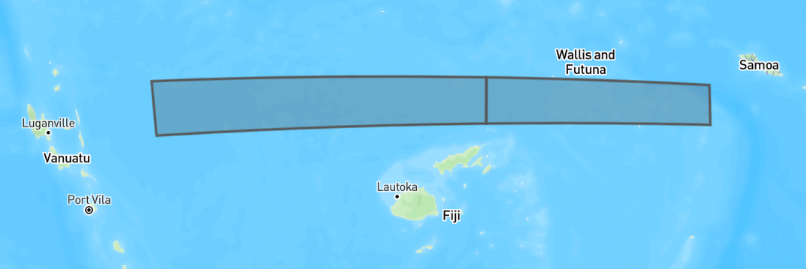
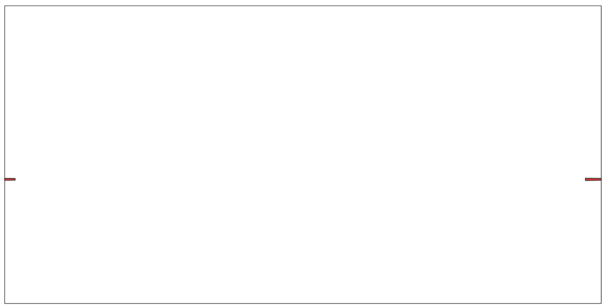
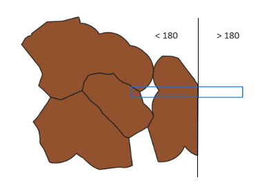
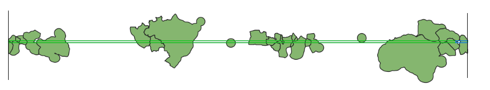

# Antimeridian

When a Sketch polygon or multipolygon has coordinates that are on both sides of the 180 degree antimeridian, for example 179 degrees longitude would be on the left side, 181 degrees on the right side, then it is said to `cross` the antimeridian. When this happens, the sketch needs to be split.

References

- [https://macwright.com/2016/09/26/the-180th-meridian](https://macwright.com/2016/09/26/the-180th-meridian)

Example of Polygon on the "right" side of the world, crossing over the antimeridian at 180 degrees longitude going from 170 to 186.

```json
{
  "type": "Polygon",
  "coordinates": [
    [
      [170.387412007, -14.240489787],
      [186.381385397, -14.390078131],
      [186.44313819, -15.493856974],
      [170.480041196, -15.761471484],
      [170.387412007, -14.240489787]
    ]
  ]
}
```

Example of Polygon on the "left" side of the world, crossing over the antimeridian at -180 degrees longitude, going from -175 to -188.

```json
{
  "type": "Polygon",
  "coordinates": [
    [
      [-175, -16],
      [-188, -16],
      [-188, -15],
      [-175, -15],
      [-175, -16]
    ]
  ]
}
```

## Splitting Sketches

Most GIS libraries don't handle properly Polygons crossing this line. For projects that allows users to draw Sketches across the antimeridian, if you want to analyze that Sketch in geoprocessing functions, the best solution is to `split` these Polygons into two pieces, one piece on the right side of the line, one piece on the left side of the line.

In SeaSketch, the split Polygon will look like this with a line through the middle at -180 or 180 degrees:


And in GIS software like QGIS, the same split Polygon will look as follows, each half on different sides of the world.

This is because the portion of the sketch that is "outside", in other words less than 180 degrees, or more than 180 degrees, gets shifted to be within -180 to 180 as part of the splitting process.

SeaSketch doesn't do this split, because it's confusing to the user to see a line split through their Sketch. Geoprocessing functions are left to do this split using the `splitSketchAntimeridian()` function, which is already included when you use the `create:function` command.

## Splitting Datasources

Just like Sketches, `vector` datasources that you import and use in preprocessing geoprocessing functions also need to be split. Many global datasources such as OSM land, Marine Regions EEZ, etc. already are split. Other vector datasources are not pre-split and the `import` CLI command will automatically do this split using the ogr2ogr `wrapdateline` option.

`Raster` datasources do not need to be split. They are expected to be within -180 to 180 degrees. This means that data does not go off the `left` side of the world into less than -180 territory. And data does not go off the `right` side of the world into greater than 180 territory. So if you have a raster that covers the entire country of Fiji, you will end up with raster cells on both sides of the world, with no data in between. Thankfully, the `geoblaze` raster analysis library is smart enough to not fetch all the empty data in between when you are analyzing a Sketch that is split onto both sides of the world.


## Splitting Bounding Boxes

If a Feature or Sketch polygon crosses the antimeridian then so will it's bounding box. And the bounding box of a Sketch is used to fetch from a datasource only the features/raster cells that overlap with that bounding box. And if that bounding box extends across the 180 degree longitude line, then it won't return features or a raster for the portion less than -180, or greater than 180, you will only get the portion inside that range.

Here's an example of a bounding box crossing the Fiji EEZ. The bounding box extends greater than 180, and if you call `getFeatures(eezDatasource, bbox)` with it you will not get the right side of the Fiji EEZ.



The current (naive) `solution` is to re-calculate the bounding box after splitting a polygon Sketch. This will produce a bounding box with `clean` coordinates that are within -180 to 180. The problem is that this produces one long bounding box that extends from -180 all the way to 180. For example, if you take the Fiji bounding box from above and "clean" it, you get the bounding box below. And if you call `getFeatures(eezDatasource, cleanBbox)` with it, you will get all of the EEZ polygons across that long thin band. This works, if you filter out features after the face, but it is inefficient to send extra features over the network so be careful and watch the execution time of your geoprocessing functions.



A better solution, [not yet implemented](https://github.com/seasketch/geoprocessing/issues/250), would be to split the bounding box into two, just like we do with polygons. You would then need to call `getFeatures` for each bounding box and de-duplicate where features overlap with both bounding boxes, using a unique ID property.
