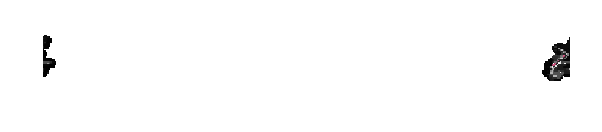

# Antimeridian

The [antimeridian](https://en.wikipedia.org/wiki/180th_meridian) is the 180 degree meridian.


With most GIS software, including SeaSketch, if you draw a polygon that has coordinates to the left and to the right of the antimeridian, you end up with coordinates that are outside of the established range of longitude from -180 to 180.

Example of Polygon extending off the "right" side of 180, going from 170 to 186.

```json
{
  "type": "Polygon",
  "coordinates": [
    [
      [170, -14],
      [186, -14],
      [186, -15],
      [170, -15],
      [170, -14]
    ]
  ]
}
```

Example of Polygon on the "left" side of the world, crossing over the antimeridian at -180 degrees longitude, going from -175 to -188.

```json
{
  "type": "Polygon",
  "coordinates": [
    [
      [-175, -16],
      [-188, -16],
      [-188, -15],
      [-175, -15],
      [-175, -16]
    ]
  ]
}
```

These polygons are technically valid, but spatial analysis libraries often don't deal well with this, producing errors or invalid output.

The solution, suggested by the [GeoJSON spec](https://datatracker.ietf.org/doc/html/rfc7946#section-3.1.9) is to split the polygons down the 180 meridian line, and shift the pieces that are outside the bounds of -180 to 180 back inside. For example, a longitude value of 200, will become 20, a longitude value of -20 will become 160.

## Splitting Sketches

The SeaSketch platform does not split sketches when you draw a Polygon. It is up to geoprocessing functions to split them before doing analysis. To do this, the [splitSketchAntimeridian](../api/geoprocessing/functions/splitSketchAntimeridian.md) and [splitFeatureAntimeridian](../api/geoprocessing/functions/splitFeatureAntimeridian.md) functions are available.

```typescript
import { splitSketchAntimeridian } from "@seasketch/geoprocessing";

const splitSketch = splitSketchAntimeridian(sketch);
```

The second polygon above, once split becomes:

```json
{
  "type": "MultiPolygon",
  "coordinates": [
    [
      [
        [-180, -14],
        [-174, -14],
        [-174, -15],
        [-180, -15],
        [-180, -14]
      ]
    ],
    [
      [
        [180, -15],
        [170, -15],
        [170, -14],
        [180, -14],
        [180, -15]
      ]
    ]
  ],
  "bbox": [-174, -15, 170, -14]
}
```


Notice that there are now 2 polygons, and that all of the coordinates are shifted to be within -180 to 180. Also notice that the `bbox` has shifted coordinates as well. This is important because the bounding box of a sketch is commonly used in analysis to efficiently fetch just the subset of features that overlap with a sketches bounding box, rather than fetching the whole datasource. See the [Splitting bounding boxes](#splitting-bounding-boxes) section below for more information.

It's also important to know that once split, the shifted pieces may appear as if they are on the other side of the world if you are viewing the data in software such as QGIS that displays data projected onto a rectangle that is split exactly at the 180th meridian.


References

- [https://macwright.com/2016/09/26/the-180th-meridian](https://macwright.com/2016/09/26/the-180th-meridian)

## Splitting Vector Datasources

Just like Sketches, `vector` datasources that you import and intend to use in preprocessing and geoprocessing functions also need to be split. Many global datasources such as OSM land, Marine Regions EEZ, etc. already are split. Other vector datasources are not pre-split and the `import` CLI command will automatically do this split using the ogr2ogr `wrapdateline` option.

## Splitting Raster Datasources

`Raster` datasources do not need to be split. They are expected to be within -180 to 180 degrees. This means that data does not go off the `left` side of the world into less than -180 territory. And data does not go off the `right` side of the world into greater than 180 territory. So if you have a raster that covers the entire country of Fiji, you should have raster cells that havewill end up with raster cells on both sides of the world, with no data in between.



## Splitting Bounding Boxes

If a Feature or Sketch polygon crosses the antimeridian then so will it's bounding box. And the bounding box of a Sketch is used to efficiently fetch features from a cloud-optimized datasets. `rasterMetrics()`, geoblaze methods, `loadCog` and `overlapFeatures()` all accept a bounding box (or a sketch and its bounding box is used) to fetch data.

And if that bounding box extends less than -180 (to the left of) or more than 180 (to the right of), then use of that bounding box to fetch data from a cloud-optimized GeoTIFF or Flatgeobuf datasource won't return features or raster cells for the portion less then -180 or greater than 180, only the portion within that range.

The solution used by this framework is to shift the coordinates of the bbox to be within -180 and 180. That is what `splitSketchAntimeridian` and `splitFeatureAntimeridian` return by default.

The remaining problem is that a "shifted" bounding box will now span across the world.


And this will "overfetch" data if you are using a global dataset that has features across the globe.

The raster solution is that the `geoblaze` library is smart enough to not overfetch. `rasterMetrics` and other functions that use it will simply do the right thing.

For vector datasources, there is no built-in solution. You need to do one or a combination of:

- Overfetch data, and filter the features after the fact
- Clip your datasource to your planning area to limit the issue
- Split the bounding box into two, just like we do with polygons. Then call `getFeatures` or `fgbFetchAll` twice. Then de-duplicate where features overlap with both bounding boxes using a unique feature ID.
