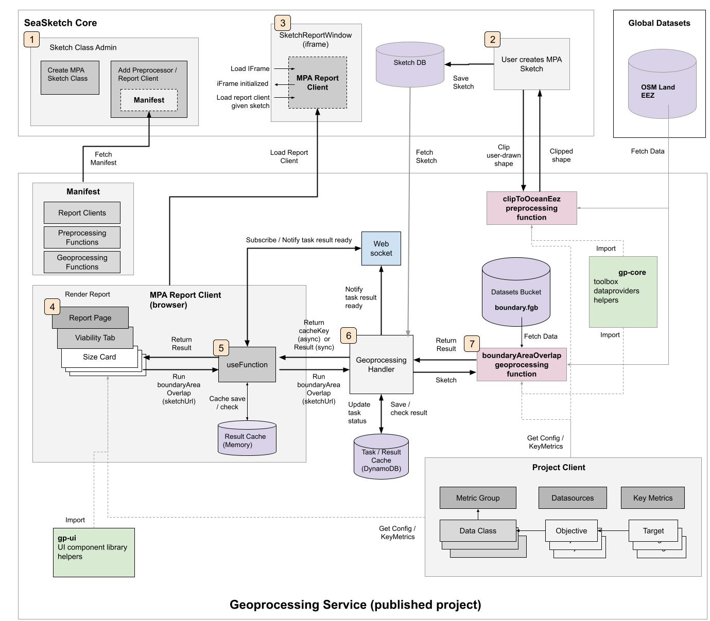
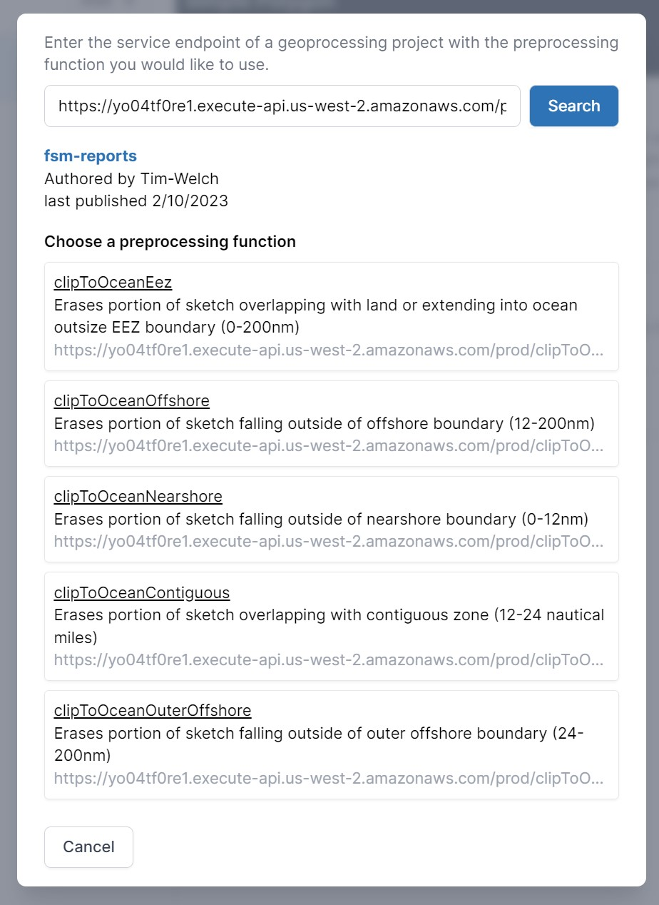
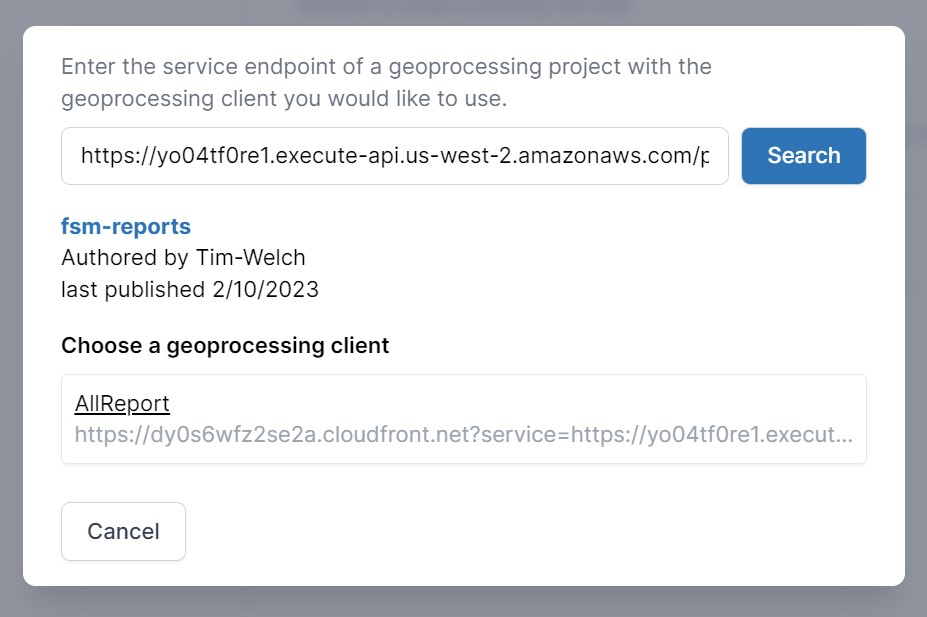
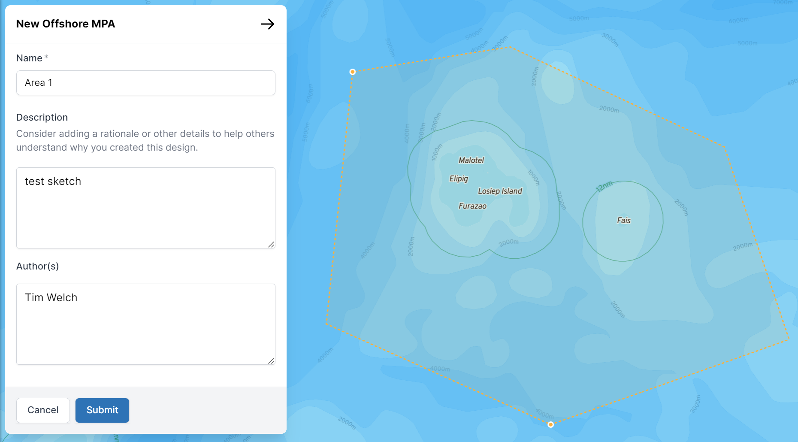
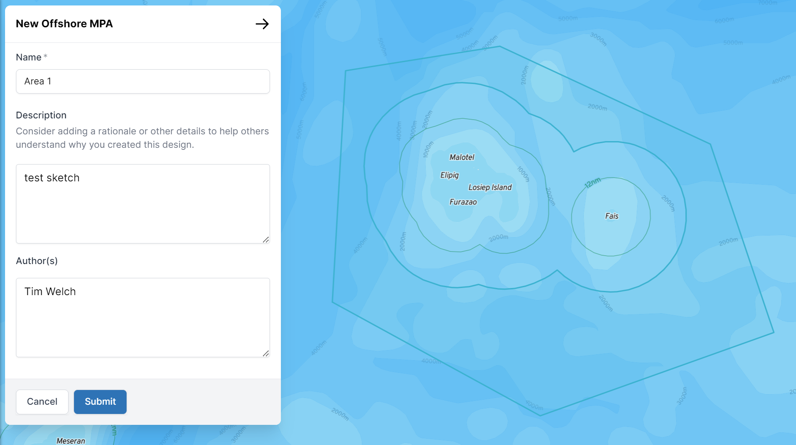
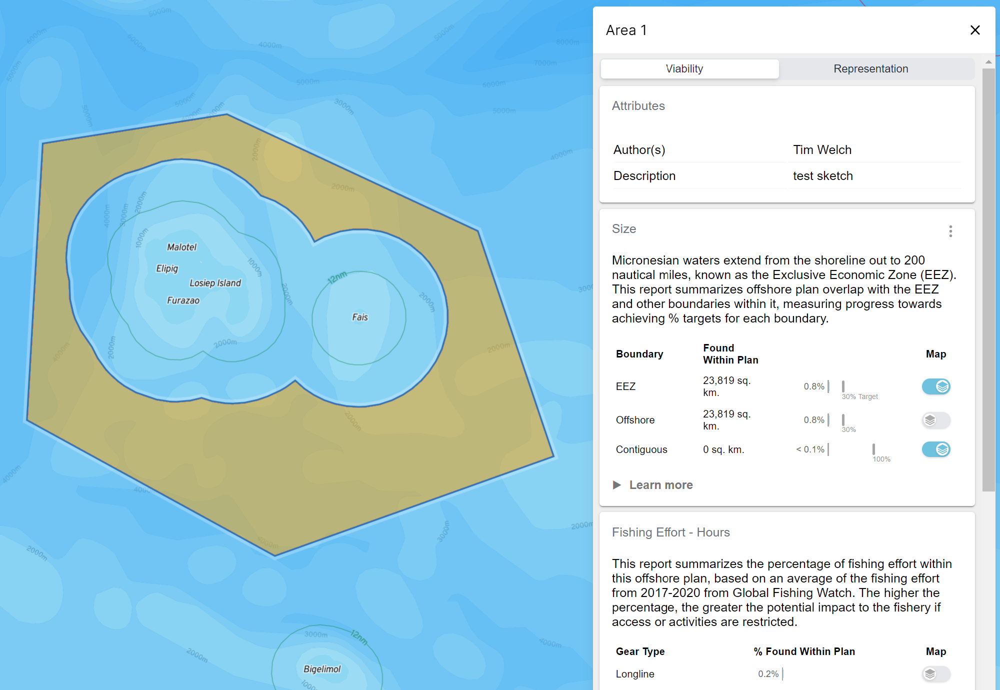
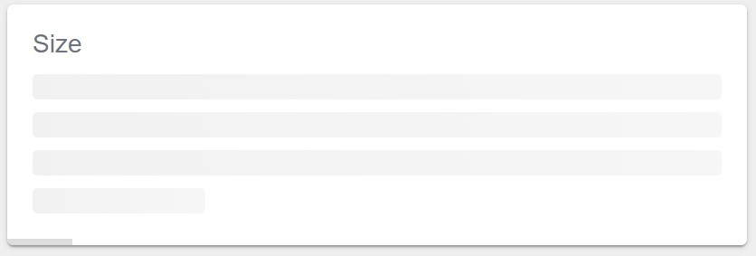

## Library

The geoprocessing library is modeled after [create-react-app](https://github.com/facebook/create-react-app) in that it allows a new project to be generated with a single command.

It publishes a CLI (command line interface) via the `geoprocessing` command [registered](https://github.com/seasketch/geoprocessing/blob/dev/packages/geoprocessing/package.json#L45), which runs the accompanying [script](https://github.com/seasketch/geoprocessing/blob/dev/packages/geoprocessing/scripts/geoprocessing.ts), which publishes all of the CLI commands.

The [init](https://github.com/seasketch/geoprocessing/blob/dev/packages/geoprocessing/scripts/init/init.ts) command is runnable using `npx` without installing the geoprocessing library (see Tutorials). The init command [creates a new project](https://github.com/seasketch/geoprocessing/blob/dev/packages/geoprocessing/scripts/init/createProject.ts) using the [base-project](https://github.com/seasketch/geoprocessing/tree/dev/packages) as a template followed by merging in one of the available [templates](https://github.com/seasketch/geoprocessing/tree/dev/packages).

The new generated project takes the geoprocessing library as a dependency, allowing the projects report clients access to the `gp-ui` module and preprocessing/geoprocessing functions access to the `gp-core` module. This also gives the project access to the remaining CLI commands via its [package.json](https://github.com/seasketch/geoprocessing/blob/dev/packages/base-project/package.json), including the ability to [build](https://github.com/seasketch/geoprocessing/blob/dev/packages/geoprocessing/scripts/build/build.sh) client and function bundles using [webpack](https://webpack.js.org/) and [deploy](https://github.com/seasketch/geoprocessing/blob/dev/packages/geoprocessing/scripts/deploy/deploy.sh) the project using [aws-cdk](https://docs.aws.amazon.com/cdk/v2/guide/work-with-cdk-javascript.html).

## Published Project



A published geoprocessing project at its heart is a single monolithic [GeoprocessingStack](https://github.com/seasketch/geoprocessing/blob/dev/packages/geoprocessing/scripts/aws/GeoprocessingStack.ts#L58) created using AWS CloudFormation, with a REST API as its main access point.

### 1. Registering with SeaSketch

The root URL of the REST API returns a manifest of all project assets. This includes names, URL's, and configuration for all of the projects report clients, preprocessing functions, and geoprocessing functions.

Example for FSM: [https://yo04tf0re1.execute-api.us-west-2.amazonaws.com/prod/](https://yo04tf0re1.execute-api.us-west-2.amazonaws.com/prod/)

```json
{
  "title": "fsm-reports",
  "author": "Tim-Welch",
  "apiVersion": "1.1.1-experimental-preprocess.14+7d0938c",
  "version": "1.0.0",
  "relatedUri": "https://github.com/seasketch/fsm-reports.git#readme",
  "sourceUri": "git+https://github.com/seasketch/fsm-reports.git.git",
  "published": "2023-02-11T03:54:03.297Z",
  "clients": [
    {
      "title": "AllReport",
      "uri": "https://test.com/AllReport",
      "bundleSize": 0,
      "apiVersion": "",
      "tabs": []
    }
  ],
  "feedbackClients": [],
  "preprocessingServices": [
    {
      "title": "clipToOceanEez",
      "description": "Erases portion of sketch overlapping with land or extending into ocean outsize EEZ boundary (0-200nm)",
      "endpoint": "https://yo04tf0re1.execute-api.us-west-2.amazonaws.com/prod/clipToOceanEez",
      "requiresProperties": []
    },
    {
      "title": "clipToOceanOffshore",
      "description": "Erases portion of sketch falling outside of offshore boundary (12-200nm)",
      "endpoint": "https://yo04tf0re1.execute-api.us-west-2.amazonaws.com/prod/clipToOceanOffshore",
      "requiresProperties": []
    },
    {
      "title": "clipToOceanNearshore",
      "description": "Erases portion of sketch falling outside of nearshore boundary (0-12nm)",
      "endpoint": "https://yo04tf0re1.execute-api.us-west-2.amazonaws.com/prod/clipToOceanNearshore",
      "requiresProperties": []
    },
    {
      "title": "clipToOceanContiguous",
      "description": "Erases portion of sketch overlapping with contiguous zone (12-24 nautical miles)",
      "endpoint": "https://yo04tf0re1.execute-api.us-west-2.amazonaws.com/prod/clipToOceanContiguous",
      "requiresProperties": []
    },
    {
      "title": "clipToOceanOuterOffshore",
      "description": "Erases portion of sketch falling outside of outer offshore boundary (24-200nm)",
      "endpoint": "https://yo04tf0re1.execute-api.us-west-2.amazonaws.com/prod/clipToOceanOuterOffshore",
      "requiresProperties": []
    }
  ],
  "geoprocessingServices": [
    {
      "memory": 10240,
      "title": "boundaryAreaOverlap",
      "description": "Calculate sketch overlap with boundary polygons",
      "executionMode": "async",
      "timeout": 40,
      "requiresProperties": [],
      "handlerFilename": "boundaryAreaOverlap.ts",
      "vectorDataSources": [],
      "rateLimited": false,
      "rateLimit": 0,
      "rateLimitPeriod": "daily",
      "rateLimitConsumed": 0,
      "medianDuration": 0,
      "medianCost": 0,
      "type": "javascript",
      "issAllowList": ["*"],
      "endpoint": "https://yo04tf0re1.execute-api.us-west-2.amazonaws.com/prod/boundaryAreaOverlap"
    },
    {
      "memory": 10240,
      "title": "depthZoneValueOverlap",
      "description": "metrics for sketch overlap with ocean depth zones",
      "timeout": 120,
      "executionMode": "async",
      "requiresProperties": [],
      "handlerFilename": "depthZoneValueOverlap.ts",
      "vectorDataSources": [],
      "rateLimited": false,
      "rateLimit": 0,
      "rateLimitPeriod": "daily",
      "rateLimitConsumed": 0,
      "medianDuration": 0,
      "medianCost": 0,
      "type": "javascript",
      "issAllowList": ["*"],
      "endpoint": "https://yo04tf0re1.execute-api.us-west-2.amazonaws.com/prod/depthZoneValueOverlap"
    },
    {
      "memory": 10240,
      "title": "envRegionValueOverlap",
      "description": "metrics for sketch overlap with ocean depth zones",
      "timeout": 120,
      "executionMode": "async",
      "requiresProperties": [],
      "handlerFilename": "envRegionValueOverlap.ts",
      "vectorDataSources": [],
      "rateLimited": false,
      "rateLimit": 0,
      "rateLimitPeriod": "daily",
      "rateLimitConsumed": 0,
      "medianDuration": 0,
      "medianCost": 0,
      "type": "javascript",
      "issAllowList": ["*"],
      "endpoint": "https://yo04tf0re1.execute-api.us-west-2.amazonaws.com/prod/envRegionValueOverlap"
    },
    {
      "memory": 10240,
      "title": "geomorphValueOverlap",
      "description": "metrics for sketch overlap with geomorphic features",
      "timeout": 120,
      "executionMode": "async",
      "requiresProperties": [],
      "handlerFilename": "geomorphValueOverlap.ts",
      "vectorDataSources": [],
      "rateLimited": false,
      "rateLimit": 0,
      "rateLimitPeriod": "daily",
      "rateLimitConsumed": 0,
      "medianDuration": 0,
      "medianCost": 0,
      "type": "javascript",
      "issAllowList": ["*"],
      "endpoint": "https://yo04tf0re1.execute-api.us-west-2.amazonaws.com/prod/geomorphValueOverlap"
    },
    {
      "memory": 10240,
      "title": "gfwEffortValueOverlap",
      "description": "metrics for sketch overlap with fishing effort",
      "timeout": 120,
      "executionMode": "async",
      "requiresProperties": [],
      "handlerFilename": "gfwEffortValueOverlap.ts",
      "vectorDataSources": [],
      "rateLimited": false,
      "rateLimit": 0,
      "rateLimitPeriod": "daily",
      "rateLimitConsumed": 0,
      "medianDuration": 0,
      "medianCost": 0,
      "type": "javascript",
      "issAllowList": ["*"],
      "endpoint": "https://yo04tf0re1.execute-api.us-west-2.amazonaws.com/prod/gfwEffortValueOverlap"
    },
    {
      "memory": 10240,
      "title": "normaCatchValueOverlap",
      "description": "metrics for sketch overlap with catch",
      "timeout": 120,
      "executionMode": "async",
      "requiresProperties": [],
      "handlerFilename": "normaCatchValueOverlap.ts",
      "vectorDataSources": [],
      "rateLimited": false,
      "rateLimit": 0,
      "rateLimitPeriod": "daily",
      "rateLimitConsumed": 0,
      "medianDuration": 0,
      "medianCost": 0,
      "type": "javascript",
      "issAllowList": ["*"],
      "endpoint": "https://yo04tf0re1.execute-api.us-west-2.amazonaws.com/prod/normaCatchValueOverlap"
    },
    {
      "memory": 10240,
      "title": "benthicSpeciesValueOverlap",
      "description": "metrics for sketch overlap with ",
      "timeout": 120,
      "executionMode": "async",
      "requiresProperties": [],
      "handlerFilename": "benthicSpeciesValueOverlap.ts",
      "vectorDataSources": [],
      "rateLimited": false,
      "rateLimit": 0,
      "rateLimitPeriod": "daily",
      "rateLimitConsumed": 0,
      "medianDuration": 0,
      "medianCost": 0,
      "type": "javascript",
      "issAllowList": ["*"],
      "endpoint": "https://yo04tf0re1.execute-api.us-west-2.amazonaws.com/prod/benthicSpeciesValueOverlap"
    }
  ],
  "uri": "https://yo04tf0re1.execute-api.us-west-2.amazonaws.com/prod/",
  "clientSideBundle": "https://dy0s6wfz2se2a.cloudfront.net?service=https://yo04tf0re1.execute-api.us-west-2.amazonaws.com/prod/"
}
```

SeaSketch allows you to add a preprocessor for your Sketch Class, populating the list from the manifest.


SeaSketch also allows you to add a reporting client for your Sketch Class, populating the list from the manifest.


### 2. Preprocessing User Sketches

The SeaSketch platform executes the preprocessing function every time a user finishes drawing their sketch. It typically performs some type of clip operation involving intersection or difference against other features (land, jurisdictional boundaries)


Drawing new sketch


Preprocessor successfully removed inner portion of sketch

[Preprocessing](https://seasketch.github.io/geoprocessing/api/classes/geoprocessing.PreprocessingHandler.html#func) functions are published by a geoprocessing project, and take a GeoJSON Feature or Sketch, validates it, potentially transforms it to make it usable in a planning process, and then returns the result. Common transformations include clipping a sketch to planning boundaries (e.g. EEZ, land, territorial sea).

[Offshore boundary intersect example](https://github.com/seasketch/fsm-reports/blob/main/src/functions/clipToOceanOffshore.ts)

Preprocessing funtions are wrapped into a [PreprocessingHandler](https://seasketch.github.io/geoprocessing/api/classes/geoprocessing.PreprocessingHandler.html) on export by the report developer, which allow them to be deployed as Lambda functions, with some additional metadata for integration with SeaSketch (name, description), and a configurable amount of memory and processing power.

### 3. Loading Reports Via iFrame

When a SeaSketch user clicks to "View Reports" in the core platform for their Sketch or SketchCollection, it opens an iFrame in the sidebar and loads the appropriate report client published by the geoprocessing project. Reports are run inside a sandboxed iframe to isolate the two environments in order to protect user data.


Viewing sketch report

To do this, the SeaSketch platform contains a [SketchReportWindow](https://github.com/seasketch/next/blob/d0de6a0783f2a4f6df8137519d2fd618d030b318/packages/client/src/projects/Sketches/SketchReportWindow.tsx) component which creates an iFrame and tells it to load the `clientSideBundle` specified in the manifest.

```json
"clientSideBundle": "https://dy0s6wfz2se2a.cloudfront.net?service=https://yo04tf0re1.execute-api.us-west-2.amazonaws.com/prod/"
```

The URL is to a static React app stored on AWS S3 and distributed via CloudFront. It contains all of the published report clients inside its bundle. It's entry point is to the [App](https://github.com/seasketch/geoprocessing/blob/dev/packages/geoprocessing/src/components/App.tsx) React component which communicates with the SeaSketch platform over the iFrame [PostMessage API](https://developer.mozilla.org/en-US/docs/Web/API/Window/postMessage). Notice the `service` parameter included in the URL, this is to provide the App component with access to the project manifest for looking up geoprocessing functions, which the report client is responsible for running.

Once the App component is initialized it sends a `SeaSketchReportingInitEvent` message back to the SketchReportWindow to say it's ready, which then sends a `SeaSketchReportingMessageEventType` message with the name of the client to load and the URL and properties of the sketch to report on.

```javascript
postMessage({
  type: "SeaSketchReportingMessageEventType",
  client: "CLIENT_NAME_FROM_MANIFEST",
  geometryUri: "SKETCH_URL",
  sketchProperties: {
    id: "607f3953a967192577003534",
    name: "Test Sketch",
    createdAt: "2023-04-20T20:28:03.607Z",
    updatedAt: "2023-04-20T20:28:03.607Z",
    sketchClassId: "5edfa3a8a1a9956b48ece131",
    isCollection: false,
    userAttributes: [],
    visibleLayers: [],
  },
});
```

The `App` component receives this message and stores the sketch properties in its context state, and then imports and renders the requested client report. The report is rendered and displayed in the iFrame window.


Viewing sketch report

### 4. Report Client

A report client is a React component, loaded by the top-level App component, and it is usually made up of one or more report pages, each with one or more report sections. Typically, each of those report sections contains a [ResultsCard](https://github.com/seasketch/geoprocessing/blob/dev/packages/geoprocessing/src/components/ResultsCard.tsx) component, which given the name of a geoprocessing function will run it using the useFunction() hook, passing the sketch url and properties stored in the client App's context. The results are then passed back for the body of the card to render. The hook also provides estimates of how long the function will take to run (0 for unknown to start, and updated thereafter) and provides the user with a progress bar.


Viewing sketch report

The report client is responsible for running all of the functions and displaying the results as they come back.

```jsx
<ResultsCard
    title="Zone Size"
    functionName="calculateArea"
    skeleton={<LoadingSkeleton />}
    >
    {(data: AreaResults) => (
        <p>
        📐This feature is{" "}
        <b>{Number.format(Math.round(data.area * 1e-6))}</b> square
        kilometers.
        </p>
    )}
</ResultsCard>
```

Example of a ResultsCard component that runs the `calculateArea` geoprocessing function, which is expected to return a result with type `AreaResults` with property `area`, which is then rendered into a paragraph HTML element. Typescript allows you to strictly define what the result will look like, and the geoprocessing can define this structure.

```javascript
export interface AreaResults {
  /** area of the sketch in square meters */
  area: number;
  bbox: BBox;
}
```

The most common type of data that a geoprocessing function returns is a [ReportResult](https://github.com/seasketch/geoprocessing/blob/dev/packages/geoprocessing/src/types/reports.ts#L21) which is simply an array of Metric values, and the original sketch with null geometry.

The ResultsCard uses a `render callback` pattern called `Function as Child Component` or `FaCC`.

### 5. useFunction Hook

`useFunction` is a [React hook](https://reactjs.org/docs/hooks-intro.html) that calls out to a given geoprocessing function given its name, and passes the results back to the caller.

To do this it:

- Returns a loading state so the user can be given an indicator of loading.
- Fetches the manifest from the root of the published project and finds the URL of the given function name, which is to the published Lambda function.
- If its an sync geoprocessing function it calls out to the function and waits for the result.
- If its an async geoprocessing function then it receives back a task ID and an estimate of how long it will take, and subscribes to the project web socket, listening for the task to be complete. The hook caller is provided with an updated estimate of how long the task will take so that it can give a better indication to the user.
- In either case, a `cacheKey` is usually provided by the hook, which is used server-side as the unique ID to cache the result in DynamoDB, and to notify via websocket the result is ready.
- Once the task is complete the hook calls a final time to the Lambda function synchronously, with `checkCacheOnly` parameter set, and receives back the result from the DynamoDB cache.
- The result is then stored in the local in-memory cache, using the `cacheKey`, for easy lookup should the geoprocessing function get called multiple times in a single session.
- The result is finally returned by the useFunction hook for the caller (usually ResultsCard) to display the result.

### 6. Geoprocessing Handler

Geoprocessing Functions are bundled and deployed to [AWS Lambda](https://aws.amazon.com/lambda/). The advantage of running on lambda is that costs are based directly on use, and are typically very low compared to a server running 24/7. They also scale up to hundreds of simulateous users very quickly.

Every geoprocessing function is wrapped into a [GeoprocessingHandler](https://github.com/seasketch/geoprocessing/blob/dev/packages/geoprocessing/src/aws/GeoprocessingHandler.ts) function. It's role is to be the Lambda function entry point and:

- Given a URL as input to a Sketch or GeoJSON Feature, fetch it.
- Track the transitions through accomplishing the task of running the geoprocessing function including `pending`, `completed`, `failed`.
- Estimate how long it will take based on past task runs (Task table in DynamoDB).
- Check the cache to see if this geoprocessing function has already been run with the same input and return the result if so.
- Execute one of 4 different request scenarios, depending on the configured execution mode and step of the request.

The two different execution modes for running a geoprocessing function are `sync` and `async`. Sync will execute the geoprocessing function immediately and wait for the result without closing the connection from the browser client. Async will will return a task ID, that the browser client can use to subscribe to the available web socket and wait to be messaged that the result is ready.

These 2 execution modes create 4 different request scenarios. A lambda is created for each scenario, and the one GeoprocessingHandler function contains the conditional logic to handle all four of them.

#### Sync

- immediately runs the geoprocessing function and return result in resolved promise to client without the browser client closing the connection.

#### Async

- `ASYNC_REQUEST_TYPE=start` - returns a Task ID to the browser client, that it can use to subscribe to the available web socket and wait to be messaged that the result is ready. In the meantime, this `start` lambda will invoke a second lambda to `run` the actual gp function.
- `ASYNC_REQUEST_TYPE=run` - run gp function started by scenario 2, cache the result in DB cache and message the client by Task ID that the result is ready.
- `checkCacheOnly=true` - checks the cache given task ID and returns the result.

### 7. Geoprocessing Functions

[Geoprocessing](https://seasketch.github.io/geoprocessing/api/classes/geoprocessing.GeoprocessingHandler.html#func) functions typically take a GeoJSON Feature or Sketch, whether singular or a collection, and perform geospatial operations on it and return a result. This can include:

- determining whether sketches within a collection overlap with each other and remove the overlap ensuring there is no double counting.
- assessing the protection level of each sketch and calculating metrics by protection level. Overlap of sketches within each protection level can also be removed ensuring there is not double counting.

The result can take any form but typically are [metrics](/concepts/Concepts.md#metrics).

[Boundary overlap example](https://github.com/seasketch/fsm-reports/blob/main/src/functions/boundaryAreaOverlap.ts#L23)
