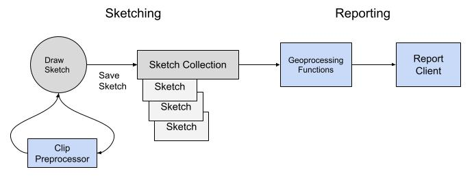

# Concepts

The [SeaSketch platform](https://docs.seasketch.org/seasketch-documentation) supports the following planning workflow, of which the geoprocessing framework supports step #2 and #4:

1. Allow a user to draw a design (sketch) and define attributes (e.g. allowed activities, etc.).
2. Preprocess that sketch to ensure it meets project guidelines, for example to ensure that it has a valid shape and is within the designated planning area.
3. Allow a user to organize one or more sketches into a proposal (collection).
4. Provide feedback (reports) on how well sketches and sketch collections meet measurable planning objectives and their targets (using geoprocessing functions).
5. Allow users to share and iterate on designs as a group until they come to a decision.

## Where to start

A planning tool [design template](https://docs.google.com/document/d/1Qe7pZYmwg7ggRY9ocu3tpdTQkvuIHMr38wLxrjSitpU/edit?usp=sharing) is available.  It encompasses not only report design but the design of the sketch classes, planning geographies, objectives, datasources, etc. that feed into them.

### Terms

There are a number of terms and concepts to be familiar with:

- `Goal` - also known as vision or aim. These are general summaries of the desired future state of an area.

  - Example - Protect biological diversity, productivity, and ecological function across all habitat types

- `Objective` - These are specific statements that describe how a planning goal will be reached and are typically measurable or quantifiable in some way.
  - Example - Designate a minimum of 20% of planning area as protected areas.

- `Target` - The measurement to reach to say that an objective has been met.
  - Example - 20% of the EEZ, 15% of a species habitat within planning area, 

- `Metric` - an individual piece of data, a measurement.  For example a spatial statistic or an area calcultion.

- `Sketch` - a user-drawn feature, typically a Polygon, that can be shared, further altered or put into a Sketch Collection. A Sketch is an extension of a GeoJSON [Feature](https://www.rfc-editor.org/rfc/rfc7946#section-3.2).

- `Geography` - one or more geographic boundaries for the project. Primarily used to define project planning boundaries.

- `Datasource` - a published dataset within the project.  It can be either Vector or Raster spatial data.  A datasource can contain vector features that define the extent of a Geography or provide spatial data for calculating Metrics for sketches.

Here's a couple examples putting it all together:
- A polygon boundary Datasource containing a countries Exclusive Economic Zone is used to measure what % of the EEZ a proposed area covers.
- A coral reef Datasource can be used to measure whether a proposed area covers at least 50% of each coral type.
- A geomorphology Datasource can be used to measure whether a proposed area covers at least 20% of each seabottom type.

### Marine Spatial Planning

- `MPA` - marine protected area.  An area designated for marine protection with defined allowed uses.

- `Territorial Sea` - A belt of coastal waters extending at most 12 nautical miles from the baseline (usually the mean low-water mark) of a coastal state.

- `EEZ` - exclusive economic zone aka "Offshore".  An area of the sea in which a sovereign state has exclusive rights regarding the exploration and use of marine resources.  It stretches from the outer edge of the territorial sea, 12 nautical miles out from the baseline, to 200 nautical miles.  May also be defined as the "Offshore".

- `Nearshore` - a shorthand name used in marine planning projects, which often matches up with the definition of Territorial Sea, but it may not.

- `Offshore` - a shorthand name used in marine planning projects, which often matches up with the definition of EEZ, but it may not.

### Classification System

Planning processes may leverage a `classification system` for defining what levels of protection can be assigned to proposed areas. They then decide what protection levels are required at minimum to count towards meeting a planning objective. Marine Protected Areas or MPA's for example have multiple [classification schemes](https://docs.google.com/document/d/1i0baxgK8JEUjtU8mnzFiG5VB_gO8lmxCrAtJ5rltk30/edit?usp=sharing) to choose from.

To learn more, visit the [advanced concepts](./AdvancedConcepts.md) page.