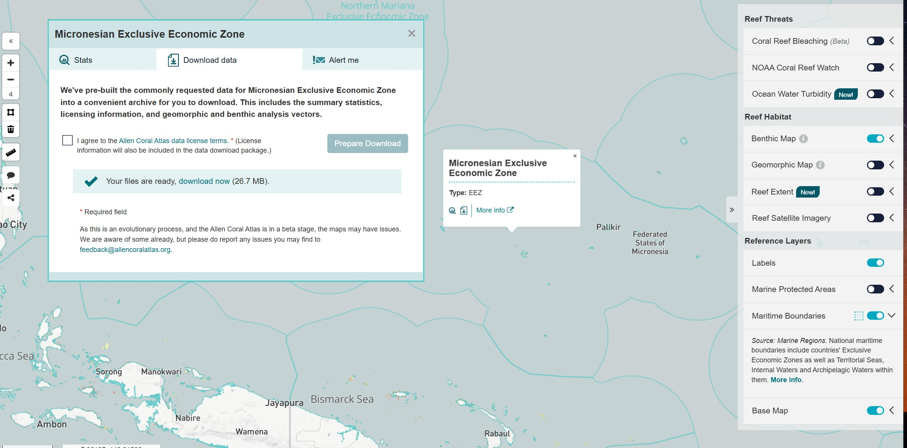

# Third Party Data

## Global datasource

A number of global datasources are published in the [global-datasources](https://github.com/seasketch/global-datasources) project.

## Allen Coral Atlas

Access this data as follows:

- Go to [Allen Coral Atlas](https://allencoralatlas.org) and loging or register an account
- Once logged in, go to Micronesia on the atlas page - https://allencoralatlas.org/atlas/#4.51/6.3220/153.7907
- Turn on Maritime Boundaries in the layer menu on the right
- Click the Micronesia EEZ on the map
- Click the small Download button that appears in the map popup (icon of a page with a down arrow)
- Agree to the terms and click to Prepare Download
- Extract your downloaded zip file and look for `Reef-Extent/reefextent.gpkg` and `Benthic-Map/benthic.gpkg`, and make the data accessible to your project through one of the data linking methods described above.

