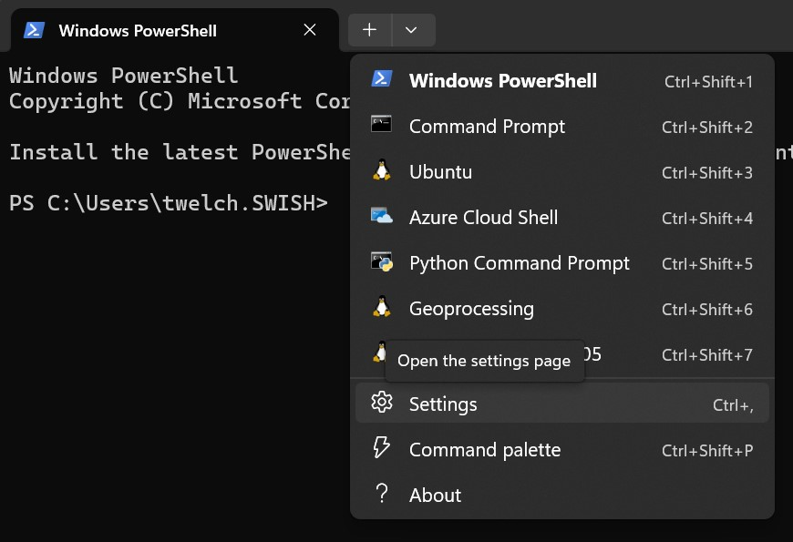
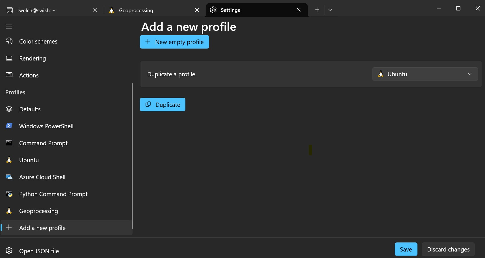

# System Setup

import { NodeVersion, UbuntuVersion } from '../\_components/NodeVersion';

These tutorials will walk you through creating and deploying a basic seasketch `geoprocessing` project. You should already have a basic working knowledge of your computer, its operating system, shell environment (command line), and web application development using NodeJS and React. Learn more about the [skills](../skills.md) required.

Setup options:

- MacOS
  - [Docker Desktop](#docker-desktop-setup)
  - [Direct Install](#macos-setup)
- Windows
  - [Windows Subsystem for Linux (WSL) with Ubuntu](#windows-setup)
  - [Docker Desktop](#docker-desktop-setup)
  - Direct Install not supported
- Ubuntu Linux
  - [Docker Desktop](#docker-desktop-setup)
  - [Direct Install](#ubuntu-setup)
- [Github codespaces](../codespaces/)
  - Possible but not well tested

Docker Desktop is the **recommended** option for beginners with systems running the MacOS or Ubuntu Linux operating system.

For Windows systems, the Windows Subsystem for Linux (WSL) with Ubuntu is the recommended option. This lightweight virtual machine layer is faster than running Docker Desktop alone, and has a built-in filesystem bridge allowing you to access all your Windows drives in the Ubuntu container (via `/mnt` path).

## Docker Desktop Setup

Docker Desktop allows you to run containerized applications that are isolated from your host operating system. It's similar but different from a virtual machine. SeaSketch publishes the [docker-gp-workspace](https://github.com/seasketch/docker-gp-workspace) container image that is a fully-configured environment for developing geoprocessing projects. It allows you to get up and running quickly and has persistent storage. The downside is that code runs a bit slower in a container than directly on your system.

Install steps for all operating systems:

- Install [Docker Desktop](https://www.docker.com/products/docker-desktop/) on your host operating system and make sure it's running.
  - If you have a Mac, choose either Apple processor or Intel processor as appropriate. If you don't know, click the apple icon in the top left and select `About This Mac` and look for `Processor`.
- Install [VS Code](https://code.visualstudio.com) on your host operating system and open it.
- Clone the geoprocessing-devcontainer Github repository to your host operating system, and open that folder in VSCode.
  - From VSCode, click `Open Folder` button or `File -> Open Folder` and create or choose a folder where you keep source code. A folder called `src` or `code` in your users home directory is reasonable. Then click `Select Folder` to finish.
  - Press `Ctrl-J` or `Cmd-backtick` to open a terminal. The current directory of the terminal will be your workspace folder.
  - Enter the command to clone the geoprocessing-devcontainer repository to your workspace.
    - `git clone https://github.com/seasketch/geoprocessing-devcontainer`
  - Click `Open Folder` button or `File -> Open Folder` and open the repo folder you just cloned.
  - Press `Ctrl-J` or `Cmd-backtick` to open a terminal again.
- Install required VSCode extensions. You may be prompted to do this, otherwise go to the `Extension` panel found on the left side of the VSCode window. Then install the following extensions:
  - Remote Development
  - Remote Explorer
  - Docker
  - Dev Containers

Once you have added the `Dev Containers` extension you should be prompted to "Reopen folder to develop in a container". <b>_Do not do this yet._</b>

- In the file `Explorer` panel, open the `.devcontainer` folder.
  - This top-level folder contains the configuration for the `stable` geoprocessing devcontainer you will use.
- Make a copy of `.devcontainer/.env.template` file and name it `.env`.
  - You don't need to add anything yet to your .env file, but it is required that it exists in the `.devcontainer` folder.

Now start the devcontainer:

- `Ctrl-Shift-P` or `Cmd-Shift-P` to open the VSCode command palette
- type “Reopen in container” and select the Dev Container command to do so.
- Select the `Geoprocessing Local Stable` environment.
- VSCode will pull the latest `geoprocessing-workspace` docker image, create a container with it, and start a remote code experience inside the container.
- Notice the bottom left blue icon in your vscode window. It may say `Opening remote connection` and eventually will say `Dev Container: Geoprocessing`. This is telling you that this VSCode window is running in a devcontainer environment.


You now have a devcontainer, ready to create a project in.

To exit your devcontainer:

- Click the blue icon in the bottom left, and then `Reopen locally`. This will bring VSCode back out of the devcontainer session.
- You can also type `Ctrl-Shift-P` or `Cmd-Shift-P` and select `Dev Containers: Reopen folder locally`.


See devcontainer advanced usage [guide](../devcontainer/devcontainer.md) to learn more.

## MacOS Setup

Requirement: 11.6.8 Big Sur or newer

Install all software dependencies directly on your Apple machine running the MacOS operating system:

- Install [Node JS](https://nodejs.org/en/download/) >= <NodeVersion />
  - [nvm](https://github.com/nvm-sh/nvm) is great for this
    - First, install nvm. May ask you to first install XCode developer tools which is available through the App Store or follow the instructions provided.
    - Then <code>nvm install v<NodeVersion /></code>.
  - Then open your Terminal app of choice and run `node -v` to check your node version
- Install latest [NPM](https://www.npmjs.com/) package manager after installing node.
  - `npm --version` to check
  - `npm install -g latest`
- Install [VS Code](https://code.visualstudio.com)

  - Install recommended [extensions](https://code.visualstudio.com/docs/editor/extension-marketplace) when prompted. If not prompted, go to the `Extensions` panel on the left side and install the extensions named in [this file](https://github.com/seasketch/geoprocessing/blob/dev/packages/geoprocessing/templates/project/.vscode/extensions.json)

- Install [GDAL](https://gdal.org/)

  - First install [homebrew](https://brew.sh/)
  - `brew install gdal`

- Install [Java runtime](https://www.java.com/en/download/) for MacOS (required for testing with Amazon DynamoDb Local)

- Create a free Github account if you don't have one already

## Windows Setup

Requirement: Windows 11 or newer

- Install [Powershell for Windows](https://learn.microsoft.com/en-us/powershell/scripting/install/installing-powershell-on-windows?view=powershell-7.4)
- Install [WSL with Ubuntu distribution](https://learn.microsoft.com/en-us/windows/wsl/install)
  - Install Ubuntu as directed
- Install [Docker Desktop with WSL2 support](https://docs.docker.com/desktop/windows/wsl/).
  - Once installed, make sure Docker Desktop is running

Now decide if you want to install the pre-configured [Geoprocessing Distribution](#geoprocessing-distribution) (easiest). Or you can instead setup the [Default Ubuntu Distribution](#default-ubuntu-installation) from scratch on your own (more difficult).

### Geoprocessing Distribution

The Geoprocessing distribution will be installed right alongside the default Ubuntu distribution from the previous step.

- Open Powershell
- Download latest Geoprocessing distribution to tmp directory
  - `mkdir C:\tmp\WslDistributions\Geoprocessing`
  - Download most recent zip from https://ucsb.box.com/s/k9477fqzzn0yel5kf5kj2y81tst09f4i to this folder, then unzip it
- Install Geoprocessing image

  - `wsl --import Geoprocessing C:\WslDistributions\Geoprocessing\ C:\tmp\geoprocessing-workspace_20230627\geoprocessing-workspace_20230627_65bd30ba63a3.tar`
  - Change the path and tar file name to match the version you downloaded.
  - If started correctly, you will see the message `Import in progress, this may take a few minutes...`
  - Once done it should say `The operation completed successfully.`
  - If it didn't imiport successfully, try restarting your system, WSL may not have been running properly.

- Setup Terminal Profile (for easy start)
  - With powershell or another terminal open click down arrow button in the tab bar, to the right of the (+) icon, then click Settings



- Find Profiles section in left sidebar -> click Add a new profile
- Under `Duplicate a profile`, click `Ubuntu`, then `Duplicate`



- Change name from Ubuntu-Copy to `Geoprocessing`
- Right below that, change the Terminal command from `C:\WINDOWS\system32\wsl.exe -d Ubuntu` to `C:\WINDOWS\system32\wsl.exe -u vscode -d Geoprocessing`
- Save and exit the profile
- The Terminal dropdown menu should now have a new `Geoprocessing` choice. Click this to start an instance of the Geoprocessing Distribution. It will open a shell, logged in with the vscode user.
  Setup`
- Setup workspaces directory.

```bash
sudo mkdir /workspaces
sudo chmod 777 /workspaces
cd /workspaces
```

- Check to make sure you have access to your Windows filesystem:

```bash
ls /mnt/c
```

- Install [VS Code](https://learn.microsoft.com/en-us/windows/wsl/tutorials/wsl-vscode) in Windows and setup with WSL2.
  - Install recommended [extensions](https://code.visualstudio.com/docs/editor/extension-marketplace) when prompted. If not prompted, go to the `Extensions` panel on the left side and install the extensions named in [this file](https://github.com/seasketch/geoprocessing/blob/dev/packages/geoprocessing/templates/project/.vscode/extensions.json)

Follow the [final configuration steps](#final-configuration---all-install-options) below, then move on to creating a new project.

#### Upgrade Geoprocessing Distribution

If you previously installed a Geoprocessing distribution, and now want to replace it with a new one, first backup your existing Geoprocessing distribution (if needed):

```bash
mkdir C:\tmp\WslBackups\Geoprocessing
wsl --export Geoprocessing C:\tmp\WslBackups\20241104_Geoprocessing.tar
```

Then unregister it:

```bash
wsl --unregister Geoprocessing
```

Then follow the instructions above to install WSL Geoprocessing image again

### Default Ubuntu Distribution

- Open Windows start menu -> start typing `Ubuntu on Windows` -> Select `Ubuntu on Windows`
  - This will start Ubuntu virtual machine and open a bash shell in your home directory.

In Ubuntu shell:

- Install [Java runtime](https://stackoverflow.com/questions/63866813/what-is-the-proper-way-of-using-jdk-on-wsl2-on-windows-10) in Ubuntu (required by AWS CDK library)
- Install [Git in Ubuntu and Windows](https://learn.microsoft.com/en-us/windows/wsl/tutorials/wsl-git)
- Install [VS Code](https://learn.microsoft.com/en-us/windows/wsl/tutorials/wsl-vscode) in Windows and setup with WSL2.
  - Install recommended [extensions](https://code.visualstudio.com/docs/editor/extension-marketplace) when prompted. If not prompted, go to the `Extensions` panel on the left side and install the extensions named in [this file](https://github.com/seasketch/geoprocessing/blob/dev/packages/geoprocessing/templates/project/.vscode/extensions.json)
- Install [Node JS](https://nodejs.org/en/download/) >= <NodeVersion /> in Ubuntu
  - [nvm](https://github.com/nvm-sh/nvm) is great for this
    - First, install nvm. May ask you to first install XCode developer tools which is available through the App Store or follow the instructions provided.
    - Then <code>nvm install v<NodeVersion /></code>.
  - Then open your Terminal app of choice and run `node -v` to check your node version
- Install latest [NPM](https://www.npmjs.com/) package manager after installing node.
  - `npm --version` to check
  - `npm install -g latest`

## Ubuntu Setup

Requirement: Ubuntu <UbuntuVersion /> or newer

Setup is for a physical machine running the Ubuntu operating system.

From a Ubuntu terminal with root access, simply follow the steps above for [default ubuntu installation](#default-ubuntu-distribution)

## Final Configuration - all install options

The last step, regardless of install option, is to set the [username](https://docs.github.com/en/get-started/getting-started-with-git/setting-your-username-in-git?platform=mac) and email address git will associate with your commits.

You can set these per repository, or globally for all repositories on your system (and override as needed). Here's the commands to set globally for your environment.

```bash
git config --global user.name "Your Name"
git config --global user.email "yourusername@youremail.com"
```

Now verify it was set:

```bash
# If you set global - all repos
cat ~/.gitconfig

# If you set local - current repo
cat .git/config
```

Your environment is now ready for a project
