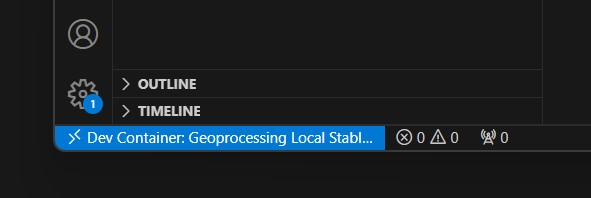
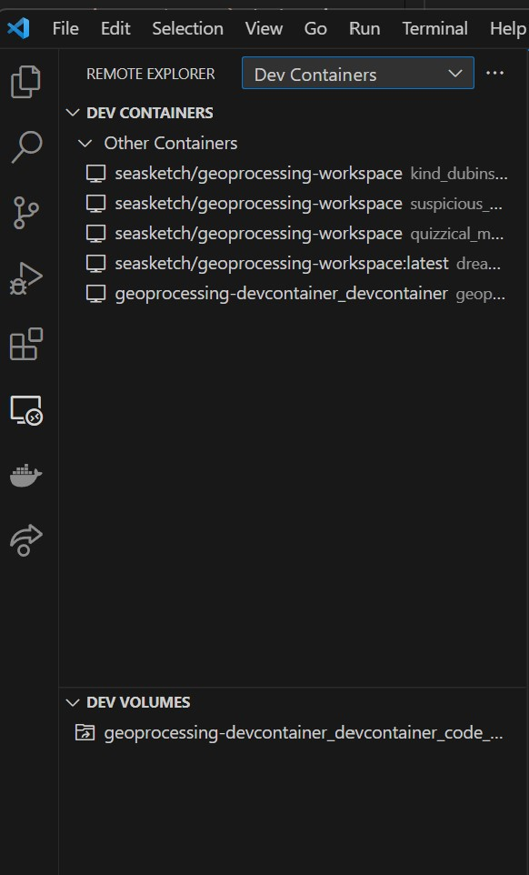

# System Setup

These tutorials will teach you the fundamentals of creating and deploying a seasketch `geoprocessing` project. They expect you already have a basic working knowledge of your computer, its operating system, command line interfaces, and web application development. Learn more about the [skills](../skills.md) required.

You will need a computer running at least:

- Windows 11
- MacOS 11.6.8 Big Sur
- Linux: untested but recent versions of Linux such as Ubuntu, Debian, or Fedora should be possible that are capable of running VSCode and Docker Desktop.

Web browser:

- Chrome is the most common but Firefox, Safari, Edge can also work. Their developer tools will all be a little different.
- Chrome is the most common but Firefox, Safari, Edge can also work. Their developer tools will all be a little different.

### Install Options

You have 2 options for how to develop geoprocessing projects

1. Docker Desktop Environment
   - Docker provides a sandboxed Ubuntu Linux environment on your local computer, setup specifically for geoprocessing projects.
   - Best for: intermediate to power users doing development every day
   - Pros
     - Provides a fully configured environment, with installation of many of the third-party dependencies already take care of.
     - Docker workspace is isolated from your host operating system. You can remove or recreate these environment as needed.
     - You can work completely offline once you are setup.
   - Cons
     - You will need to get comfortable with Docker Desktop software.
     - Docker is slower than running directly on your system (maybe 30%)
     - Syncing data from network drives like Box into the Docker container is more challenging.
2. MacOS Bare Metal / Windows WSL
   - All geoprocessing dependencies are installed and maintained directly by you on your local computer operating system. For MacOS this means no virtualization is done. For Windows, this means running Ubuntu via WSL2 aka the Windows Subsystem for Linux.
   - Best for - power user.
   - Pros - fastest speeds because you are running without virtualization (aka bare metal)
   - Cons - prone to instability and issues due to progression of dependency versions or operating system changes. Difficult to test and ensure stable support for all operating systems and processors (amd64, arm64).

Choose an option and follow the instructions below to get started. You can try out different options over time.

[Github codespaces](../codespaces/) is also possible to use instead of Docker Desktop but is more limited and not well tested.

### If Install Option #1 - Docker Desktop Environment

- Install [Docker Desktop](https://www.docker.com/products/docker-desktop/) and make sure its running.
- If you have a Mac, choose either Apple processor or Intel processor as appropriate to your system. If you don't know which processor you have, click the apple icon in the top left and select `About This Mac` and look for `Processor`.
- Install [VS Code](https://code.visualstudio.com) and open it.
- Clone the geoprocessing-devcontainer Github repository to your local system and open that folder in VSCode.

```bash
git clone https://github.com/seasketch/geoprocessing-devcontainer
```

Here are more detailed instructions to do this step:

- From VSCode, click `Open Folder` button or `File -> Open Folder` and create or choose a folder where you keep source code. A folder called `src` or `code` in your users home directory is reasonable. Then click `Select Folder` to finish.
- Press `Ctrl-J` or `Cmd-backtick` to open a terminal. The current directory of the terminal will be your workspace folder.
- Enter the command to clone the geoprocessing-devcontainer repository to your workspace.
  - `git clone https://github.com/seasketch/geoprocessing-devcontainer`
- Click `Open Folder` button or `File -> Open Folder` and open the repo folder you just cloned.
- Press `Ctrl-J` or `Cmd-backtick` to open a terminal.

- Install required VSCode extensions. If you are already prompted to install suggested extensions, click to do so now, otherwise go to the `Extension` panel on the left side of the VSCode window and install the following extensions:
  - Remote Development
  - Remote Explorer
  - Docker
  - Dev Containers

Once you have added the `Dev Containers` extension you should be prompted to ”Reopen folder to develop in a container”. <b>_Do not do this yet._</b>

- In the file `Explorer` panel, you will find a `.devcontainer` folder. This top-level folder contains the configuration for the `stable` geoprocessing devcontainer.
- Make a copy of `.devcontainer/.env.template` file and name it `.env`.
  - You don't need to add anything yet to your .env file, but it is required that it exists in the `.devcontainer` folder.

Now start the devcontainer:

- `Ctrl-Shift-P` or `Cmd-Shift-P` to open the VSCode command palette
- type “Reopen in container” and select the Dev Container command to do so.
- Select the `Geoprocessing Local Stable` environment.
- VSCode will pull the latest `geoprocessing-workspace` docker image, create a container with it, and start a remote code experience inside the container.
- Notice the bottom left blue icon in your vscode window. It may say `Opening remote connection` and eventually will say `Dev Container: Geoprocessing`. This is telling you that this VSCode window is running in a devcontainer environment.



You now have a devcontainer, ready to create a project in.

To exit your devcontainer:

- Click the blue icon in the bottom left, and then `Reopen locally`. This will bring VSCode back out of the devcontainer session.
- You can also type `Ctrl-Shift-P` or `Cmd-Shift-P` and select `Dev Containers: Reopen folder locally`.



See devcontainer advanced usage [guide](../devcontainer/devcontainer.md) to learn more.

### Install Option #2 - Bare Metal

Running 'bare metal' means running the geoprocessing framework directly on your computers operating system. It's up to you to install and maintain all necessary dependencies.

#### MacOS

- Install [Node JS](https://nodejs.org/en/download/) >= v20.0.0
  - [nvm](https://github.com/nvm-sh/nvm) is great for this, then `nvm install v20`. May ask you to first install XCode developer tools as well which is available through the App Store or follow the instructions provided when you try to install nvm.
  - Then open your Terminal app of choice and run `node -v` to check your node version
- Install [VS Code](https://code.visualstudio.com)

  - Install recommended [extensions](https://code.visualstudio.com/docs/editor/extension-marketplace) when prompted. If not prompted, go to the `Extensions` panel on the left side and install the extensions named in [this file](https://github.com/seasketch/geoprocessing/blob/dev/packages/geoprocessing/templates/project/.vscode/extensions.json)

- Install [NPM](https://www.npmjs.com/) package manager >= v10.5.0 after installing node. The version that comes with node may not be recent enough.

  - `npm --version` to check
  - `npm install -g latest`

- Install [GDAL](https://gdal.org/)

  - First install [homebrew](https://brew.sh/)
  - `brew install gdal`

- Install [Java runtime](https://www.java.com/en/download/) for MacOS (required for testing with Amazon DynamoDb Local)

- Create a free Github account if you don't have one already

#### Windows

For Windows, you won't actually be running bare metal. your `geoprocessing` project and the underlying code run in a Docker container running Ubuntu Linux. This is done using the Windows Subsystem for Linux (WSL2) so performance is actually quite good. Docker Desktop and VSCode both know how to work seamlessly with WSL2. Some of the building blocks you will install in Windows (Git, AWSCLI) and link them into the Ubuntu Docker container. The rest will be installed directly in the Ubuntu Docker container.

In Windows:

- Install [WSL2 with Ubuntu distribution](https://learn.microsoft.com/en-us/windows/wsl/install)
- Install [Docker Desktop with WSL2 support](https://docs.docker.com/desktop/windows/wsl/) and make sure Docker is running
- Open start menu -> `Ubuntu on Windows`
  - This will start a bash shell in your Ubuntu Linux home directory

In WSL Ubuntu:

- Install [Java runtime](https://stackoverflow.com/questions/63866813/what-is-the-proper-way-of-using-jdk-on-wsl2-on-windows-10) in Ubuntu (required by AWS CDK library)
- Install [Git in Ubuntu and Windows](https://learn.microsoft.com/en-us/windows/wsl/tutorials/wsl-git)
- Install [VS Code](https://learn.microsoft.com/en-us/windows/wsl/tutorials/wsl-vscode) in Windows and setup with WSL2.
  - Install recommended [extensions](https://code.visualstudio.com/docs/editor/extension-marketplace) when prompted. If not prompted, go to the `Extensions` panel on the left side and install the extensions named in [this file](https://github.com/seasketch/geoprocessing/blob/dev/packages/geoprocessing/templates/project/.vscode/extensions.json)
- Install [Node JS](https://nodejs.org/en/download/) >= v16.0.0 in Ubuntu
  - [nvm](https://github.com/nvm-sh/nvm) is great for this, then `nvm install v16`.
  - Then open your Terminal app of choice and run `node -v` to check version
- Install [NPM](https://www.npmjs.com/) package manager >= v8.5.0 after installing node. The version that comes with node may not be recent enough.
  - `npm --version` to check
  - `npm install -g latest`

### Final Steps

The last step, regardless of install option, is to set the [username](https://docs.github.com/en/get-started/getting-started-with-git/setting-your-username-in-git?platform=mac) and email address git will associate with your commits.

You can set these per repository, or globally for all repositories on your system (and override as needed). Here's the commands to set globally for your environment.

```bash
git config --global user.name "Your Name"
git config --global user.email "yourusername@youremail.com"
```

Now verify it was set:

```bash
# If you set global - all repos
cat ~/.gitconfig

# If you set local - current repo
cat .git/config
```

Your devcontainer environment is now ready for a project
