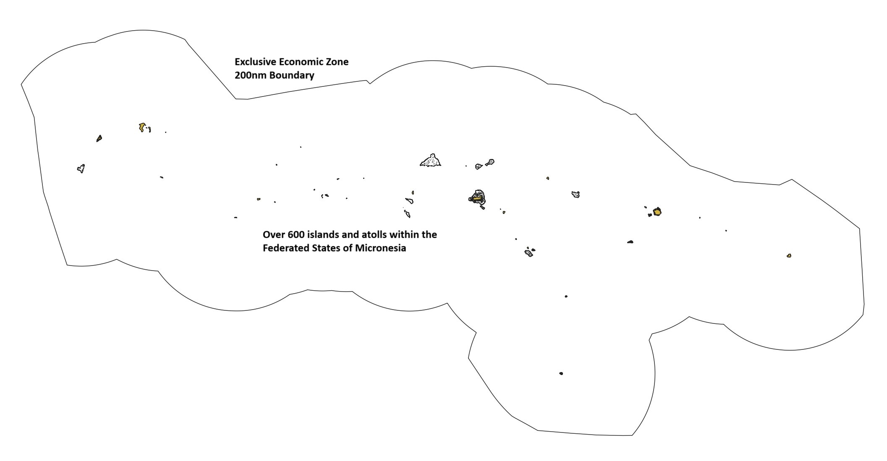
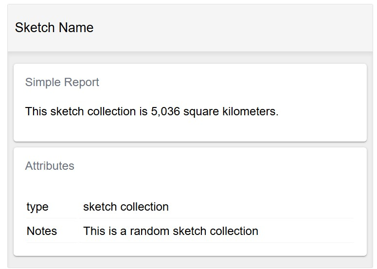
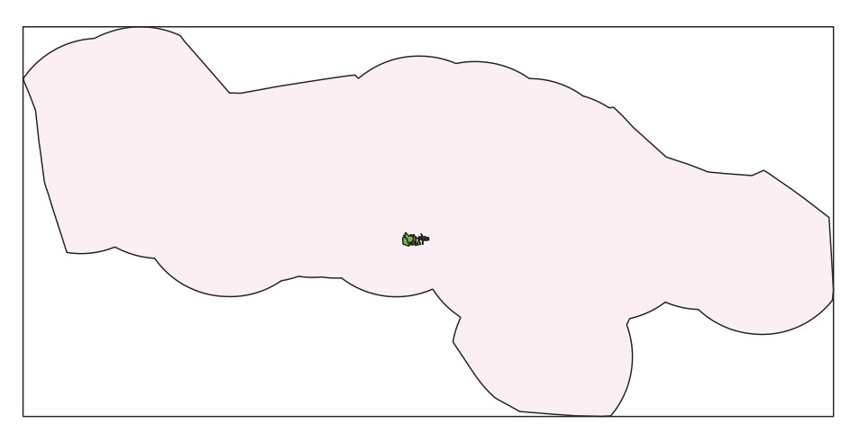
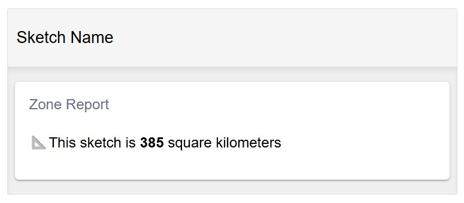
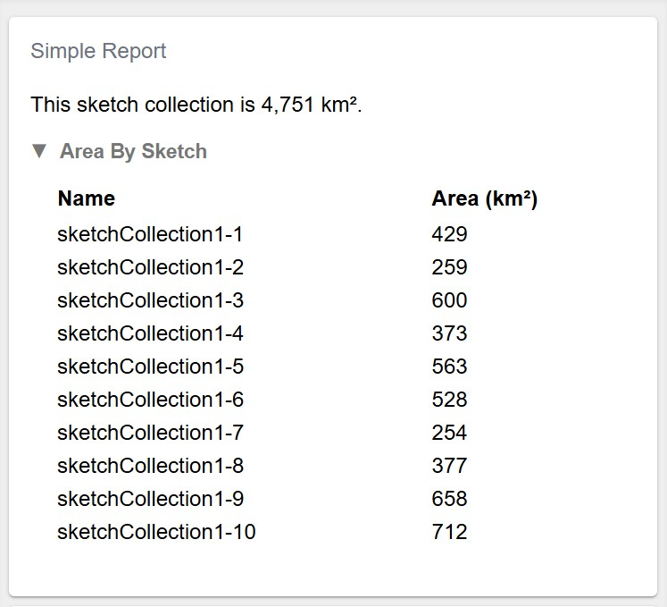
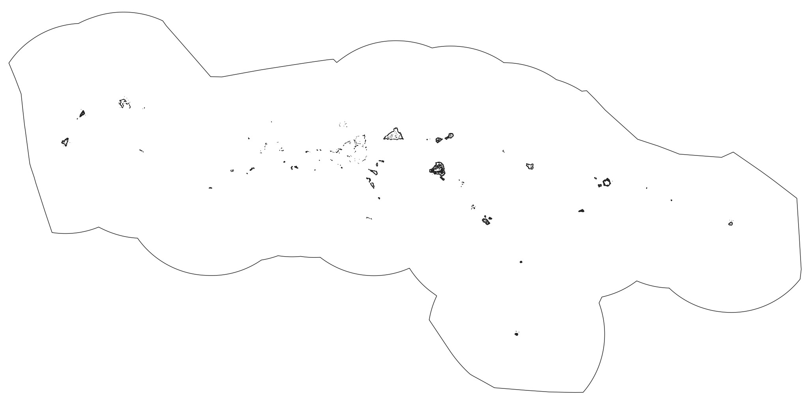

# Create Sample Project

This tutorial walks through creating a sample geoprocessing project for the Federated States of Micronesia. It demonstrates multiple methods for doing spatial analysis and creating reports, from low-level to high-level, so that you can engage with it at any/all of the levels needed for your project.

The planning area for this example is defined as the area extending from the baseline (coastline/shoreline) to the outer boundary of the Exclusive Economic Zone (200 nautical miles).



This tutorial assumes:

- Your [system setup](./Tutorials.md) is complete
- Your geoprocessing virtual environment is running (Devcontainer or WSL)
- You have VSCode open in your virtual environment with a terminal pane open

Have questions along the way? Start a [discussion](https://github.com/seasketch/geoprocessing/discussions) on Github

## Initialize Geoprocessing Project

Start the project `init` process, which will download the framework, and collect required project metadata.

```sh
cd /workspaces
npx @seasketch/geoprocessing@7.0.0-experimental-7x-docs.95 init 7.0.0-experimental-7x-docs.95
```

```text
? Choose a name for your project
fsm-reports-test
? Please provide a short description of this project
Micronesia reports
? Source code repository location
[LEAVE BLANK]
? Your name
[YOUR_NAME]
? Your email
[YOUR_EMAIL]
? Organization name (optional)
Example organization
? What software license would you like to use?
BSD-3-Clause
? What AWS region would you like to deploy functions in?
us-west-1
? What languages will your reports be published in, other than English? (leave blank for none)
Chuukese
Kosraean
```

After pressing Enter, your project will be created and all NodeJS software dependencies installed. If your language is not present, you will be able to add it later.

Now, re-open VSCode one level deeper, in your project folder::

```text
File -> Open Folder
Type /workspaces/fsm-reports-test/
Press Ctrl-J or Ctrl-backtick to open a new terminal
```

## Connect Github repo and push

Before you continue, let's take a snapshot of your code now, at the starting point.

[Create a remote Github repository](https://github.com/new) called `fsm-reports-test`. Leave it empty, do not choose to initialize with a template, README, gitignore, or LICENSE.

Then connect your local repo and make your first code commit:

```bash
git init
git add .
git commit -m "first commit"
git branch -M main
git remote add origin https://github.com/PUT_YOUR_GITHUB_ORG_OR_USERNAME_HERE/fsm-reports-test.git
git push -u origin main
```

You should see your files successfuly pushed to Github.

It may ask you if it can use the Github extension to sign you in using Github. It will open a browser tab and communicate with the Github website. If you are already logged in there, then it should be done quickly, otherwise it may have you login to Github.

After this point, you can continue using git commands in the terminal to stage code changes and commit them if that's what you know, or you can use VSCode's [built-in git support](https://code.visualstudio.com/docs/sourcecontrol/overview).

You can learn more about your projects [folder structure](../structure.md)

## Preprocessing

Preprocessing function are invoked by the SeaSketch platform, on a user-drawn shape, right after the user finishes drawing it. It's a specialized function that validates a drawn shape and potentially modifies it, such as to remove portions of the shape outside the planning boundary. This "clipping" of the shape is useful in that it allows a user to overdraw beyond the planning boundary and it will be clipped right to the edge of that boundary.

In the `src/functions` directory you will find four preprocessing functions that come with every project, and they are further configureable to meet your needs:

- `validatePolygon` - verifies shape is not self-crossing, is at least 500 square meters in size, and no larger than 1 million square kilometers.
- `clipToLand` - clips the shape to just the portion on land, as defined by OpenStreeMap land polygons. Includes validatePolygon.
- `clipToOcean` - clips the shape to remove the portion on land, as defined by OpenStreetMap land polygons. Includes validatePolygon.
- `clipToOceanEez` - clips the shape to keep the portion within the boundary from the coastline to the outer boundary of the EEZ. Includes validatePolygon.

### Testing

Each preprocessing function has its own unit test and smoke test file. For example:

- Unit: `src/functions/validatePolygon.test.ts`
- Smoke: `src/functions/validatePolygonSmoke.test.ts`

**Unit tests** ensure the preprocessor produces exact output for very specific input features and configuration, and throws errors properly.

**Smoke tests** are about ensuring the preprocessor behaves properly for your project location, and that its results "look right" for a variety of input features. It does this by loading example shapes from the project `examples/features` directory. It then runs the preprocessing function on the examples, makes sure they produce "truthy" output, and saves them to `examples/output`.

To test your preprocessing functions, we need to create example features within the extent of our Micronesian planning area. To do this, run the following script:

```bash
npx tsx scripts/genRandomPolygon.ts --outDir examples/features --filename polygon1.json --bbox "[135.31244183762126,-1.1731109652985907,165.67652822599732,13.445432925389298]"
npx tsx scripts/genRandomPolygon.ts --outDir examples/features --filename polygon2.json --bbox "[135.31244183762126,-1.1731109652985907,165.67652822599732,13.445432925389298]"
```

This will output an example Feature and an example FeatureCollection to `examples/features`.

Now run the tests:

```bash
npm test
```

You can now look at the geojson output in `examples/output`, including visually by opening a file in QGIS or pasting it into geojson.io. This is the best way to verify the preprocessor worked as expected.

Commit the feature examples and their output files to your git repository so that you can track changes over time.

To learn more about preprocessing, check out the [guide](../preprocessing.md)

## Simple Report

Your new project comes with a simple report that calculates the area of a sketch or sketch collection and presents it in a human readable format. Let's look at the pieces that go into this report.



### simpleFunction

The area calculation is done within a geoprocessing function in `src/functions/simpleFunction.ts`.

Open this file and you will notice this function defines a custom result payload called `SimpleResults`, which in this case is an object with an `area` number value.

```typescript
export interface SimpleResults {
  /** area of sketch within geography in square meters */
  area: number;
}
```

`simpleFunction` starts off with the basic signature of a geoprocessing function. It accepts a `sketch` parameter that is either a single `Sketch` polygon or a `SketchCollection` with multiple Sketch polygons. Unless your planning project only requires users to design single sketches and not collections, your geoprocessing function must be able to handle both.

```typescript
async function simpleFunction(
  sketch:
    | Sketch<Polygon | MultiPolygon>
    | SketchCollection<Polygon | MultiPolygon>,
): Promise<SimpleResults> {
```

The function then performs its analysis and returns the result.

```typescript
// Add analysis code
const sketchArea = area(sketch);

// Custom return type
return {
  area: sketchArea,
};
```

Below that, a new `GeoprocessingHandler` is instantiated, with simpleFunction passed into it. Behind the scenes, this wraps simpleFunction in an AWS Lambda handler function, which once deployed to AWS, allows the geoprocessing function to be invoked using an API call, by a report client running in a web browser.

```typescript
export default new GeoprocessingHandler(simpleFunction, {
  title: "simpleFunction",
  description: "Function description",
  timeout: 60, // seconds
  memory: 1024, // megabytes
  executionMode: "async",
});
```

`GeoprocessingHandler` requires a `title` and `description`, which uniquely identifies the function that will be published by your project. It also accepts some additional parameters defining what resources the Lamda should have, and its behavior:

- `timeout`: how many seconds the Lambda will run before it times out in error.
- `memory`: memory allocated to the Lambda, can go up to 10,240 MB. Number of processors increase with memory size automatically.
- `executionMode`: determines how the report client waits for geoprocessing function results, defaults to async. Sync - wait with connection open for immediate results, Async - wait for web socket message that results are ready, then fetch. Sync should only be used for very fast geoprocessing functions (1-2 seconds max). Think of it as a performance optimization.

You can change all these parameter values to suit your needs, but the default values are suitable for now.

`simpleFunction` is already registered as a geoprocessing function in `project/geoprocessing.json`.

Now let's look at the browser report client that invokes this function.

### SimpleReport

A report client is a top-level React component for rendering a report in the users web browser. Report clients are located in the `src/clients` directory and are responsible for the layout of one or more `Card` components. Cards are able to invoke geoprocessing functions and display their results.

The two report clients that come with your project are:

- `SimpleReport.tsx` - simple one page report client containing a SketchAttributesCard and a SimpleCard.
- `TabReport.tsx` - more complex multi-page report layout controlled by a tab switcher component, so that only one page is in view at a time.

Both these report clients are already registered in `project/geoprocessing.json`. To start, let's focus on `SimpleReport` and `SimpleCard`.

```jsx
export const SimpleReport = () => {
  return (
    <Translator>
      <SimpleCard />
      <SketchAttributesCard autoHide />
    </Translator>
  );
};
```

SimpleReport renders two cards, `SimpleCard` and `SketchAttributesCard`, wrapping them in a languge `Translator` component (you will learn more about this later).

`SketchAttributes` card is a card component that displays the properties of the users Sketch. No geoprocessing function is needed to do its work.

`SimpleCard` is a card component that invokes simpleFunction and displays its results. Let's look at the full initial code:

<details>
<summary>src/components/SimpleCard.tsx</summary>

```jsx
import React from "react";
import { Trans, useTranslation } from "react-i18next";
import {
  ResultsCard,
  useSketchProperties,
} from "@seasketch/geoprocessing/client-ui";
// Import SimpleResults to type-check data access in ResultsCard render function
import { SimpleResults } from "../functions/simpleFunction.js";
import { roundDecimalFormat } from "@seasketch/geoprocessing/client-core";

export const SimpleCard = () => {
  const { t } = useTranslation();
  const [{ isCollection }] = useSketchProperties();
  const titleTrans = t("SimpleCard title", "Simple Report");
  return (
    <>
      <ResultsCard title={titleTrans} functionName="simpleFunction">
        {(data: SimpleResults) => {
          const areaSqKm = data.area / 1_000_000;
          const areaString = roundDecimalFormat(areaSqKm, 0, {
            keepSmallValues: true,
          });
          const sketchStr = isCollection ? t("sketch collection") : t("sketch");

          return (
            <>
              <p>
                <Trans i18nKey="SimpleCard sketch size message">
                  This {{ sketchStr }} is {{ areaString }} square kilometers.
                </Trans>
              </p>
            </>
          );
        }}
      </ResultsCard>
    </>
  );
};
```

</details>

The first thing to notice is that SimpleCard renders a `ResultsCard` component. Behind the scenes ResultsCard invokes the geoprocessing function with the `functionName` provided (simpleFunction).

```typescript
<ResultsCard title={titleTrans} functionName="simpleFunction">
```

ResultsCard then render function it is provided with the results.

```typescript
{
  (data: SimpleResults) => {
    // Render results here
  };
}
```

This render function takes an input parameter `data` that has the same type (`SimpleResults`) as the return type of `simpleFunction`. This gives you fully typed access to your report results.

The code in this render function is the heart of each report card. This particular card takes the `area` value it is given in square meters, and converts it to square kilometers. It then rounds it to a whole number, and formats it to make it more readable. Also notice that it renders a slightly different message depending on whether it is a single sketch or a sketch collection being reported on.

### Language Translation

The last thing to notice is that SimpleCard contains a lot of boilerplate for language translation of its strings (using [`react-i18next`](https://react.i18next.com/)). If your reports need to be multi-lingual you will need to to use these, otherwise you can drop them. Language translation is a multi-part process:

- First, a combination of `useTranslation`, `t` function, and `Trans` components are used to establish which strings in your report client and components should be translated.
- Next, translateable strings are extracted using the `extract:translation` command to `src/i18n/lang/en/translation.json`. The strings extacted for SimpleCard are:

```text
{
  "sketch": "sketch",
  "sketch collection": "sketch collection",
  "SimpleCard sketch size message": "This {{sketchStr}} is {{areaString}} square kilometers.",
}
```

- Once the strings are translated to different languages (covered in a later tutorial), the `Translator` component in our report client is responsible for inspecting the users language at runtime in the browser and swapping in strings for the appropriate language.

### Generate Examples

With a working geoprocessing function and report client already in place, you're ready to generate example sketches for testing them. We'll use the same `genRandomPolygon` script as before. But let's look closer at how we figured out the bounding box extent of the Micronesian planning area. First, use ogrinfo to inspect the Micronesia EEZ polygon data layer in your data package.

```bash
ogrinfo -so -json data/src/eez_withland_mr.fgb
```

Deep in its output you will see a `geometryFields` property, which contains the bounding box extent of the EEZ feature. Use the `jq` utility to extract this extent:

```bash
ogrinfo -so -json data/src/eez_withland_mr.fgb | jq -c .layers[0].geometryFields[0].extent
[135.31244183762126,-1.1731109652985907,165.67652822599732,13.445432925389298]
```

This will output an array with the extent of the EEZ. This is just one of multiple possible methods to get this extent. You are welcome to use the method that works best for you.

Now run the genRandomPolygon script with this extent. The following examples will create a Sketch polygon, and then a SketchCollection containing 10 Sketch polygons.

```bash
npx tsx scripts/genRandomPolygon.ts --outDir examples/sketches --filename sketch1.json --bbox "[135.31244183762126,-1.1731109652985907,165.67652822599732,13.445432925389298]" --bboxShrinkFactor 5 --sketch
npx tsx scripts/genRandomPolygon.ts --outDir examples/sketches --filename sketchCollection1.json --bbox "[135.31244183762126,-1.1731109652985907,165.67652822599732,13.445432925389298]" --bboxShrinkFactor 5 --sketch --numFeatures 10
```

The `--bboxShrinkFactor` argument used shrinks the height and width of the given bbox by a factor of 5, and then generates random features that are within that reduced bbox. A suitable shrink factor value was discovered through trial and error. Simply visualize the resulting json file in QGIS or other software and find a value that produces polygons that are completely within the planning area polygon. (see image below).


Image: cluster of 10 random sketches (in orange) within Micronesia EEZ

Learn more about the options for `genRandomPolygon` by running:

```
npx tsx scripts/genRandomPolygon.ts --help
```

### Run test suite

Now that you have example features and sketches, you can test `simpleFunction`. Run the test suite now:

```bash
npm test
```

- Using `simpleFunctionSmoke.test.ts`, simpleFunction will be run against all of the polygon Sketches in `examples/sketches`.
- The results of all smokes tests are output to the `examples/output` directory.
- You can inspect the output files, and see the calculated area values for each sketch input.

Commit the output files to your git repository at this time.

You can make changes to simpleFunction, then rerun tests to regenerate them at any time, and delete any that are stale and no longer needed. For advanced use, check out the [testing](../Testing.md) guide.

### Storybook

Storybook is used to view your reports.

```bash
npm run storybook
```

This will:

- Generate a story for every combination of report client registered in `project/geoprocessing.json` and sketch present in `examples/sketches`.
- Load all of the smoke test output for every sketch (to load in stories instead of running geoprocessing functions)
- Start the storybook server and give you the URL.

Open the storybook URL in your browser and click through the stories.



A powerful feature of Storybook is that when you save edits to your report client or component code, storybook will refresh the browser automatically with the changes. This lets you develop your reports and debug them more quickly.

If you later add more sketch examples to the `examples/sketch` directory, will need to rerun the smoke tests to generate example output, and then stop and restart your storybook to re-generate all the stories.

Learn more in the [storybook guide](./storybook.md).

### Simple Function Modifications

Let's enhance your simple geoprocessing function to calculate more detailed information when the report is run on a sketch collection. It should now also calculate the area of the entire collection, and the area of each child sketch in the collection.

First modify SimpleResults with an additional property `childSketchAreas` that can store this information:

```typescript
export interface SimpleResults {
  /** area of reef within sketch in square meters */
  area: number;
  childSketchAreas: {
    /** Name of the sketch */
    name: string;
    /** Area of the sketch in square meters */
    area: number;
  }[];
}
```

Then calculate the additional values and return them in the result payload:

```typescript
// Add analysis code
const sketchArea = area(sketch);

let childSketchAreas: SimpleResults["childSketchAreas"] = [];
if (sketch.properties.isCollection) {
  childSketchAreas = toSketchArray(sketch).map((sketch) => ({
    name: sketch.properties.name,
    area: area(sketch),
  }));
}

// Custom return type
return {
  area: sketchArea,
  childSketchAreas,
};
```

Here's what the final `simpleFunction` code should look like:

<details>
<summary>src/functions/simpleFunction.ts</summary>

```typescript
import {
  Sketch,
  SketchCollection,
  Polygon,
  MultiPolygon,
  GeoprocessingHandler,
  toSketchArray,
} from "@seasketch/geoprocessing";
import { area } from "@turf/turf";

export interface SimpleResults {
  /** area of reef within sketch in square meters */
  area: number;
  childSketchAreas: {
    /** Name of the sketch */
    name: string;
    /** Area of the sketch in square meters */
    area: number;
  }[];
}

/**
 * Simple geoprocessing function with custom result payload
 */
async function simpleFunction(
  sketch:
    | Sketch<Polygon | MultiPolygon>
    | SketchCollection<Polygon | MultiPolygon>,
): Promise<SimpleResults> {
  // Add analysis code
  const sketchArea = area(sketch);

  let childSketchAreas: SimpleResults["childSketchAreas"] = [];
  if (sketch.properties.isCollection) {
    childSketchAreas = toSketchArray(sketch).map((sketch) => ({
      name: sketch.properties.name,
      area: area(sketch),
    }));
  }

  // Custom return type
  return {
    area: sketchArea,
    childSketchAreas,
  };
}

export default new GeoprocessingHandler(simpleFunction, {
  title: "simpleFunction",
  description: "Function description",
  timeout: 60, // seconds
  memory: 1024, // megabytes
  executionMode: "async",
});
```

</details>

Run your tests again to generate the new smoke test output:

```bash
npm run test
```

### Simple Report Modification

Now let's modify SimpleReportCard to display the new data. You will add a new `Collapse` section with a `Table` component that lists out the sketch areas by name.

```jsx
<p>
  <Trans i18nKey="SimpleCard sketch size message">
    This {{ sketchStr }} is {{ areaString }} km².
  </Trans>
</p>
<Collapse title={t("Area By Sketch")}>
  <Table
    data={data.childSketchAreas}
    columns={[
      {
        Header: t("Name"),
        accessor: "name",
      },
      {
        Header: t("Area (km²)"),
        accessor: (row: any) =>
          roundDecimalFormat(row.area / 1_000_000, 0, {
            keepSmallValues: true,
          }),
      },
    ]}
  />
</Collapse>
```

Here's what the final SimpleCard code should look like:

<details>
  <summary>src/components/SimpleCard.tsx</summary>

```jsx
import React from "react";
import { Trans, useTranslation } from "react-i18next";
import {
Collapse,
ResultsCard,
Table,
useSketchProperties,
} from "@seasketch/geoprocessing/client-ui";
// Import SimpleResults to type-check data access in ResultsCard render function
import { SimpleResults } from "../functions/simpleFunction.js";
import { roundDecimalFormat } from "@seasketch/geoprocessing/client-core";

export const SimpleCard = () => {
const { t } = useTranslation();
const [{ isCollection }] = useSketchProperties();
const titleTrans = t("SimpleCard title", "Simple Report");
return (
  <>
    <ResultsCard title={titleTrans} functionName="simpleFunction">
      {(data: SimpleResults) => {
        const areaSqKm = data.area / 1_000_000;
        const areaString = roundDecimalFormat(areaSqKm, 0, {
          keepSmallValues: true,
        });
        const sketchStr = isCollection ? t("sketch collection") : t("sketch");

        return (
          <>
            <p>
              <Trans i18nKey="SimpleCard sketch size message">
                This {{ sketchStr }} is {{ areaString }} km².
              </Trans>
            </p>
            <Collapse title={t("Area By Sketch")}>
              <Table
                data={data.childSketchAreas}
                columns={[
                  {
                    Header: t("Name"),
                    accessor: "name",
                  },
                  {
                    Header: t("Area (km²)"),
                    accessor: (row: any) =>
                      roundDecimalFormat(row.area / 1_000_000, 0, {
                        keepSmallValues: true,
                      }),
                  },
                ]}
              />
            </Collapse>
          </>
        );
      }}
    </ResultsCard>
  </>
);
};


```

</details>

If your storybook is still running from last time, you will need to restart it to pick up the new smoke test output. In fact, anytime you rerun your smoke tests to generate new output, you will need to restart your storybook.

```bash
Ctrl-C
npm run storybook
```

Your updated report should have a new collapsible table, that when expanded looks like the following:


### First Project Build

Now that you have confirmed your function is working properly, and your report client displays properly for a variety of example sketches, you are ready to do your first build. The application `build` proceess packages it for deployment. Specifically it:

- Checks all the Typescript code to make sure it's valid and types are used properly.
- Transpiles all Typescript to Javascript
- Bundles UI report clients into the `.build-web` directory
- Bundles geoprocessing and preprocessing functions into the `.build` directory.

To build your application run the following:

```bash
npm run build
```

Once your build is successful, you should stage and commit all your changes to git.

## Reef Report

Next you will create a coral reef report using a reef extent datasource. Here is an image of it displayed in QGIS. Notice that the coral is entirely in shallow water around the island coastline and atolls.



### Import Data

To access this datasource, first download a data package prepared for FSM to your project space and unzip it:

```bash
wget -P data/src https://github.com/user-attachments/files/17697992/FSM_MSP_Data_Example_V2.zip
unzip data/src/FSM_MSP_Data_Example_V2.zip -d data/src
rm data/src/FSM_MSP_Data_Example_V2.zip
```

Now import the datasource to your project.

```bash
npm run import:data
```

```text
? Type of data?
Vector
? Enter path to src file (with filename)
data/src/reefextent.fgb
? Select layer to import
reefextent
? Choose unique datasource name (a-z, A-Z, 0-9, -, _), defaults to filename
reefextent
? Should multi-part geometries be split into single-part geometries?
Yes
? (Optional) additional formats to create (besides fgb)
[Press enter to skip]
? Select feature properties that you want to group metrics by
[Press enter to skip]
? Select additional feature properties to keep in final datasource
[Press enter to skip]
? These formats are automatically created: fgb. Select any additional formats you want created
[Press enter to skip]
? Will you be precalculating summary metrics for this datasource after import? (Typically yes if reporting sketch % overlap with datasource)
Yes
```

The import process will:

- reproject your data to the WGS84 reference system, if not already (for ease of use with Turf.JS)
- split any features that cross the 180 degree [antimeridian](../antimeridian/Antimeridian.md)
- reduce the source dataset down to only the necessary attributes (saving network bandwidth later)
- output a new file in the cloud-optimized flatgeobuf format to the `data/dist` directory.
- register the datasource in `project/datasources.json`, along with metadata. This allows you to:
  - quickly access project datasources in your reports using the `projectClient` (more on this later)
  - quickly reimport datasources using the `reimport:data` command, without having to answer questions again.

Once finished you are ready to use your datasources for `local` report development. Datasource publishing for `production` use is covered later.

You can add, edit, or delete records in datasources.json manually to meet your need as long as the records meet the expected [schema](../concepts/AdvancedConcepts.md#datasources).

If at any point the process of using `data:import`, `datasources.json`, and `projectClient` doesn't meet your needs, you are welcome to create your own separate process, as long as it gets datasources to the `data/dist` directory in the format (fgb) and projection (WGS84) required, ready to be published for production use. Data publishing will be covered at a later time.

### Precalculation

Next, you will create a standalone script to calculate the total area of the polygons in the reef extent datasource for use in the report. By doing this calculation ahead of time, you won't need to do it every time the geoprocessing function runs.

Create a new file with the following code and save it to `scripts/coralReefPrecalc.ts`:

```typescript
// Run the following command from the project root directory
// npx tsx scripts/coralReefPrecalc.ts

import { area } from "@turf/turf";
import { geojson } from "flatgeobuf";
import { readFileSync } from "fs";
import fs from "fs-extra";

// Fetch all reef features and calculate total area
const buffer = readFileSync(
  `${import.meta.dirname}/../data/dist/reefextent.fgb`,
);
const reefFeatures = geojson.deserialize(new Uint8Array(buffer));
const totalArea = area(reefFeatures);

const reefPrecalc = {
  totalAreaSqMeters: totalArea,
};

fs.ensureDirSync(`${import.meta.dirname}/../data/precalc`);
fs.writeJsonSync(
  `${import.meta.dirname}/../data/precalc/reefextent.json`,
  reefPrecalc,
);
```

Now run it:

```bash
npx tsx scripts/coralReefPrecalc.ts
```

The script fetches all features from the reef extent flatgeobuf file, calculates their total area and writes it to `data/precalc/reefextent.json`.

```text
{
  "totalArea": 716100906.2570591
}
```

We are going to use this precalculated value in a geoprocessing function in the next step.

### Geoprocessing Function

To create a new geoprocessing function ready to build on, run the following:

```bash
npm run create:function
```

```text
? Function type
Geoprocessing - For sketch reports
? Title for this function, in camelCase
coralReef
? Describe what this function does
calculate sketch overlap with reef extent datasource
? Choose an execution mode
Async - Better for long-running processes

✔ created coralReef function in src/functions/
✔ Registered function in project/geoprocessing.json

Geoprocessing function: src/functions/coralReef.ts
Smoke test: src/functions/coralReefSmoke.test.ts

Next Steps:
    * Update the geoprocessing function with your analysis
    * Populate examples/sketches folder with sketches for smoke test to run against
    * 'npm test' to smoke test your new geoprocessing function against all example sketches
```

Open `src/functions/coralReef.ts`.

You will now update this code answer the following question:

- what percentage of all coral reef is within the current sketch polygon (or sketch collection polygons)?

Replace the existing code with the following:

<details>
<summary>src/functions/coralReef.ts</summary>

```typescript
import {
  Sketch,
  SketchCollection,
  Polygon,
  MultiPolygon,
  GeoprocessingHandler,
  getFeaturesForSketchBBoxes,
  getFlatGeobufFilename,
  toSketchArray,
} from "@seasketch/geoprocessing";
import project from "../../project/projectClient.js";
import { area, featureCollection } from "@turf/turf";
import reefPrecalc from "../../data/precalc/reefextent.json";

export interface CoralReefResults {
  /** area of all reef extent polygons in square meters */
  totalArea: number;
  /** area of reef extent within sketch or sketch collection in square meters */
  sketchArea: number;
  childSketchAreas: {
    /** Name of the sketch */
    name: string;
    /** Area of reef extent within child sketch in square meters */
    area: number;
  }[];
}

/**
 * Simple geoprocessing function with custom result payload
 */
async function coralReef(
  sketch:
    | Sketch<Polygon | MultiPolygon>
    | SketchCollection<Polygon | MultiPolygon>,
): Promise<CoralReefResults> {
  // Load just the reef features that intersect with the sketch bounding box
  // or in case of a sketch collection, the child sketch bounding boxes
  const ds = project.getInternalVectorDatasourceById("reefextent");
  const url = project.getDatasourceUrl(ds);
  const sketchFeatures = await getFeaturesForSketchBBoxes(sketch, url);
  const sketchArea = area(featureCollection(sketchFeatures));

  // Add analysis code
  let childSketchAreas: CoralReefResults["childSketchAreas"] = [];
  if (sketch.properties.isCollection) {
    childSketchAreas = toSketchArray(sketch).map((sketch) => ({
      name: sketch.properties.name,
      area: area(sketch),
    }));
  }

  // Custom return type
  return {
    totalArea: reefPrecalc.totalArea,
    sketchArea: sketchArea,
    childSketchAreas,
  };
}

export default new GeoprocessingHandler(coralReef, {
  title: "coralReef",
  description: "calculate sketch overlap with reef extent datasource",
  timeout: 60, // seconds
  memory: 1024, // megabytes
  executionMode: "async",
});
```

</details>

Notice that the code imports the totalArea value you precalculated and inserts it into the result payload, avoiding the need to recalculate it each time.

```typescript
import reefPrecalc from "../../data/precalc/reefextent.json";

reefPrecalc.totalArea;
```

Then it fetches only the reef features whose bounding box intersects with the sketch bounding box, or in case of a sketch collection, that intersects with each of its child sketch bounding boxes. This is more efficient than fetching the entire dataset, saving time and network bandwidth, and is done using the index built into the flatgeobuf format and use of http request range headers to fetch just the right portion of the file.

```typescript
const ds = project.getInternalVectorDatasourceById("reefextent");
const url = `${project.dataBucketUrl()}${getFlatGeobufFilename(ds)}`;
const sketchFeatures = await getFeaturesForSketchBBoxes(sketch, url);
const sketchArea = area(featureCollection(sketchFeatures));
```

Finally it calculates the overall sketch area and the area for each of the child sketches if present.

```typescript
let childSketchAreas: CoralReefResults["childSketchAreas"] = [];
if (sketch.properties.isCollection) {
  childSketchAreas = toSketchArray(sketch).map((sketch) => ({
    name: sketch.properties.name,
    area: area(sketch),
  }));
}

// Custom return type
return {
  totalArea: reefPrecalc.totalArea,
  sketchArea: sketchArea,
  childSketchAreas,
};
```

Now run tests to generate updated output for each of the sample sketches:

```bash
npm run test
```

Confirm that the output looks as expected.

<details>
<summary>Example output</summary>

```text
{
  "totalArea": 716100906.2570591,
  "sketchArea": 367734.86730626615,
  "childSketchAreas": [
    {
      "name": "sketchCollection1-1",
      "area": 428611581.5348215
    },
    {
      "name": "sketchCollection1-2",
      "area": 258701691.8012635
    },
    {
      "name": "sketchCollection1-3",
      "area": 599831752.2377243
    },
    {
      "name": "sketchCollection1-4",
      "area": 372585470.74404347
    },
    {
      "name": "sketchCollection1-5",
      "area": 562781719.588172
    },
    {
      "name": "sketchCollection1-6",
      "area": 528237794.83984125
    },
    {
      "name": "sketchCollection1-7",
      "area": 253970548.59694752
    },
    {
      "name": "sketchCollection1-8",
      "area": 376674659.1741572
    },
    {
      "name": "sketchCollection1-9",
      "area": 657788539.6501052
    },
    {
      "name": "sketchCollection1-10",
      "area": 712233449.0549812
    }
  ]
}
```

</details>

### Report Client

```typescript
npm run create:client

WORK IN PROGRESS PAST THIS POINT
```

## Benthic Habitat Report

This next section will demonstrate more advanced framework features for calculating polygon overlap and measuring progress towards planning objective targets. These features become more useful when you have multiple data classes that you want to report on at the same time.

### Import Data

```bash
npm run import:data
```

```text
? Type of data?
Vector
? Enter path to src file (with filename)
data/src/benthic-rock.fgb
? Select layer to import
benthic-rock
? Choose unique datasource name (a-z, A-Z, 0-9, -, _), defaults to filename benthic-rock
? Should multi-part geometries be split into single-part geometries?
Yes
? Select feature properties that you want to group metrics by
class
? Select additional feature properties to keep in final datasource
[Press Enter to skip]
? These formats are automatically created: fgb. Select any additional formats you want created
[Press Enter to skip]
? Will you be precalculating summary metrics for this datasource after import? (Typically yes if reporting sketch % overlap with datasource)
Yes
```

The import will proceed. Once complete you will find:

- The output file `data/dist/benthic-rock.fgb`.
- An updated `project/datasources.json` new datasource record `benthic-rock`.

If the import fails, start the import over and double check everything. It is most likely one of the following:

- You specified the wrong source file path.
- You specified the wrong layer name

### Add Metric Group

A metric group defines a metric to be measured, for one or more classes of data. A `MetricGroup` **record** provides the information needed for a metric to be calculated (in a geoprocessing function) and to be displayed (in a report client). Let's create your first metric group by opening `project/metrics.json`.

The benthic dataset represents where different classes of benthic habitat are predicted to be present. Specifically is is a single vector datasource with multiple habitats defined by the `class` attribute. While there are many types of habitats, we want to only focus on Sand, Rubble, and Rock. To do this, you'll add multiple class records, each with a unique `classId` value to match on, and a `classKey` that specific which feature attribute the classId values are found.

Add the following record to the end of the array in `project/metrics.json` and save the file.

```json
{
  "metricId": "benthicHabitat",
  "type": "areaOverlap",
  "classes": [
    {
      "classId": "Sand",
      "classKey": "class",
      "display": "Sand",
      "datasourceId": "benthic"
    },
    {
      "classId": "Rock",
      "classKey": "class",
      "display": "Rock",
      "datasourceId": "benthic"
    },
    {
      "classId": "Rubble",
      "classKey": "class",
      "display": "Rubble",
      "datasourceId": "benthic"
    }
  ]
}
```

The reef extent dataset simply tells you where there is reef present. Therefore, we represent it as a single class of data. You should end up with the following:

```json
[
  {
    "metricId": "coralReef",
    "type": "areaOverlap",
    "classes": [
      {
        "classId": "reefextent",
        "display": "Coral Reef",
        "datasourceId": "reefextent"
      }
    ]
  }
]
```

To learn more about metric groups, visit the [advanced concepts](../concepts/AdvancedConcepts.md#metric-group) page.

### Create Report

Next you will create your first report using the metric group created in the previous step. Run the following command and answer the questions:

```bash
npm run create:report
```

```text
? Type of report to create
Vector overlap report - calculates sketch overlap with vector datasources
? Describe what this reports geoprocessing function will calculate (e.g.Calculate sketch overlap with boundary polygons)
Calculate sketch overlap with reef extent
? Choose an execution mode for the geoprocessing function for this report
Async - Better for long-running processes
? Select the metric group to report on
coralReef

✔ Created coralReef report
✔ Registered report assets in project/geoprocessing.json

Geoprocessing function: src/functions/coralReef.ts
Smoke test: src/functions/coralReefSmoke.test.ts
Report component: src/components/CoralReefCard.tsx
Story generator: src/components/CoralReefCard.example-stories.ts

Next Steps:
    * 'npm test' to run smoke tests against your new geoprocessing function
    * 'npm run storybook' to view your new report with smoke test output
    * Add <CoralReefCard /> to a top-level report client or page when ready
```

As the output explains, 4 new files have been created for you including a geoprocessing function (coralReef.ts) and a

### Create Report

```bash
npm run create:report
```

```text
? Type of report to create
Vector overlap report

? Describe what this reports geoprocessing function will calculate
Calculate sketch overlap with benthic habitats

? Choose an execution mode for the geoprocessing function for this report
Async - Better for long-running processes

? Select the metric group to report on
benthicHabitat
```

Now:

- Add your new component to the Viability Page
- `npm run test`
- `npm run storybook`
- Verify report displays properly

## Octocoral Report

### Import Data

Now import the following additional datasources:

Octocorals - raster with 0/1 values representing predicted presence/absence of species.

```text
? Type of data?
Raster
? Enter path to src file (with filename)
data/src/yesson_octocorals.tif
? Choose unique datasource name (a-z, A-Z, 0-9, -, _), defaults to filename
octocorals
? Select raster band to import
1
? What type of measurement is used for this raster data?
Quantitative - values represent amounts, measurement of single thing
? Will you be precalculating summary metrics for this datasource after import? (Typically yes if reporting sketch % overlap with datasource)
Yes
```

### Add Metric Group

### Create Report

## Advanced Features

### Add Planning Boundary

### Update default Geography

Now change the projects default geography from the world, to your new planning boundary.

- Open `project/geographies.json`. You will see an array with one geography record called `world`. This is the default geography and can be left here. You will disable its precalc and remove it from the `default-boundary` group, then add a new geography record for your `planning-boundary`.
- Replace the contents of the geographies file with the following and save it:

```json
[
  {
    "geographyId": "world",
    "datasourceId": "world",
    "display": "World",
    "groups": [],
    "precalc": false
  },
  {
    "geographyId": "planning-boundary",
    "datasourceId": "planning-boundary",
    "display": "Planning Boundary",
    "groups": ["default-boundary"],
    "precalc": true
  }
]
```

### Precalc Data

The `precalc` command calculates spatial statistics for the portion of each of your datasources that falls within each of your project's Geographies.

Geographies are simply geographic boundaries for your project, and the default Geography for this project is the entire World.

Why do this?

One of the questions our report needs to answer is "what percentage of coral reef within the planning boundary are within my Sketch polygon?

This is calculated as:
`% area of coral reef in sketch = area of coral reef within sketch / area of coral reef within planning boundary`

The numerator in this equation (area of reef within sketch) is relatively inexpensive to calculate and we will do it within a geoprocessing function where we have access to the sketch. But the denominator calculation can be expensive if the data is very large or complex. Thankfully we can calculate it ahead of time.

Since your datasources and geographies already have `precalc: true` set, you are ready to start:

```bash
npm run precalc:data

? Do you want to precalculate only a subset?
  Yes, by datasource
  Yes, by geography
  Yes, by both
❯ No, just precalculate everything (may take a while)
```

Choose to "precalculate everything". Then press enter. The precalc process may take a while.

What's happening is that the precalc script starts a local web server on port 8001 that serves up the datasources in `data/dist`.

The precalc script then gets all your project datasources with `precalc: true`, and all your project geographies with `precalc: true`, and then calculate `area`, `sum`, and `count` metrics for each combination of datasource and geography.

Once complete `project/precalc.json` will have been updated with the new metric values.

- To learn more advanced use, see the [precalc](../precalc.md) guide.
- To learn more about use of precalculated metrics, see the [report client](../reportclient.md) guide.

### Language Translation

Run the following to extract the latest translations from all of you report clients and its underlying components.

```bash
npm run extract:translation
```

## What's Next

You've now completed the sample tutorial. Your next step is to choose whether you would like to:

- Setup an [existing project to setup](./existingproject.md), and re-deploy it.
- Create a [create a new project](./newproject.md), deploy it and integrate with SeaSketch.
